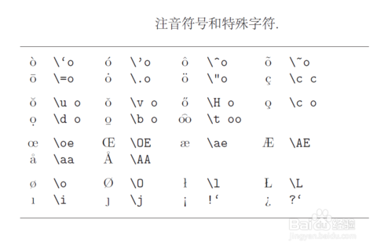

## brackets

$$
\begin{bmatrix}
 & \\ 
 & 
\end{bmatrix}

\begin{pmatrix}
 & \\ 
 & 
\end{pmatrix}

\left\{\begin{matrix}
 & \\ 
 & 
\end{matrix}\right.

\begin{cases}
 & \text{ if } x= \\ 
 & \text{ if } x= \\ 
 & \text{ if } x= 
\end{cases}
$$

## phonetic tag
http://jingyan.baidu.com/article/9f7e7ec05fe9d66f2815541a.html

 

## binomial

\usepackage{amsmath}
\binom2n

