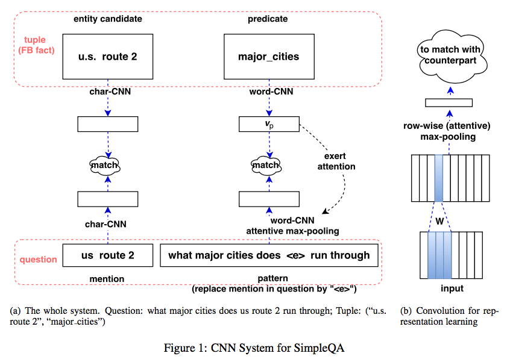
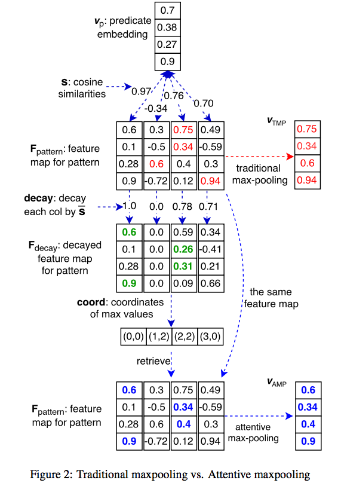
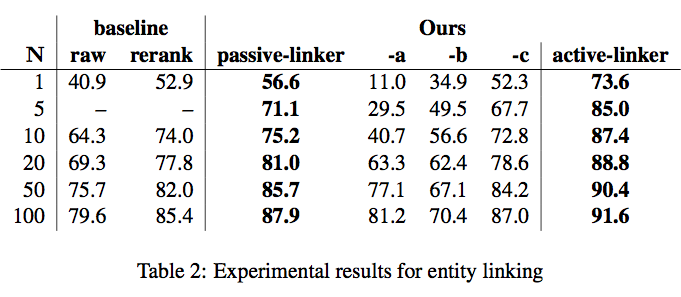
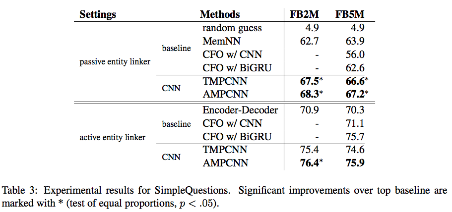
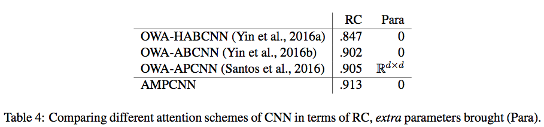

## Yin et al. 2016

Simple Question Answering by Attentive Convolutional Neural Network

Wenpeng Yin, Mo Yu, Bing Xiang, Bowen Zhou, Hinrich Schutze

COLING 2016

### Thoughts

Logic:

- Factoid questions are common in CQA and search logs, and require no inference
- Factoid QA is far from solved

Challenge:

1. Quantity of facts in Freebase is **overwhelmingly** large
2. Choose a subset of freebase
  - entity linking
  - fact selection

> representation encoding could be another way, getting rid of entity linking

Main Contributions:

- an entity linker (with results to be further compared)
  - surface text as linking hints
- an attentive CNN
  - try to find keywords suggesting the predicate, thus CNN + attentive CNN

### Entity Linking

Two Way:
- Passive: Entity first
- Active: Mention first

Passive (unsupervised):

1. tokenize / lowercase / ...
2. get entities whose name contains any single words from the question
3. compute Longest Consecutive Common Subsequence $\sigma$
4. weighted sum: $$s_e = \alpha \frac{\vert\sigma\vert}{\vert q\vert} + \beta\frac{\vert\sigma\vert}{\vert e\vert} + (1-\alpha-\beta)\frac{p}{\vert q\vert}$$

Active:

1. Use the entity label in SimpleQA
2. Train a model BiLSTM-CRF (similar to Dai et al. 2016) to label the mention span in question
3. use the mention again in the way of previous Passive Linker

Finally, a (mention, pattern) pair is output.

> 

### Fact Selection

Concatenation + Conv (zero-padded) + Max Pooling:

$$
\begin{align}
c_i &= [v_1, v_2, \cdots, v_s] \\
p_i &= \tanh (W\cdot c_i + b) \\
s   &= \max(p_1, p_2, \cdots, p_i)
\end{align}
$$

Attentive CNN: (bias the pooling by predicate)

- Decay: normalize positive weights, set 0 for negative weights
- n-grams with high similarity to predicate decays less.
- use original weights in cells having the largest decayed weights

### Experiments

Training:

- facts from Top-N entities
- train: 99 negative sample

$$
\begin{align}
s(q, t) &= m_e + m_r + s_e \\
l(q, t^+, t^-) &= \max (0, \lambda + s(q, t^-) - s(q, t^-))
\end{align}
$$

> entity to train, linked or gold

Entity Linker:

SimpleQA:

> improvement mainly comes from entity-linker

Relation Classification (match pattern with predicate):

- gold predicate v.s. all other predicate of gold entity

> 0.888 * 0.913 = 0.811 > 0.759

