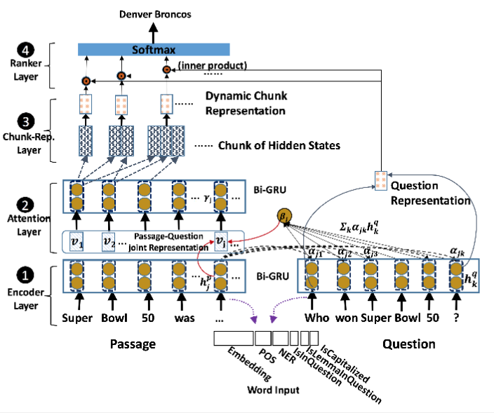
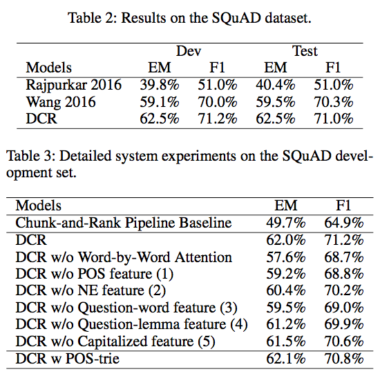
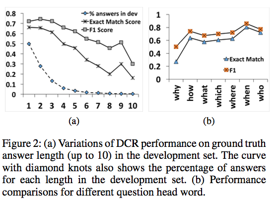
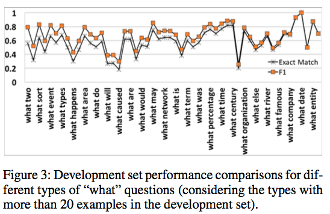

# introduction

End-to-End Answer Chunk Extraction and Ranking for Reading Comprehension

Yang Yu, Wei Zhang, Kazi Hasan, Mo Yu, Bing Xiang, Bowen Zhou

arXiv: 1610.09996

## background

real-word QA: factoid and non-factoid

> Non-factoid questions may or may not rise from a single document.
> RCQA task mainly deals with single document only.

previous RCQA work: entity or choice, answer boundary are trival or already given

dataset:

- quiz-style (MCTest, MovieQA): multi-choice questions
- cloze-style: factoid question
- answer-selection
  - TREC-QA: factoid question from multiple given passages
  - bAbI: for inference
  - SQuAD: both factoid and non-factoid, answer is a span in passage

this paper: arbitrary length, complexity: $O(n^2)$ (n possible start positions, max length n)

Chunk: a span in passage

Existing works for answer selection:

- Rajpukar et al. 2016: extract candidates using rule -> ranking candidates using hand-crafted features
- Wang and Jiang 2016: end-to-end predicting answer boundary or tagging answer/not-answer

## contributions

- joint candidate chunking and ranking
- new question attention
- some useful features

# Dynamic Chunk Reader

training data: $$(P_i, Q_i, A_i)$$

candidates: $$C_i = \{c_i^{m,n}\mid\forall m,n\in N^+,subj(m,n,P_i),1\le m\le n\le\vert P_i\vert\}$$

> constraints as filters

## baseline

An improvement over (Rajpurkar et al. 2016): not to use rules

Chunking answers: POS patterns in training set (cover 90% questions in dev. set)

Ranking chunks:

- **Scoring** the given passage:
  - word-level single-layer Gated Attention Reader (Dhingra et al. 2016): state-of-the-art on CNN/DayliMail
- **collect chunks score** from the passage
- **extract features** for the score sequence:
  - max / min / avg / sum
  - quantity of the matched POS patterns in the chunk (detail not given)
- **ranking**: (Ganjisaffar, Caruana, and Lopes 2011) NDCG@10

> useful info. to use previous works

## implementation

### Encoder Layer:

input concatenation:

- GloVe embedding 
- one-hot POS encoding
- one-hot NE tag
- binary: whether word surface form is in question
- binary: whether lemma of word is in question
- binary: is capitalized or not

Bi-GRU (effective in RC and NMT: Bahdanau, Cho and Bengio, 2015; Kadlec et al. 2016; Dhingra et al. 2016):

- shared parameters in question and passage (better than not shared)
- concatenation of forward and backward

$$
\begin{array}{rcl}
r_t &= &\sigma(W_rx_t + U_r h_{t-1}) \\
u_t &= &\sigma(W_ux_t + U_u h_{t-1}) \\
\bar h_t &= &\tanh(Wx_t + U(r_t\odot h_{t-1})) \\
h_t &= &(1 - u_t)\cdot h_{t-1} + u_t \cdot \bar h_t
\end{array}
$$

### attention layer

$$
\begin{array}{rcl}
\alpha_{jk} &= &h_j^p \cdot h_k^q \\
\beta_j &= &\sum_k\alpha_{jk}h_k^q \\
v_j     &= &[h_j^p;\beta_j]
\end{array}
$$

> beta is a weighted pooling of question hidden states

again, another Bi-GRU (and [forward;backward]) gives $v_j\to\gamma_j$

### Chunk Representation

for Chunk boundary:

- matched POS pattern
- enumerate all possible chunks

chunk representation:

$$
\bar\gamma_{m,n} = g(\gamma_m, \dots, \gamma_n) = [\overrightarrow\gamma_m,\overleftarrow\gamma_n]
$$

### Ranker Layer

$$
P(c_i^{m,n}\mid P_i,Q_i) = softmax(\bar\gamma_{m,n}\cdot
[\overrightarrow{h_{\vert Q_i\vert}^{Q_i}},\overleftarrow{h_1^{Q_i}}])
$$

> different from above, the last state in forward and first in backward

> softmax is similar to list-wise ranking in (Cao et al. 2007)

### Training

$$
L = -\sum_i\log P(c_i^{m,n}\mid P_i,Q_i)
$$

## experiment

- POS-trie is good enough

Baseline EM upper bound:

- 72% words with highest attention score are in correct span
- 92% ground truth answer is in the candidate chunk set
- upperbound is around 0.66 = 0.72 * 0.92
- EM of DCR is at 62%

Accuracy of longer answer is worse.

- question with long answer
- question asking for reasons
- question asking for explainations

