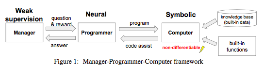
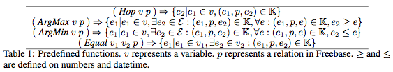
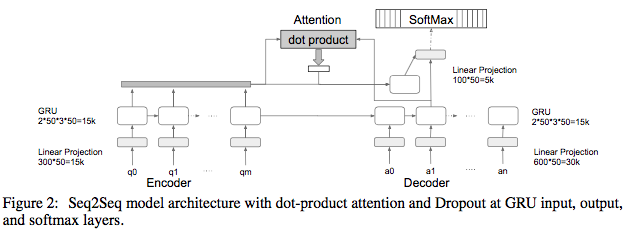
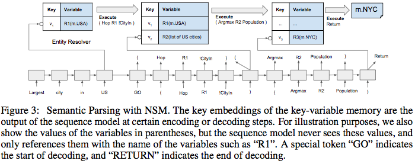
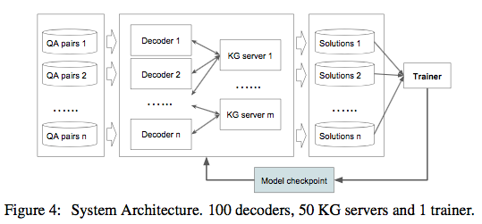
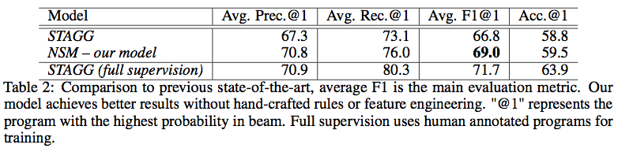
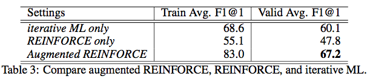
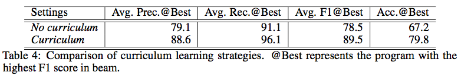
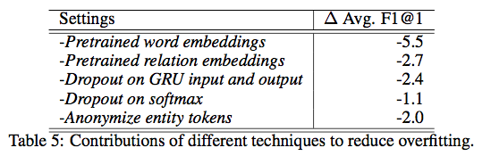

# introduction

Neural Symbolic Machines: Learning Semantic Parsers on Freebase with Weak Supervision

Chen Liang∗, Jonathan Berant†, Quoc Le, Kenneth D. Forbus, Ni Lao

- Northwestern University, Evanston, IL {chenliang2013,forbus}@u.northwestern.edu
- Tel-Aviv University, Tel Aviv-Yafo, Israel joberant@cs.tau.ac.il
- Google Inc., Mountain View, CA {qvl,nlao}@google.com

Logic:

- To use NN to **language understanding** and **symbolic reasoning**
  - complex operations
  - external memory
- Existing neural program induction methods are
  - differentiable (Memory Network)
  - low-level (Neural Turing Machine)
  - limited to small synthetic dataset
- The proposed MPC framework
  - non-differentiable
  - support **abstract, scalable and precise** operations
  

# the Neural Symbolic Machines

the metaphor:

- Manager: input data (and reward as weak supervision)
- Programmer: seq-to-seq induction model
- Computer: high-level language program execution

## Computer

Interpreter for Lisp-style programs:

> the program is equivalent to a subset of lambda calculus

Code-Assistant:

Tokens are restricted based on the current state: $ ( \to Hop \to v $, the next must be a relation reachable from v.

> like typing constraint in function matching
> may adopt derivation rather than program tokens

## Programmer:

### seq-to-seq:

- GRU for both encoder and decoder
- attention similar to (Dong and Lapata, 2016)

### key-variable memory

- key: embedding
- value: a reference in computer, thus **symbolic and non-differentiable**

> differs with TransE, where each entities have their own embedding
> and differs with MemNet and Hybrid computing (published in Nature)

**at encoding**

resolved (similar to STAGG (Yih et al. 2015)) entities get:

- key: avg. of GRU embeddings within the entity span
- value: the entity token ("m.12345")

input: GloVe 300d embedding -> 50d embedding

**at decoding**

an expression gets executed immediately when ended (encounter the right parenthesis ")"), the executed result is saved to memory:

- key: GRU output at the last step of the expression
- value: executed result (an entity or a list of entity)

freebase id: /domain/type/property, e.g. /people/person/parents
concatenate:

- avg "people" and "person" (GloVe)
- "parents"

300+300=600d -> 50d

## thus:

- abstract: lisp expressions rather than low-level
- scalable: executable on the whole freebase
- precise: use exact tokens rather than embeddings

# Training

## reinforcement narrative

given query $q$: state, action, reward $(s_t, a_t, r_t)$

$a_t \in A(s_t)$ is the possible actions given by the computer

**REINFORCE** algorithm (Williams, 1992)

$$
\begin{align}
R(q, a_{0:T}) &= \sum_t r_t = F_1(q, a_{0:T}) \\
P(a_{0:T} \mid q, \theta) &= \prod_t P(a_t \mid q, a_{0:t-1}, \theta) \\
J^{RL}(\theta) &= \sum_q E_{P(a_{0:T}\mid q,\theta)}[R(q, a_{0:T})] \\
\nabla_\theta J^{RL}(\theta) &=
  \sum_q\sum_{a_{0:T}} P(a_{0:T}\mid q,\theta)
    [R(q, a_{0:T}) - B(q)]\nabla_\theta\log P(a_{0:T}\mid q, \theta) \\
B(q) &= \sum_{a_{0:T}}P(a_{0:T}\mid q,\theta)R(q, a_{0:T})
\end{align}
$$

Use beam search rather than sampling to compute the gradient

**Problem:**

sparse reward signal in a large search space: non-zero reward program receive very low probability

- converge slowly
- local optima

## Find Approximate Gold Program

new training objective:

$$
J^{ML}(\theta) = \sum_q\log P(a_{0:T}^{best}(q) \mid q, \theta)
$$

the $a_{0:T}^{best}(q)$ is the program **shortest** length and **highest reward** (excluding question that gives no positive reward)

Still large search space for some complex programs: use **curriculum learning**:
gradually add the program complexity (functions used and length of program)

- first 10 iterations for ML training, using only **Hop** function and **length 2**
- iterations again, using both **Hop and Equal** with **length 3**

## Augmented REINFORCE Training

like linear combined ML and RL objectives in [Game Go] and [Google Trans]

the $a_{0:T}^{best}(q)$ receive probability $\alpha=0.1$ and others $1-\alpha$.

# results

architecture:

result:

different training methods:

curriculum methods:

to avoid overfitting:

