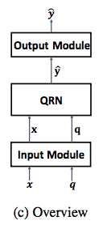
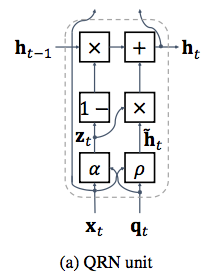
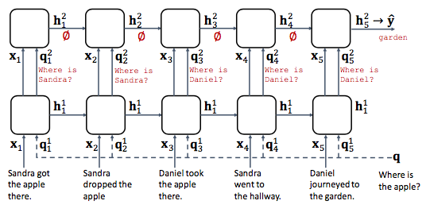
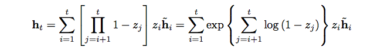
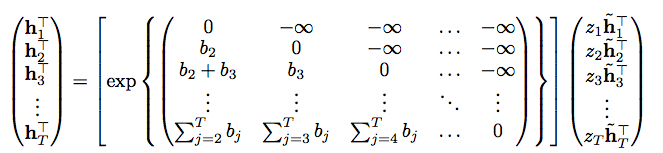
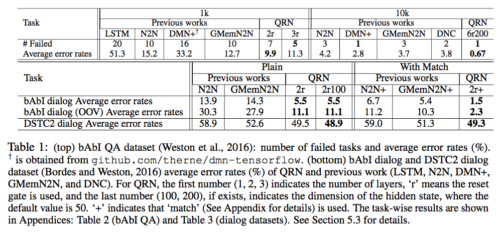
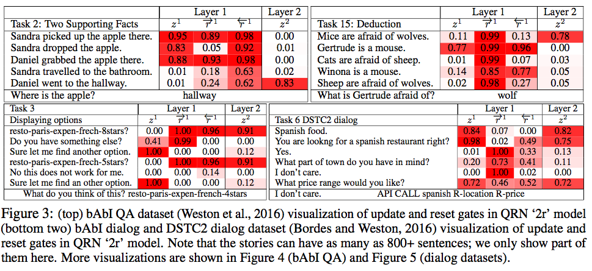
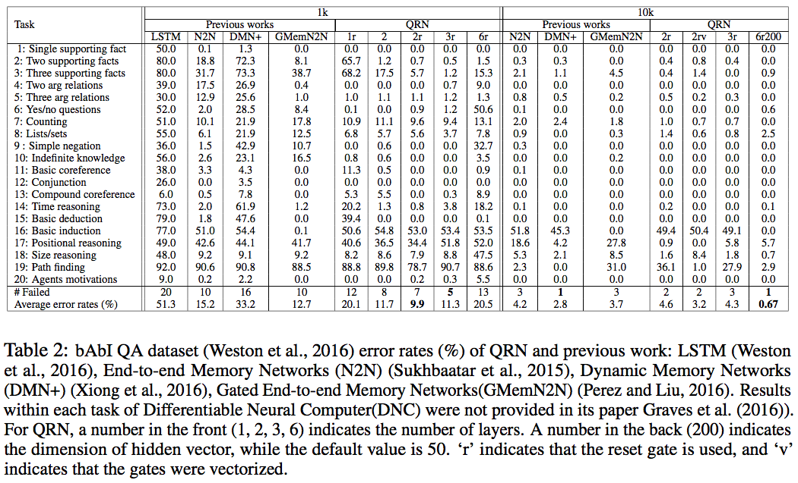

## introduction

QUERY-REDUCTION NETWORKS FOR QUESTION ANSWERING

submitted to ICLR-2017

Minjoon Seo 1, Sewon Min 3, Ali Farhadi 1,2 & Hannaneh Hajishirzi 1
University of Washington 1,
Allen Institute for Artificial Intelligence 2,
Seoul National University 3
{minjoon, ali, hannaneh}@cs.washington.edu, shmsw25@snu.ac.kr

**Target**:

Reasoning over multiple fact questions:

> Frogs eat insects.  
> Flies are insects.  
> Do frogs eat flies?

*"standard attention mechanisms are insensitive to the time step (memory address) of the sentences when accessing them"*

## model

Query-Reduction Network (QRN)

- considers the context sentences as a sequence of state-changing triggers
- reduces the original query to an easier-to-answer query

Model Overview:

1. Input: sentence $x_t$ and question $q_t$ encoding 
2. **QRN Layer**: predict answer $\hat y\in R^{d}$
3. Output: $\hat y \to$ natural language answer



### QRN Layer:

A variant of RNN unit

- update gate: $$z_t = \alpha(x_t, q_t) = \sigma(W^{(z)}(x_t\circ q_t)+b^{(z)})$$
- reduce query: $$\tilde{h_t} = \rho(x_t, q_t) = \tanh(W^{(h)}[x_t;q_t]+b^{(h)})$$
- hidden: $$h_t = z_t\tilde{h_t} + (1-z_t)h_{t-1}$$



Stacked Layer:

- next layer q: $$q^{k+1}_t = \overrightarrow{h}_t^k$$
- next layer q bi-direction: $$q^{k+1}_t = \overrightarrow{h}_t^k + \overleftarrow{h}_t^k$$
- next layer x: $$x^{k+1} = x^{k}$$



#### Extension:

Reset gate:

- $$r_t = \beta(x_t, q_t) = \sigma(W^{(r)}(x_t\circ q_t)+b^{(r)})$$
- Hidden: $$h_t = z_t r_t \tilde{h_t} + (1-z_t)h_{t-1}$$

Vector gates: both update gate and reset gate is replace as a vector

## Parallelization

unrolled hidden states: 



Vectorized (for all time step t):



## implementation

**input module**: Position Encoder (Weston et al., 2015 (Memory Networks))

**output module**:

- story-based QA: V-class single-layer softmax (multi-word answer included)
- dialog: RNN decoder (Cho et al. 2014), w/o recurrent hidden states and attention

**result**









