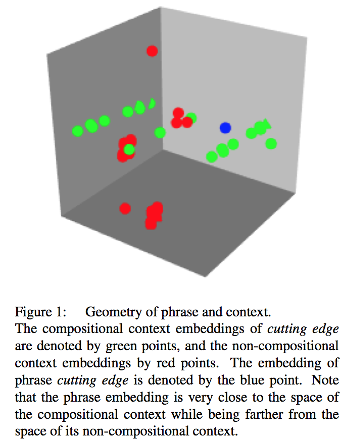
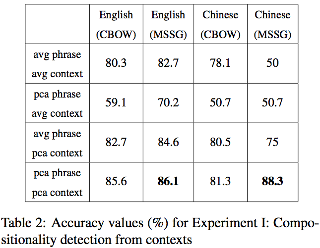
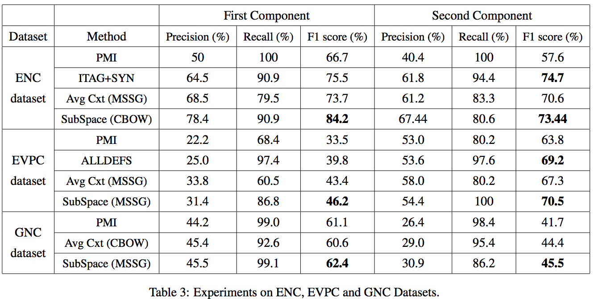
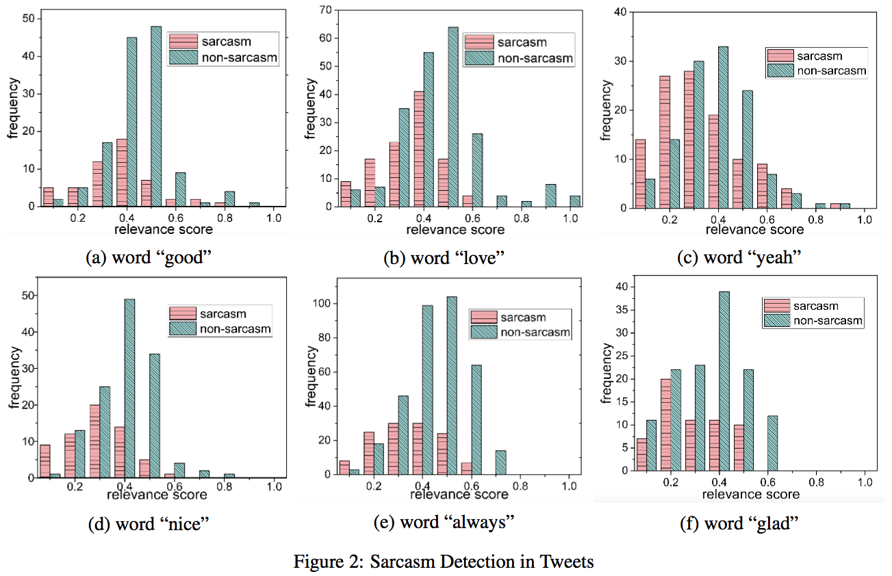
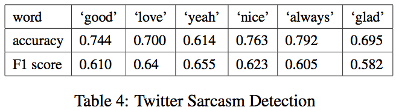
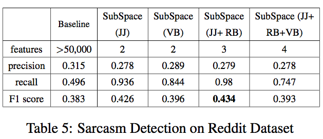
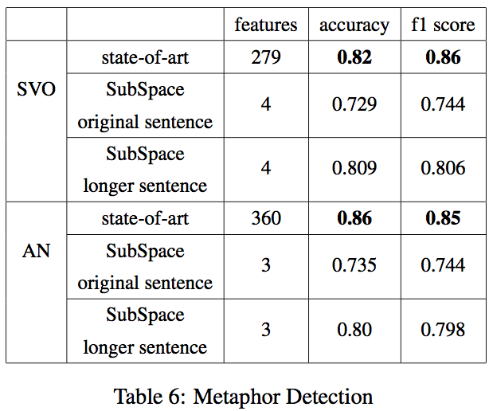

**Hongyu Gong** and **Suma Bhat** and **Pramod Viswanath**
hgong6@illinois.edu, spbhat2@illinois.edu, pramodv@illinois.edu
Department of Electrical and Computer Engineering
University of Illinois at Urbana Champaign, USA

AAAI-2017

## Introduction

How are meaning of words composed in a whole?
How to get a sentence representation from word embeddings?

### The non-compositionality phenomenons:

- Idiomatic expressions:
  - *by and large*, *spill the beans*, *part of speech*
- Figurative speech
- Extended meaning:
  - *Ensure that one bad egg doesn't spoil good businesses for those who care for their clientele*
  - *I don't know which hen is laying the bad egg but it explodes when I crask it.*
- Sarcastic sentence:
  - *I love going to the dentist. Being waiting for it all week!*
- Metaphors:
  - *The girl is an angel because she is so kind to the children.*
  

### Contributions:

- First study on context-dependent phrase compositionality with embeddings
- First resource-independent study on sarcasm and metaphor identification

**Key Point**:

- The context word vectors lie in a **low-dimensional linear subspace**.
- compositionality turns out to **project** the word embeddings **onto the context subspace**.

## Compositionality and Geometry

Given a sentences with words $$W=\{w_1, w_2, \dots, w_n\}$$ 
and embeddings $$E=\{v_1, \dots, v_n\}$$

**avg** sentence: $$t=\frac{1}{n}\sum_iv_i$$

**PCA** subspace spaned by a set of vectors: $$P=\{v_1',v_2',\dots,v_m'\}$$

settings $d = 200, n\approx [10 , 20]$ and hyperparameter $m \approx 3$

Given the embedding $v$ of a single word (metaphor and sarcasm) or a bigram phrase (MWE), the projection

$$
v'_p = {\arg\max}_{v\in R^d} \frac{v^Tv_p}{\parallel v\parallel\cdot\parallel v_p\parallel}
$$

compositionality score: **cosine similarity** of $v$ and $v'_p$

to consider multiple word senses, use **MSSG representation** (Neelakantan et al., 2014)

## Multi-Word Expression: compositionality

Synthetic [dataset](https://github.com/HongyuGong/Geometry-of-Compositionality):

- polysemous words and phrase from: The FreeDictionary and ChineseDictionary
- context from polyglot and GoogleBooks

## Multi-Word Expression: Idiomaticity

- English Noun Compounds dataset (Reddy et al., 2011)
- English Verb Particle Constructions (Bannard, 2006)
- German Noun Compounds (Schulte im Walde et al., 2013)

Baselines:

- PMI, higher more non-compositional
- average sentence embeddings
- state-of-the-art (Salehi et al., 2014a)
  - methods use word definitions(ALLDEFS), synonyms(SYN) and idiom tags(ITAG) from wikitionary
  
  

## Sarcasm Detection

> It's so nice that a cute video of saving an animal can quickly turn the comments into political debates and racist attacks.

*nice* contradicts *debate* and *attack*

### twitter data

- Use selected twitter data. (Ghosh et al., 2015)
- Choose only six words occuring frequently enough.

and using a theshold-based classifier gives a result which could serve as a baseline for the future work

### reddit data

- Reddit irony dataset (Wallace et al., 2014): 3020 comments, 10401 sentences annotated.
- (Wallace et al., 2014) baseline:
  - feature: bag-of-words and punctuations
  - linear kernel SVM
  - grid search on 5-fold cross validation
  

**method**:

- Use smallest k scores of different POS words as feautres
- same supervised system with baseline

## Metaphor

- Dataset: English sentences with uses of S+V+O and Adj+Noun structures (Tsvetkov et al. 2014)
- baseline (Tsvetkov et al. 2014) use feature engineering and WordNet and MRC psycholinguistic database

### methods

use unsupervised compositionality score for some POS words (since the dataset has specific syntactic structure)

**SVO-features:**

- lowest score in SVO (at least on word is inconsistent with the context)
- verb score (verbs are often used in metaphor)
- ration between the lowest ratio and the highest (relative score rather than absolute score value)
- the minimum of (v/subj, subj/v, v/obj, obj/v) (relative score between verb and subj or object)

**AN-features**

- lowest score in AN
- highest score
- ratio between the highest and the lowest

all these are fed into a random forest (Tsvetkov et al. 2014)

## conclusion

study on methods with neural networks such as LSTM in the future.

