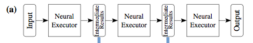
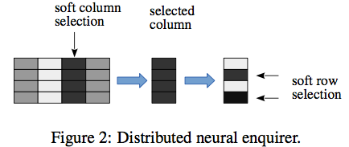
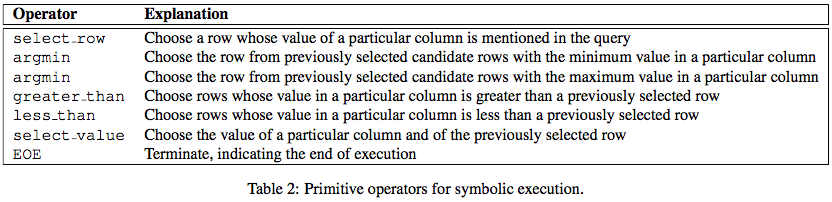
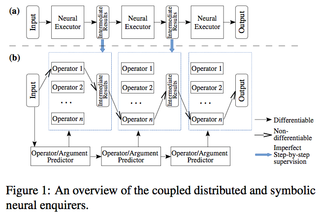
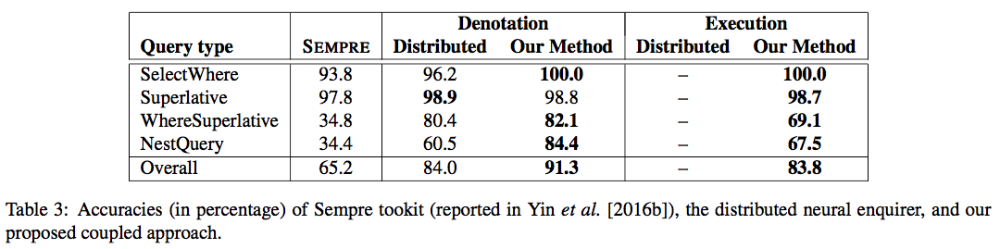
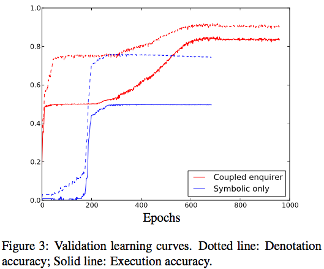

**Coupling Distributed and Symbolic Execution for Natural Language Queries**

Lili Mou,1∗ Zhengdong Lu,2 Hang Li,3 Zhi Jin1

1. Key Laboratory of High Confidence Software Technologies (Peking University), MoE; Institute of Software, Peking University, China
2. DeeplyCurious.ai
3. Noah’s Ark Lab, Huawei Technologies

doublepower.mou@gmail.com, luz@DeeplyCurious.ai HangLi.HL@huawei.com, zhijin@sei.pku.edu.cn

## Introduction

Applications of using natural language to query database:

- Generative QA [Yin et al. 2016a]
- Human-Computer conversation [Wen et al. 2016]
- Table Query [This work]

Methods:

- Semantic Parsing (language to logic forms)
  - [Long et al. 2016; Pasupat and Liang, 2016] (Further Progress over [Pasupat and Liang 2015])
  - Seq2seq: supervision of groundtruth logic forms, weak supervision of denotations are not enough
    - [Dong and Lapata, 2016] seq2tree
    - [Xiao et al. 2016] DSP
  - Neural Semantic Parsing ([NAMPI](https://uclmr.github.io/nampi/))
    - [Yin et al. 2016b] Neural enquirer (basic of this work)
      - lack of explicit interpretation
    - [Neelakantan et al. 2016] neural programmer, ICLR-2016
      - symbolic operations only for numeric tables, not for string matching
      - exponential number of combinatorial states
    - [Liang et al. 2016] neural symbolic machines
      - REINFORCE is sensitive to initial policy
    

This work: Combine symbolic and neural methods.

## Distributed Enquirer

Similar to neural enquirer of [Yin et al. 2016b].





**Query Encoder**: Bi-LSTM of the question

**Table Encoder**: any cell $c = MLP([e_{cell}; e_{f\_name}])$ 

### Executor

Executor is a sequence of execution step, results of each step: $p^t_f, r^t$

$$
\begin{align}
c^{(t-1)}_{select}[i] &= \sum_j p_{f_j}^{(t-1)}c_{ij} \\
r_i^{(t-1)} &= r_i^{(t-1)}\cdot c^{(t-1)}_{select}[i] \\
g^{(t-1)} &= MaxPool_i\{c^{(t-1)}_{select}[i]\} \\
p_{f_j}^{(t)} &= softmax(MLP([q;f_j;g^{(t-1)}])) \\
r_i^{(t)} &= sigmoid(MLP([q, g^{(t-1)}, r^{(t-1)}, c^(t)_i]))
\end{align}
$$

multiple rows may be selected thus the last is sigmoid rather than softmax.

At the last step, softmax over all the table cells.

## Symbolic Executor

Defined Operations:



A Jordan-type RNN (no input) [Jordan 1997]:

$$
\begin{align}
h^{(t)}_{op} &= sigmoid(Wh_{op}^{(t-1)}) \\
h^{(0)}_{op} &= q \\
p^{(t)}_{op} &= softmax(w_i^T h_{op}^{(t-1)}) \\
p^{(t)}_{f_j} &= softmax(f_j^T h_{field}^{(t-1)}) \\
\end{align}
$$

> further improved using query reduction network

Training whithout step-by-step supervision is non-trivial. (RL trial-and-error)

## Coupling Distributed and Symbolic Execution

Combined:

1. using the intermediate execution result of the distributed enquirer to pretrain the symbolic enquirer for an initial policy
2. use REINFORCE algorithm to improve the policy for symbolic execution



Binary reward R indicating whether the final denotation matches the groundtruth.

loss of a policy, actions are sampled from the current distribution:

$$
J = E_{a_1, a_2, \cdots, a_n \sim \theta}[R(a_1, a_2, \cdots, a_n)]
$$

partial derivatives:

$$
\frac{\partial J}{\partial o_i} = \tilde{R} \cdot (p_i - 1_{a_i})
$$

## Results

Synthetic dataset from [Yin et al. 2016b], with given groundtruth denotation and execution actions.















