Inferring Logical Forms From Denotations

ACL-2016

- Panupong Pasupat   
  Computer Science Department Stanford University ppasupat@cs.stanford.edu
- Percy Liang   
  Computer Science Department Stanford University pliang@cs.stanford.edu

## Introduction

Challenge:

- Computational: number of LF grows exponentially
- Spurious LF: those LFs happen to get the right denotation

**Task:**

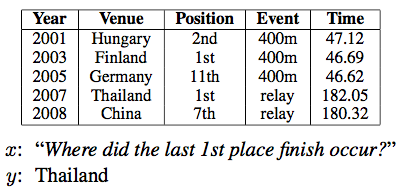

**World:**

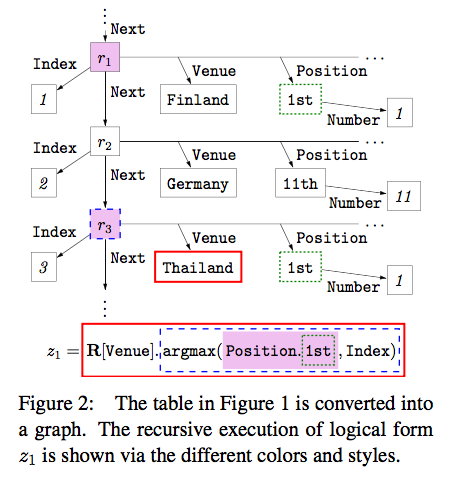

**LF (Lambda DCS):**

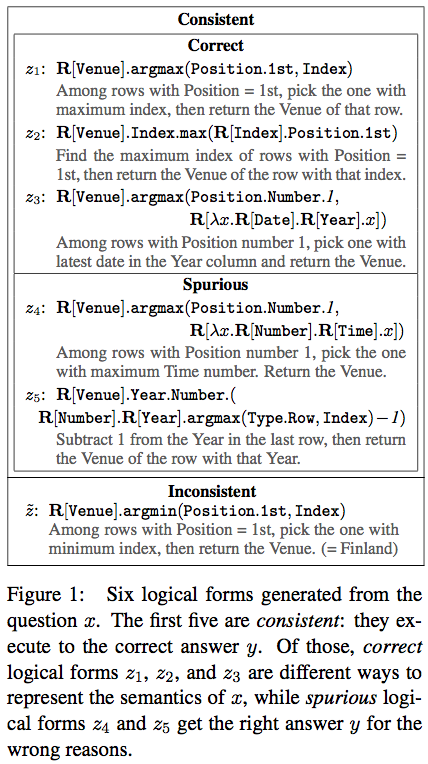

## Rules

$LF \in Categories = \{Set, Rel, Map, (TokenSpan?)\}$

Deduction rules works over two categories of LFs, output LF with some other category of LF.

**Basic Rules** with following forms:

$$
\begin{align}
TokenSpan[span] &\to c[f(span)] \\
\emptyset &\to c[f()]
\end{align}
$$

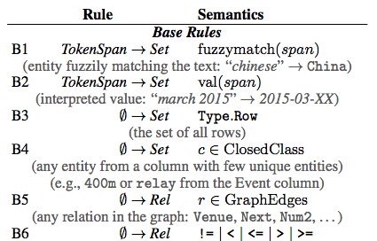

**Compositional Rules** have the following forms:

$$
\begin{align}
c_1[z_1] + c_2[z_2] &\to c[g(z_1, z_2)] \\
c_1[z_1] &\to c[g(z_1)]
\end{align}
$$

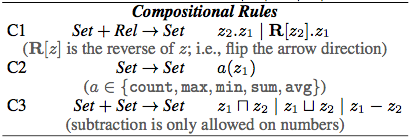

**Map Category**

- execution of partial LF is sometimes impossible, e.g. $\lambda x.count(x)$
- partial LF may be complex, e.g. z3

Introduce a map (from **set** to **map**, then **map** to **map**, finally **map** back to **set**)

A map is a pair of a finite **unary set u** and a **binary relation b**: **(u, b)**

Denotaion of $(u, b) = (u)$ is $([u]_w, [b]'_w)$ where $[b]$ is restricted to $[u]$

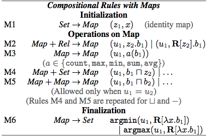

e.g. $argmax(Position.1st, Index)$

1. B1 TokenSpan to Set: 1st
2. B5 Empty to Relation: Position
3. C1 Set + Rel to Set: $$Position.1st \to \{r_1, r_3\} $$
4. M1 Set to Map: $$(Position.1st, x) \to (\{r_1, r_3\}, \{r_1:\{r_1\}, r_3:\{r_3\}\})$$
5. B5 Empty to Relation: Index
6. M2 Map + Rel to Map: $$(Position.1st, R[Index].x) \to (\{r_1, r_3\}, \{r_1:\{1\}, r_3:\{3\}\})$$
7. M6 Map to Set: $$\arg\max(Position.1st, R[\lambda x.(R[Index].x)]) \to \{r3\}$$

### Beam Search

All the LFs of each **category c** and **size s** reside in the same $cell(c, s)$.

e.g. Rule C1: Set + Rel to Set may

- choose $Number.1$ from (Set, 1)
- choose $Position$ from (Rel, 0)
- create $Position.Number.1$ to (Set, 0 + 1 + 1 = 2)

up to max size (=7)

After populating each cell, the list of logical forms is pruned to a fixed beam size on model scores.

Beam search may suffer from the propagating errors when the size goes large.

## Dynamic Programming on Denotations (DPD)

- The number of LFs goes exponential but many of them share the same denotation.
- The number of denotations are much more controlled.

collapse LFs with the same denotation in $cell(c, s, d)$

**Two pass** algorithm:

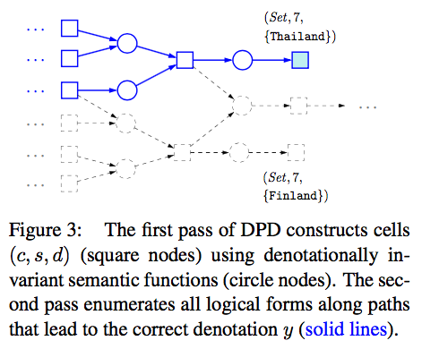

1. Find relevant cell combinations only.
  - One LF per cell and discard others further encountered.
  - Populate cells up to max size
  - Use the cells with correct denotation, collect all rule combinations (cell1, [cell2,] rule) yielding it, combinations of discarded LFs also
2. Find actual LFs. Use the rule combinations only found before. (98.7% search space are reduced)

> without denotation we can do nothing, e.g. testing

## Fictitious worlds

Semantically correct LF should give correct denotations in world (table) other than the original one.

**Sampling**

- All entities and relations in Z must be presented in the new fictitious world
- Columns are the same
- Resample the cells in each column (with replacement or not)
- Keep the sorted column sorted

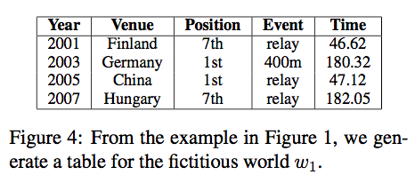

**Annotation**

Some LFs got the same denotation across all the fictitious worlds, thus they fall into a equivalence class.

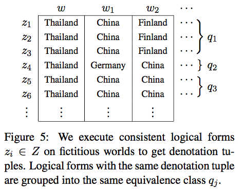

There're too many fictitious worlds(=30), choose a subset(=5) of them, thus some equivalence classes may fall into the same partition.

Notations:

$$
\begin{align}
W &= (w_1, \cdots, w_k) \\
[z]_W &= ([z]_{w_1}, \cdots, [z]_{w_k}), z\in Z \\
W' &= (w_1', \cdots, w_l') \subseteq W \\
F_t &= \{q \in Q \mid [q]_{W'} = t\} \\
F_{t^*} &\text{ as the correct partition}
\end{align}
$$

Choose a subset that maximize expected information gain (reduction in entropy):

$$
\begin{align}
\arg\min_{W'} &H(q^* \mid T_{W'}^*) \\
q^* &\sim Uniform(Q) \\
p(t^* \mid q) &= I(q\in F_{t^*}) \\
H(q^* \mid T_{W'}^*) &= \sum_{q,t}p(q, t) \log\frac{p(t)}{p(q,t)} \\
                     &= \frac{1}{\vert Q\vert}\sum_t\vert F_t\vert \log\vert F_t\vert.
\end{align}
$$

## Experiments

### more generated LFs

annotated 252 out of 300 (84%) examples from training set of WikiTableQuestions with LFs.

76% of the first 300 (agianst 53.5% of the first 200, [P and L, 2015]) were generated successfully.

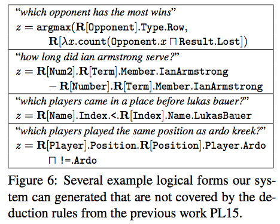

### DPD

search space is reduced by 98.7%

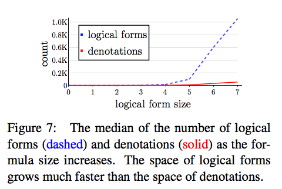

more LFs generated than Beam search

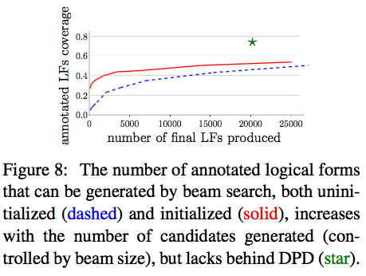

### Fictitious Worlds

30 worlds is enough (5% are different when 300 worlds)

in the 252 annotated examples, 98.3% of spurious LFs are ruled out.

32.7% of 252, only 1 equivalence classes is left.
51.3% of 252, only 3.

Randomly choose 5 worlds (rather than using the information gain)

22.6% and 36.5%.

