NEURAL PROGRAMMER: INDUCING LATENT PROGRAMS WITH GRADIENT DESCENT

- Arvind Neelakantan
  University of Massachusetts Amherst, arvind@cs.umass.edu

- Quoc V. Le
  Google Brain, qvl@google.com

- Ilya Sutskever
  Google Brain, ilyasu@google.com

## Introduction

Because:

- NN model fail to do arithmetic and logic tasks, even fail to add two numbers less than 10 bits (Joulin and Mikolov, 2015)
- Tasks like QA need complex reasoning

Contributions:

- Neural Programmer, NN augmented with arihmetic and logic ops
- Learns from weak supervision, no annotated program needed
- differentiable

Synthetic Dataset (with simple question templates)

- tables $\in \{R, text\}^{M\times C}$

**Key**: **Select operators** and **save** the result, for a total of **T times of iteration**(chosen in advance)

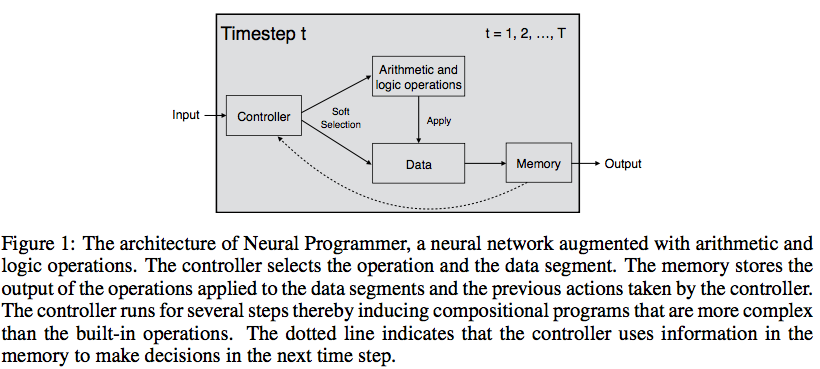

which resembles an ALU or the intraparietal sulcus (IPS)

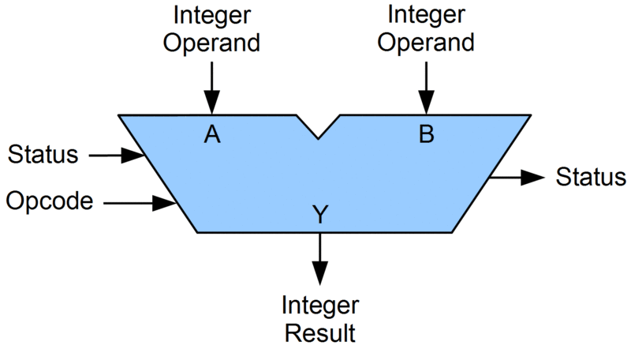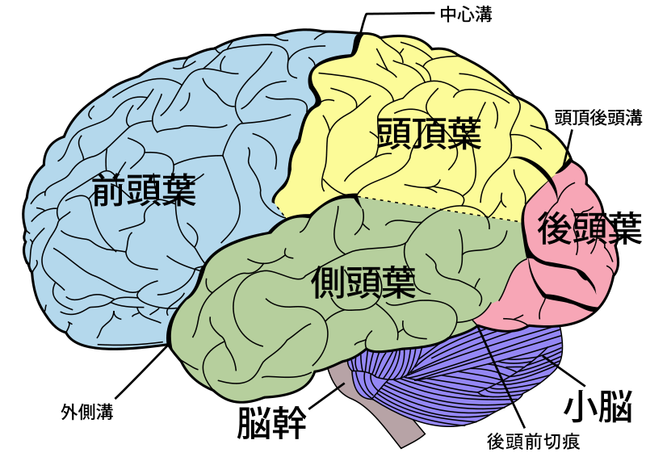

## Model

Four components:

- Question RNN
- Selector
- Operators
- History RNN

### Question RNN

$$
z_i = \tanh(W^{question}[z_{i-1};V(word_i)]),\,\,\forall i = 1, 2, \cdots, q
$$

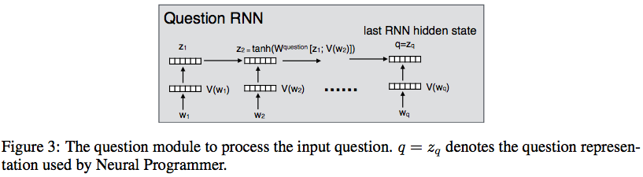

init:
- $z_0 = [0]^d$
- remove numbers from questions and save them in a separate list
- bi-RNN for long questions(detail in experiments)

### Selector

Normal softmax: question **q** and hidden memory **h**

**Operations**

$$
\alpha_t^{op} = softmax(U\tanh(W^{op}[q;h_t]))
$$

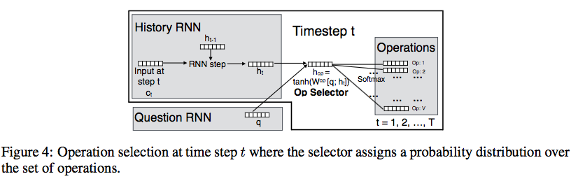

**Data Selection(against columns)**

$$
\alpha_t^{col} = softmax(P\tanh(W^{col}[q;h_t]))
$$



Column Representation:

- use column names using parameters of question RNN, for each column

### Operations

There're two types of outputs: **scalar** and **item list**

Maintain output variables, to which the operators all have access:

- ${scalar\_answer}_t\in R$, scalar answer of t step, init to 0
- ${lookup\_answer}_t\in [0, 1]^{M\times C}$, selection prob. of entry (i, j), init to 0
- ${row\_select}_t\in [0, 1]^M$, selection prob. of row i, init to 1

Operations:

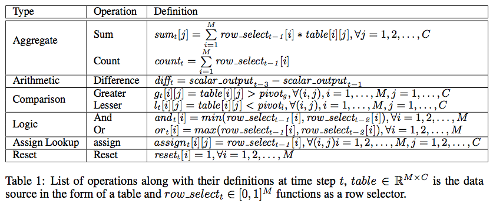

For pivot values in _greater_ and _lesser_ operator:

$$
\beta_{op} = softmax(ZU(op)) \\
pivot_{op} = \sum_{i=1}^N \beta_{op}(i)qnumber_i
$$

Z matrix contains the representation of n words on the **left** of the numbers, because the question generated are in the pattern.

**Update Variables**

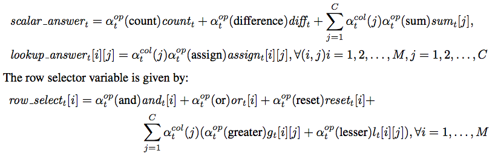

### Text Entries

Add a text match operation, and attend on each column over question hidden states. (avg failed to make column)

**Step 1**: Column Embedding: (M text entries and K text columns)

$$
\begin{align}
A &\in M \times K \times d \\
B[m][k] &= sigmoid(A[m][k]\cdot q), \forall (m, k) \\
D[k] &= \frac{1}{M}\sum_m (B[m][k]\cdot A[m][k]) \\
E_k &= P_k + D_k \\
\end{align}
$$

**Step 2**: Attention

$$
\begin{align}
e_{kj} &= E_k \cdot q_j, \forall j = 1, 2, \cdots, Q \\
\alpha_{k} &= softmax(e_{k}) \\
G_k &= \sum_j\alpha_{kj} q_j
\end{align}
$$

**Step 3**: Text Match selection:

$$
text\_match[m][k] = sigmoid(A[m][k]\cdot G[k])
$$

**Update variables**:

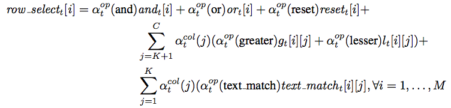

### History RNN

$$
\begin{align}
c_t &= [(\alpha^{op}_{t-1})^TU;(\alpha^{col}_{t-1})^TP] \\
h_t &= \tanh(W^{history}[c_t; h_{t-1}]), \forall i = 1, 2, \cdots, Q
\end{align}
$$

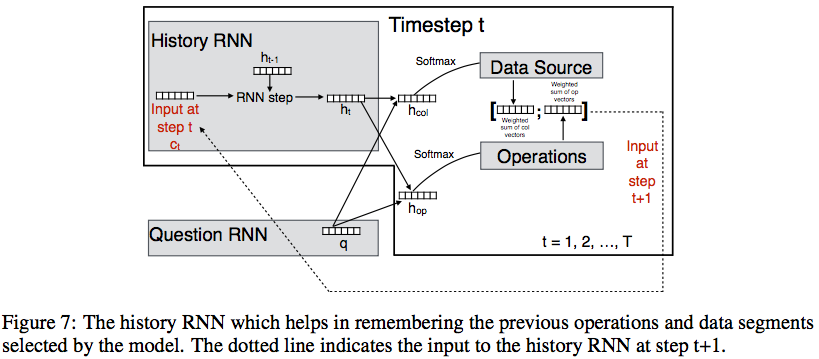

## Training

$$
\begin{align}
L_{scalar}(scalar\_answer_T, y) &= \begin{cases}
\frac{1}{2}a^2, &\text{ if } a\le \delta \\
\delta a - \frac{1}{2}\delta^2, &\text{ otherwise}
\end{cases} \\
a &= \lvert scalar\_answer_T - y \rvert \\
L_{lookup}(lookup\_answer_T, y) &= - \frac{1}{MC}\sum_{i,j}(y_{i,j}\log(lookup\_answer_T(i,j))+
    (1-y_{i,j})\log(1-lookup\_answer_T(i,j))) \\
L &= \frac{1}{N}\sum_{k=1}^N([n_k == True]L_{scalar}^k+[n_k==False]\lambda L_{lookup}^k)
\end{align}
$$

hyper-parameter: $\lambda, \delta$

**Inference**:

- output whatever is updated at timestep T
- use _hardmax_

## Experiments

### synthetic dataset

sampling:

- elements from [-100, 100] for training and [-200, 200] for testing
- rows from [30, 100] for training, and 120 for testing

templates:

- Single column templates
- multi-colum templates
- variability: several utterances for the same operator
- text match: small vocabulary of 10 words

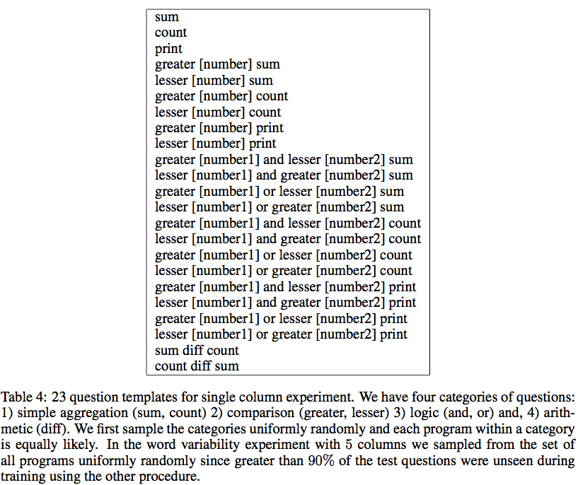

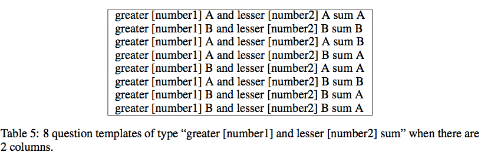

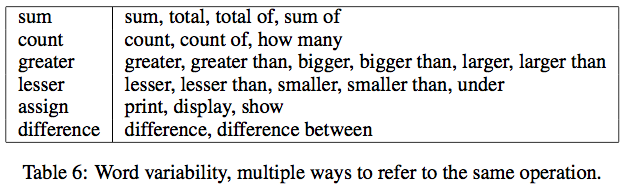

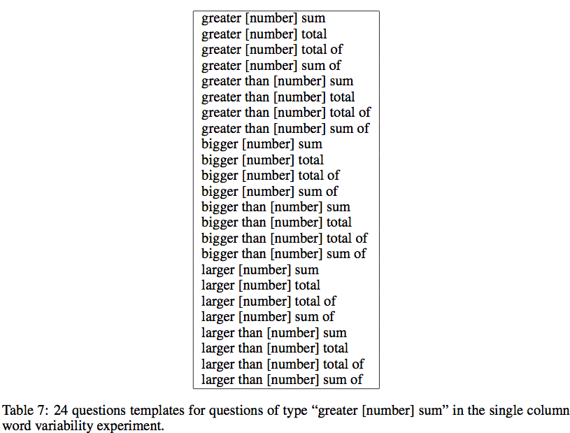

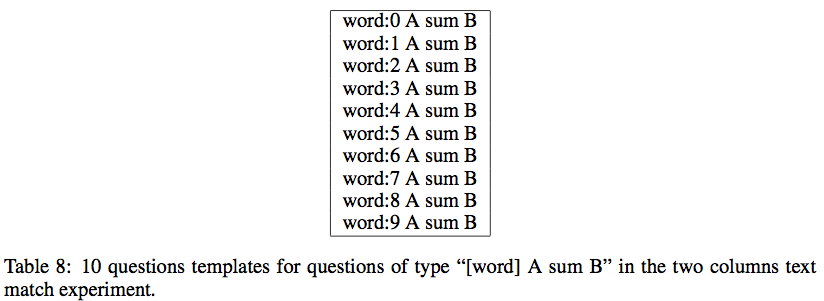

### results

Optimize:

- Adam (Kingma and Ba, 2014) by default value
- parameters init from [-0.1, 0.1]
- mini-batch size=50, embedding dim=256

Add gaussian noise:

- [Neelakantan et al. 2016] proof
- as a regularizer, gaussian of mu=0, var=curr_step^(-0.55), (Welling and Teh, 2011)

Gradient Clipping:

- Scaling the gradient when it exceeds a threshold([1,5,50]) (Graves, 2013)
- Adam epsilon [1e-6, 1e-8]
- delta [10, 25, 50]
- lambda [25, 50, 75, 100]

Others:

- >= 5 columns, use bi-RNN
- >= 10 columns, use attention

almost all errors were made when difference ops are needed

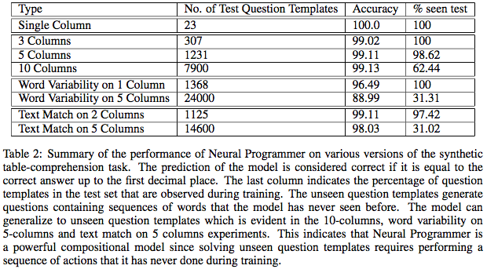

### compare with LSTM

LSTM settings:

- w/ and w/o attention
- attention heads (1, 5, 10)
- input table before & after the question

result:

- dataset: single column data with only scalar answers
- entries: [-10, 10] (80%), [-50, 50] (30%)
- rows: [4, 7]

> rough and no detail

Neural Programmers:

- 100% acc
- invariant to number scale and question length

### Induced Program Example

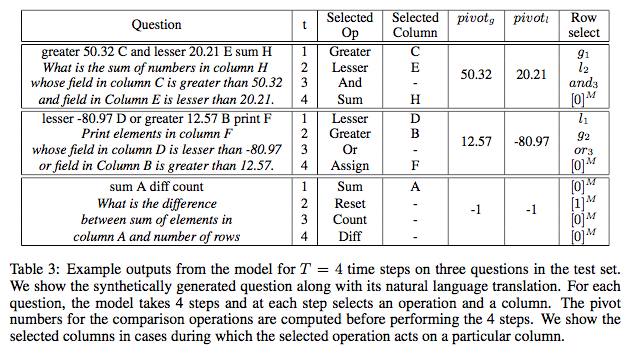

## Related Work

background:

- Semantic Parsing ...
- neural networks for CFG, knowledge repr, memory networks (not capable of doing complex reasoning)

Close related:

- Neural Programmer-Interpreter (Reed and Freitas, 2016) with program supervision
- Neural enquirer (Yin et al. 2015) with program supervision, also on tables
- dynamic neural module network (Andreas et al. 2016) with dep-tree

