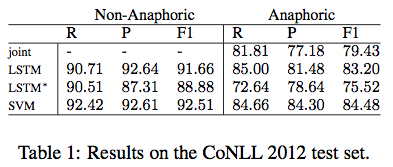
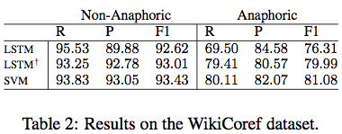
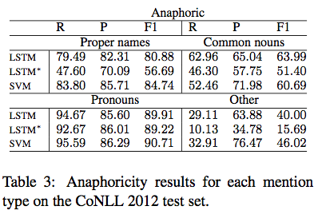
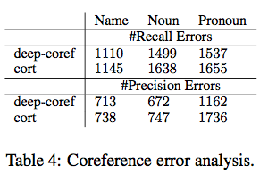

Nafise Sadat Moosavi and Michael Strube
Heidelberg Institute for Theoretical Studies gGmbH
Schloss-Wolfsbrunnenweg 35
69118 Heidelberg, Germany
{nafise.moosavi|michael.strube}@h-its.org

## Introduction

**Coreference resolution** - find mentions that refer to the same entity
**Anaphoricity detection** -  discriminates mentions that are coreferent with a previous mention

Useful mention categories for coreference resolution:

- non-referential: **It** is raining.
  - pronon _it_: Evans (2001), Muller (2006), Bergsma et al. (2008), Bergsma and Yarowsky (2011)
  - general noun phrases: Byron and Gegg-Harrison (2004) 
- Discourse-old mentions: all the mentions that occurs for not the first time
  - _Plato was a philosopher in Classical Greece. This philosopher is the founder of the Academy in Athens. Plato died at the age of 81._
  - **non-anaphoric mention** doesn't depend on previous mentions. e.g. the 2nd Plato
  - discourse-old detection is referred as **anaphoricity detection**
  - the original meaning of **anaphoric mention detection** is of no use for coreference resolution
  - state-of-the-art models learn **anaphoricity detection** jointly with coreference resolution
- Coreferent Mentions: vs. non-coreferent (Marneffe et al. 2015)
  - appears in the coreference chain
  - non-coreferent mentions can be non-referential noun phrases or entity is mentioned only once.
  
## Anaphoricity Detection Models

### Joint (Clark and Manning, 2016a)

Anaphoricity module:

- Layer 1
  - word embeddings of head, first, last, two preceding/following words of mention
  - syntactic parent (dep-tree)
- Layer 2
  - avg embedding of 5 previous/following words,
  - avg embedding of all mention words, all sentence words, all document words
- Layer 3
  - type, length, position and whether_is_nested for a mention

Combined and passed through 2 hidden layers.

### LSTM

1. replace the mention with a special placeholder
2. 10 prev words + <placeholder> + 10 following words + <sep1> + mention tokens + <sep2> + head token
3. Bi-LSTM
4. concatenate surface features:
  - mention type (proper, nominal(definite and indefinite), pronouns)
  - string match in the text, in the previous context
  - head match in the text, in the previous context
  - contains token of another mention
  - contains token of a previous mention
  - contained in another mention, in a previous mention
  - embedded in another mention
  
other LSTM models are considered but did not improve much while increased the training time:

- separate LSTM for mention and context
- longer sequences of previous words and attention

### SVM

SVM features in previous work (Coreferent mention detection): (Moosavi and Strube 2016)

- lemmas and POS of all words of a mention
- lemmas and POS of 2 prev/follow words
- mention string, length, type (proper, nominal, pronoun, list)
- string match in the text, head match in the text

Additional features for anaphoricity detection:

- string match/head match in the prev context
- mention words are contained in another mention, in a previous mention
- mention contains words of another mention, of a previous mention

Use Anchored SVM (Goldberg and Elhadad, 2007) with pruning, generalize better on new domains(Goldberg and Elhadad, 2009)

- polynomial kernel of degree 2
- remove feature-values that occur less than 10 times

## Evaluation

Performance

- CoNLL 2012 dataset
- same mention detection module for all models



Generalization

- on WikiCoref dataset (same annotation guideline as CoNLL 2012)
- trained on CoNLL only
- without and with vocabularies from WikiCoref (for LSTM)



Mention Types



Coreference Error

- cort (Martschat and Strube, 2015) with singleton features (Moosavi and Strube, 2016)
- state-of-the-art deep coreference resolver, i.e. deep-coref (Clark and Manning, 2016a)


