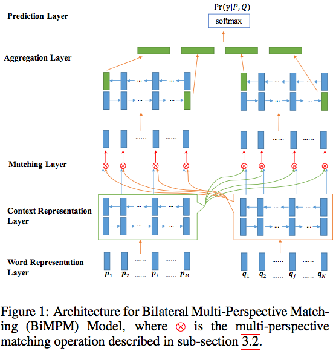
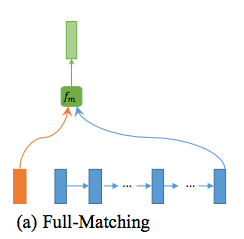
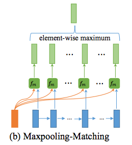
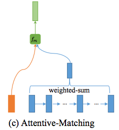
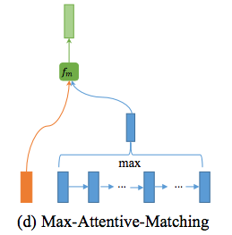
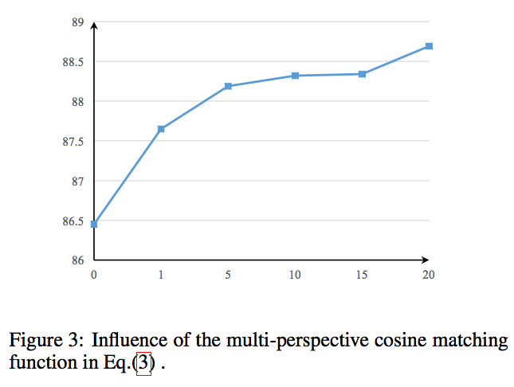
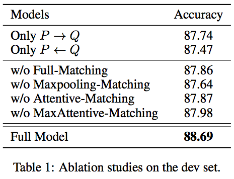
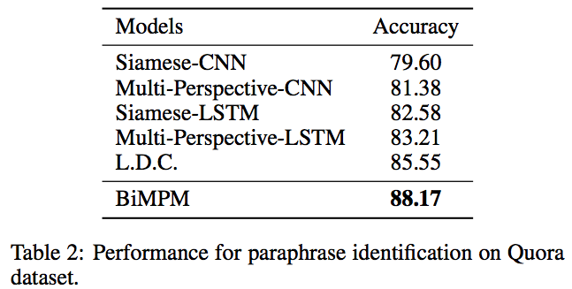
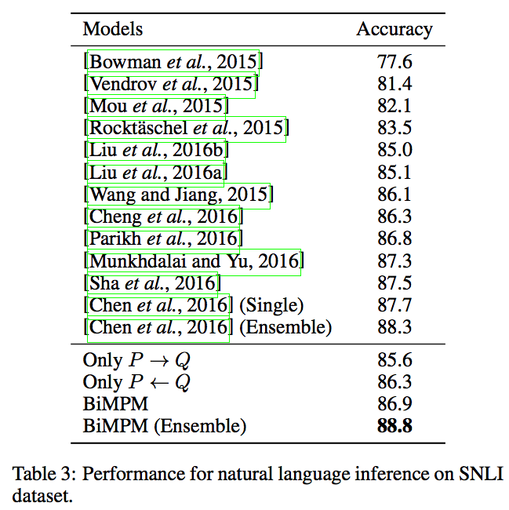
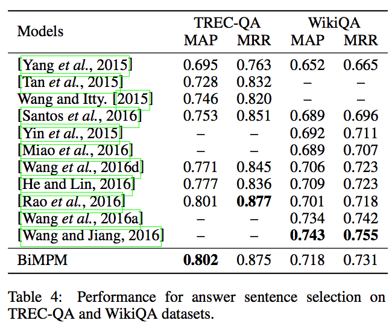

**Bilateral Multi-Perspective Matching for Natural Language Sentences**
Zhiguo Wang, Wael Hamza, Radu Florian
IBM T.J. Watson Research Center
1101 Kitchawan Rd, Yorktown Heights, NY 10598 {zhigwang,whamza,raduf}@us.ibm.com

## Background

Sentence Matching

- paraphrase classification
- entailment recognition
- Query-answer pair matching and candidate answer ranking

Two types of NN structures:

- _Siamese_ architecture: one encoder for both sentence + matching, _no interaction between two sequences_
- matching-aggregation (Wang and Jiang, 2016), matched firstly, then aggregated for final classification

Problems:

- only word-by-word matching, no other granularity
- only single direction matching

> reason not that plausible

Thus the new way:

1. BiLSTM
2. BiMatch, P to Q (p slice is matched with all q) and vice vesa
3. BiLSTM
4. FC Layer

## Task

An example is a triple

$$
(P, Q, y) = ( (p_1, p_2, \cdots, p_m), (q_1, q_2, \cdots, q_n), y)
$$

## Model



- Word Embedding Glove concat Characters within a word LSTM
- BiLSTM for context representation
- Multi-pespective matching
- BiLSTM for aggregation
- 2 layer FFN

### Multi-pespective Matching

define a multi-perspective matching function (different weighted cosine for all **perspectives**):

$$
\begin{align}
m &= f_m( v_1,v_2; W) \\
m_k &= \cos(W_k \circ v_1, W_k \circ v_2)
\end{align}
$$

and concatenate all the four strategies:

**Full Match**

match a p slice with the final q, in both directions

$$
\overrightarrow m_i^{full} = f_m (\overrightarrow h_i^p, \overrightarrow h^q_N; W^1) \\
\overleftarrow m_i^{full} = f_m (\overleftarrow h_i^p, \overleftarrow h^q_1; W^2)
$$



**Maxpooling Matching**

match a p slice with all q slices, and use max pooling

$$
\overrightarrow m_i^{max} = \max_{j\in(1\cdots N)}f_m (\overrightarrow h_i^p, \overrightarrow h^q_j; W^3) \\
\overleftarrow m_i^{max} = \max_{j\in(1\cdots N)}f_m (\overleftarrow h_i^p, \overleftarrow h^q_j; W^4)
$$



**Attentive-Matching**

match a p slice with an attentive q repr

$$
\begin{align}
\overrightarrow\alpha_{i,j} &= cosine(\overrightarrow h_i^p, \overrightarrow h_j^q), j = 1, \dots, N \\
\overleftarrow\alpha_{i,j} &= cosine(\overleftarrow h_i^p, \overleftarrow h_j^q), j = 1, \dots, N \\
\overrightarrow h_i^{mean} &= \frac{\sum_j \overrightarrow\alpha_{i,j}\overrightarrow h_j^q}
  {\sum_j \overrightarrow\alpha_{i,j}} \\
\overleftarrow h_i^{mean} &= \frac{\sum_j \overleftarrow\alpha_{i,j}\overleftarrow h_j^q}
  {\sum_j \overleftarrow\alpha_{i,j}} \\
\overrightarrow m_i^{att} &= f_m(\overrightarrow h_i^p, \overrightarrow h_i^{mean}; W^5) \\
\overleftarrow m_i^{att} &= f_m(\overleftarrow h_i^p, \overleftarrow h_i^{mean}; W^5) \\
\end{align}
$$



**Max-Attentive-Matching**

match a p slice with a max-pooling over attentive q slices, instead of weighted sum



## Experiments

settings:

- char embedding is 20-d, word is composed to 50d by LSTM
- all BiLSTM uses 100d
- perspectives = 20
- dropout ratio = 0.1, learning rate = 0.001
- word embedding not updated

multi-pespective(on paraphrase): l = 1, 5, 10, 15, 20



bi-direction and four matching strategies(on paraphrase):



Paraphrase (on Quora Question Pairs (400k)):



RTE(SNLI):



Answer Selection(WikiQA):







