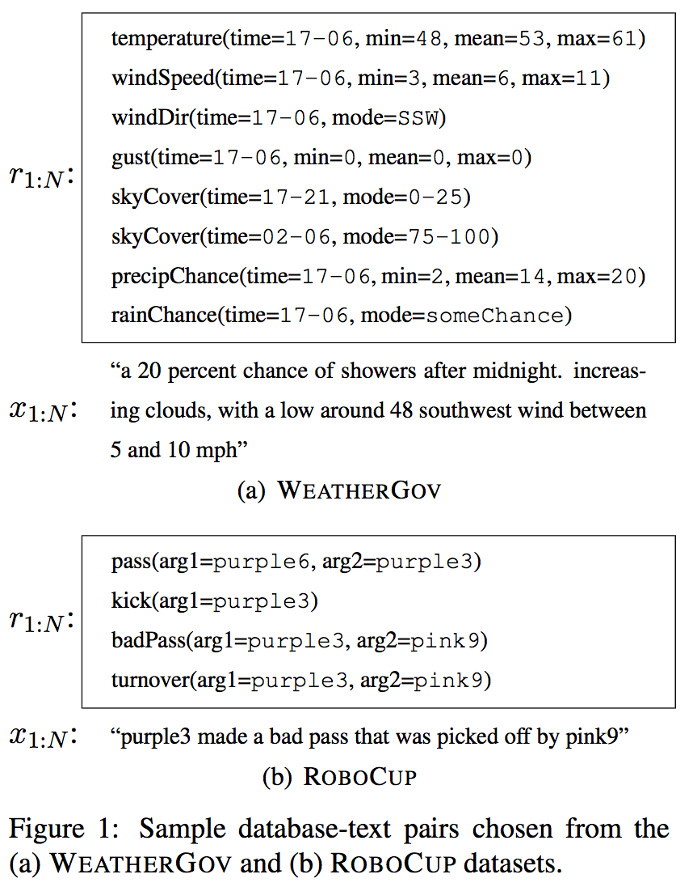
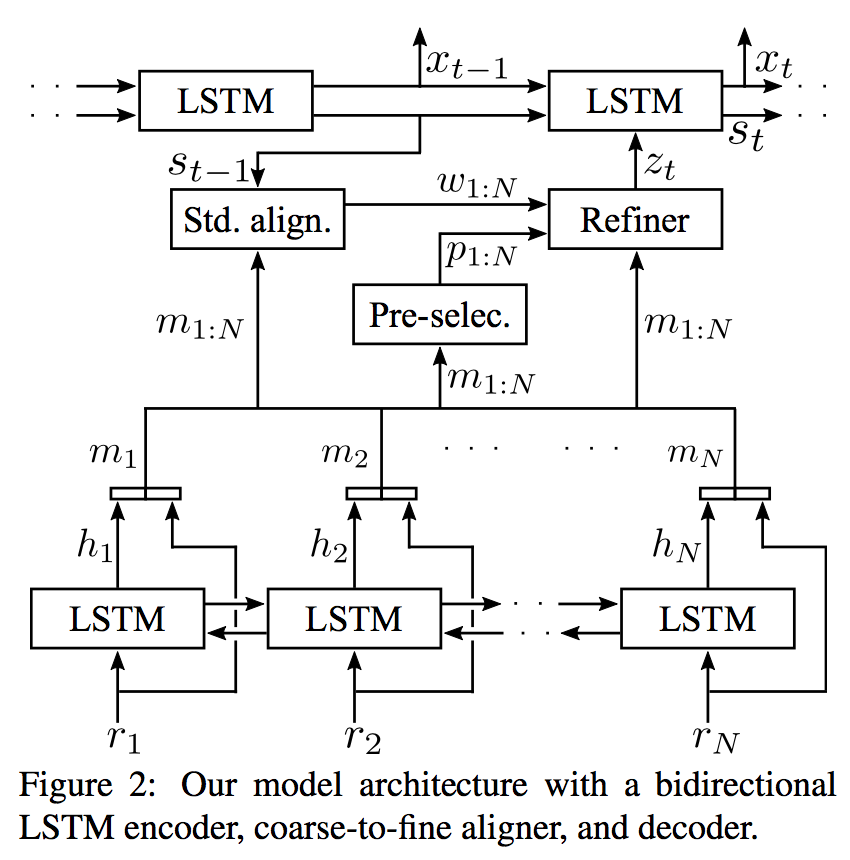
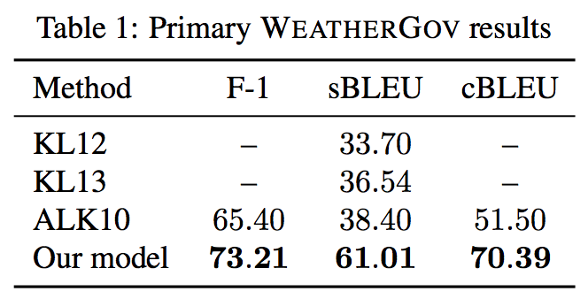
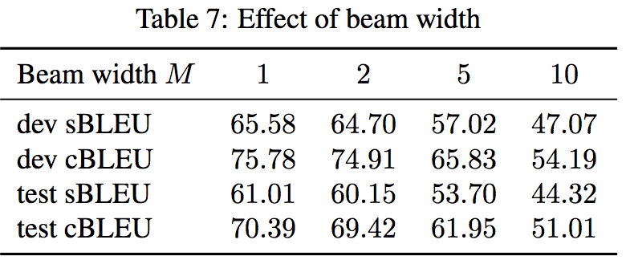
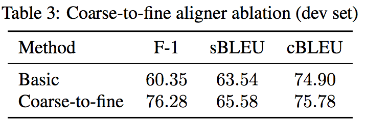
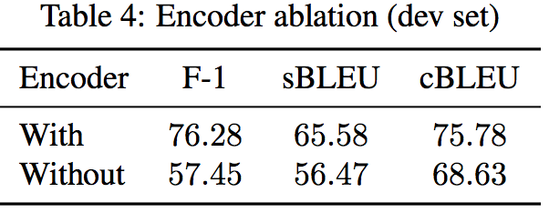
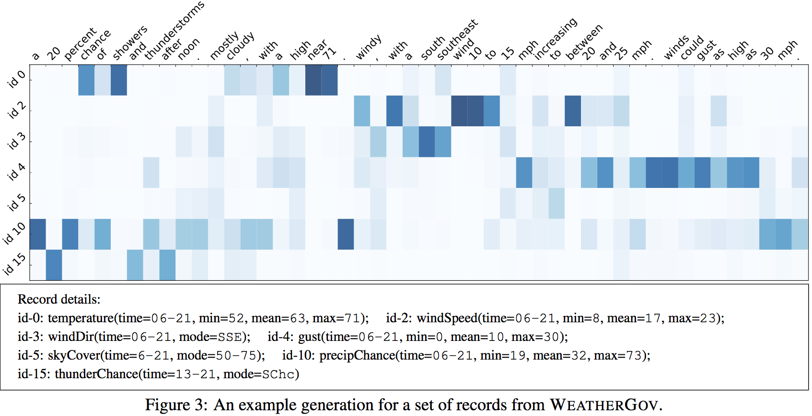
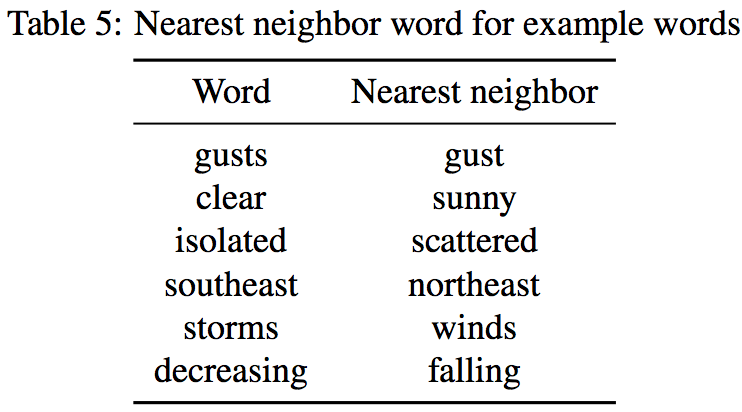

**What to talk about and how? Selective Generation using LSTMs with Coarse-to-Fine Alignment**

Hongyuan Mei, Mohit Bansal, Matthew R. Walter
Toyota Technological Institute at Chicago
Chicago, IL 60637
{hongyuan,mbansal,mwalter}@ttic.edu

## Introduction

the task: given a set of structural dataset, generate a description sentence (two main phases)

Previous work is either:

- template-based
- domain-dependent(parsers, NER tools, features)
- learning contenct selection and surface realization separately

A neural encoder-aligner-decoder

- encoder is essential
- coarse-to-fine aligner because selective generation requires identifying the small number of salient records among an over-determined database
- beam search v.s. greedy decoder

## model

LSTM-based encoder-decoder with attention:

### Common prob. model

$$
\begin{align}
x^*_{1:T} &= \arg\max_{x_{1:T}} P(x_{1:T} \mid r_{1:N}) \\
          &= \arg\max_{x_{1:T}} \prod_{t=1}^T P(x_t \mid x_{0:t-1}, r_{1:N})
\end{align}
$$

### LSTM Encoder

each output $h_j$ is a concatenation of output in both direction

$$
\begin{align}
\begin{pmatrix} i^e_j \\ f^e_j \\ o^e_j \\ g^e_j \end{pmatrix}
 &= \begin{pmatrix} \sigma \\ \sigma \\ \sigma \\ \tanh \end{pmatrix}
 T^e \begin{pmatrix} r_j \\ h_{j-1} \end{pmatrix} \\

c^e_j &= f^e_j \odot c^e_{j-1} + i^e_j \odot g^e_j \\
h_j &= o^e_j \odot \tanh(c^e_j)
\end{align}
$$

### Coarse-to-fine Aligner

Only a small subset of **salient** records are **relevant** to the output sentence.

1\. concat both hidden repr and original record

$$
m_j = (r^T_j; h^T_j)^T, j \in \{1, \dots, N\}
$$

2\. use a **pre-selector** assign a prob. to each record

the summation of all p_j can be regarded as an approx. to the total number of selected records(gamma)

$$
p_j = sigmoid(q^T\tanh(Pm_j)), j \in \{1, \dots, N\}
$$

3\. use a standard aligner to compute alignment prob. at timestep t

$$
\begin{align}
\beta_{tj} &= v^T\tanh(Ws_{t-1} + Um_j) \\
w_{tj} &= \frac{\exp(\beta_{tj})}{\sum_{j'}\exp(\beta_{tj'})}
\end{align}
$$

4\. the refiner produce final selection decision

$$
\begin{align}
\alpha_{tj} &= \frac{p_j w_{tj}} {\sum_{j'} p_{j'} w_{tj'}} \\
z_t &= \sum_j \alpha_{tj} m_j
\end{align}
$$

### decoder

$$
\begin{align}
\begin{pmatrix} i^d_j \\ f^d_j \\ o^d_j \\ g^d_j \end{pmatrix}
 &= \begin{pmatrix} \sigma \\ \sigma \\ \sigma \\ \tanh \end{pmatrix}
 T^d \begin{pmatrix} Ex_{t-1} \\ s_{j-1} \\ z_t \end{pmatrix} \\

c^d_j &= f^d_j \odot c^d_{j-1} + i^d_j \odot g^d_j \\
s_t &= o^d_t \odot \tanh (c^d_t) \\
l_t &= L_0(Ex_{t-1} + L_s s_t + L_z z_t) \\
P_{x,t} &= softmax(l_t)
\end{align}
$$

### training

regularization term:

- prob. in pre-selector should be close to some value
- at least one record should be selected

$$
\begin{align}
L &= -\log P(x^*_{1:T} \mid r_{1:N}) + G \\
  &= -\sum_{t=1}^T \log P(x^*_t \mid x_{0:t-1}, r_{1:N}) + G \\
G &= (\sum_{j=1}^N p_j - \gamma)^2 + (1 - \max(p_j))
\end{align}
$$

## Experiments

Setup:

- hidden units = 500 from {250, 500, 750} (WeatherGov)
- gamma = 8.5 from {6.5, 7.5, 8.5, 10.5, 12.5} (WeatherGov)
- gamma = 5.0 from {1.0, 2.0, ..., 6.0} (RoboCup)
- mini-batch = 100
- Adam, coverage up to 30

Metric:

- F1 for content selection
- s(tandard)BLEU (4-gram) for surface realization
- c(ustomized)BLEU not to penalize numerical derivations within 5 (low 58 = low 60)
- sBLEUg for the case that ground-truth content selection is given

### Primary

### Beam Filter with k-NN

beam search performs worse than greedy search:

k-NN steps:

1. do a standard beam search with size M
2. find the K neighbors (examples: pair of database,description) from training data for the given record
3. compute BLEU score with these K neighbors for each of the M candidates
4. choose the best candidate (not clear about sum over K or just choose the best)

### ablation on WeatherGov

aligner(compared with attention in NMT(Bahdanau et al. 2014))

encoder:

### qualitative analysis on WeatherGov

- good match: windDir and southeast, temperature and 71
- bad match: cloudy and temperature/precipitation

### Embedding matrix

- init. with the pretrained and then refine (better)
- concatenate the matrix and the pretrained

