Program Induction 原本只是说从样例输入和输出导出一段程序，即自动写出代码。但为了把各种方法都涵盖起来，这里把它的定义进一步推广：给定了一些输入和输出的样本，希望能自动导出一个计算模型，使之能够在给定输入下产生对应输出，并且在未来的新输入下也产生正确的输出。
计算模型这个词也有点玄乎，但最常见的计算模型就是程序代码，从低层次的图灵机到各种各样的高级语言都可以视为计算模型，但也有不能完全写成确定性代码的统计模型，比如神经网络等。

可以把现有的 Program Induction 方法分为三种[Murray and Krishnamurthy, 2016]：

- Inductive Logic Programming and Program Synthesis, 主要在无噪声的环境下处理输入输出，前者工作已经较少
- Probabilistic Programming Language, 主要扩展到了有噪声环境
- Neural Abstract Machines, 对计算机做抽象并应用神经网络方法

根据自己理解总结，下表可能有误：

| Work                   | Type                    | Task                                     | Explicit Code Output | Training                 | Perfect Generalization | Search Technique |
| ---------------------- | ----------------------- | ---------------------------------------- | -------------------- | ------------------------ | ---------------------- | ---------------- |
| NP (Neeklakantan)      | Neural Abstract Machine | Table QA(syn)1                           | Continuous 2         | Weak supervision         | Partial 3              | GD               |
| DNS (Graves)           | Neural Abstract Machine | bAbI, Graph Query                        | No                   | Supervised               | No                     | GD               |
| Coupling (Mou)         | Neural Abstract Machine | Table QA(syn)                            | Continuous           | Weak supervision         | No                     | GD+REINFORCE     |
| NSM (Liang)            | Neural Abstract Machine | Table QA(syn)                            | Yes                  | Weak supervision         | No                     | REINFORCE        |
| Neural Forth (Bošnjak) | Program Synthesis       | Bubble Sort + Addition                   | Continuous           | I/O and machine states   | Partial                | GD               |
| HGCNN (Gong)           | Program Synthesis       | Synthetic Tasks 4                        | Yes                  | Unsupervised (Generated) | No                     | ?                |
| DeepCoder (Balog)      | Program Synthesis       | DSL Sample 5                             | Yes                  | Unsupervised (Generated) | No                     | GD+Enumeration   |
| R3NN (Parisotto)       | Program Synthesis       | DSL Sample + FlashFill                   | Yes                  | Unsupervised (Generated) | No                     | Generative Model |
| NPI (Reed)             | Program Synthesis       | Addition + Bubble Sort + Car canonicalcize | Yes                | Supervised (Traces)      | No                     | GD               |
| NPI + Recursion (Cai)  | Program Synthesis       | Addition + BubbleSort + QuickSort + Topo. Sort | Yes            | Supervised (Traces)      | Yes (Proven)           | GD(Adam)         |
| Neural FP (Feser)      | Probabilistic PL        | Synthetic Tasks                          | ?                    | Supervised               | Partial                | GD               |
| NTPT (Gaunt)           | Probabilistic PL        | Arithmetic on Image                      | ?                    | Weak supervision         | No                     | ?                |

表中：

1. 自己合成的 QA 数据集
2. 实际生成的是代码(操作符)的概率，选概率最大即可得到一系列显式代码
3. 在一部分任务上达到了100%泛化
4. 在自定义的一些合成任务上完成
5. 在 DSL 中随机采样得到的数据集上完成

## Neural Programmer

本文出自 Google Brain 的 Neelakantan(实习) 等人。他们在自己生成的表格数据集上做问答任务。

出发点是希望能用神经网络做代数和逻辑推理，而传统神经网络做不到这点(Joulin and Mikolov, 2015)。因此他们考虑将代数和逻辑**操作符**和神经网络结合。因此他们的方法有三个特点：使用代数和逻辑操作符、弱监督学习、可微分。

核心做法是迭代地选择操作符并保存结果，在T次迭代后停止。

**表格数据集生成**

每个单元格：训练集在[-100, 100]随机选一个数，测试集[-200, 200]随机
行数：训练集有[30, 100]行，测试集固定有120行
另有一个10个词的字典，用于随机生成字符文本

每个表格数据集提的问题由模板生成，模板为如“greater [number] sum”(单列表格)和“greater [number1] A and lesser [number2] B sum A”(多列表格)等，分别表示“比[number]大的数求和”和“A列比[number1]大并且B列比[number2]大并对A列求和”

**具体模型**

问句使用普通 RNN 编码：

$$
z_i = \tanh(W^{question}[z_{i-1};V(word_i)]),\,\,\forall i = 1, 2, \cdots, q
$$

使用什么操作符、对哪一列作操作则各是一个 MLP + softmax 分类器：

$$
\alpha_t^{op} = softmax(U\tanh(W^{op}[q;h_t])) \\
\alpha_t^{col} = softmax(P\tanh(W^{col}[q;h_t]))
$$

每次的迭代操作会维护三个变量：

- 标量，数值，初始为0，当问题的答案是具体数字时输出这个
- 选中概率矩阵，M行C列的矩阵，每个格子表示对应的表格数据被选中的概率，当问题答案是很多个单元格时使用这个
- 行选中向量，有M行的向量，每个元素表示对应行被选中的概率

> 最后第T步看标量和选中概率矩阵中哪个更新，就认为问题的答案是对应类别，输出那个改变的值

共有10种预先定义的操作，而每个都会使用上面的变量值，例如对第j列求和（只用到行选择矩阵和原始表格）：

$$
sum_t[j] = \sum_{i=1}^M row\_select_{t-1}[i]*table[i][j],\forall i=1,2,\dots, C
$$

> 对于字符串的 match 操作还用到了 attention

而最后再将所有操作值加权求和，以更新上面的三个变量

$$
\begin{align}
scalar\_answer_t &= \alpha_t^{op}(count)count_t + \alpha_t^{op}(diff) diff_t + \sum_{j=1}^C\alpha_t^{col}(j)\alpha_t^{op}(sum)sum_t[j], \\
lookup\_answer_t[i][j] &= \alpha_t^{col}(j)\alpha_t^{op}(assign)assign_t[i][j], \forall (i, j) \\
row\_select_t[i] &= \alpha_t^{op}(and)and_t[i] + \alpha_t^{op}(or)or_t[i] + \alpha_t^{op}(reset)reset_t[i] + \\
    & \sum_{j=K+1}^C \alpha_t^{col}(j)(\alpha_t^{op}(greater)g_t[i][j] + \alpha_t^{op}(lesser)l_t[i][j]) + \\
    & \sum_{j=1}^K \alpha_t^{col}(j)\alpha_t^{op}(text\_match)text\_match_t[i][j], \forall(i, j)
\end{align}
$$

而上面的内容算完后则简单用 RNN 保存历史记录：

$$
\begin{align}
c_t &= [(\alpha^{op}_{t-1})^TU;(\alpha^{col}_{t-1})^TP] \\
h_t &= \tanh(W^{history}[c_t; h_{t-1}]), \forall i = 1, 2, \cdots, Q
\end{align}
$$

**优化目标**

$$
\begin{align}
L_{scalar}(scalar\_answer_T, y) &= \begin{cases}
\frac{1}{2}a^2, &\text{ if } a\le \delta \\
\delta a - \frac{1}{2}\delta^2, &\text{ otherwise}
\end{cases} \\
a &= \lvert scalar\_answer_T - y \rvert \\
L_{lookup}(lookup\_answer_T, y) &= - \frac{1}{MC}\sum_{i,j}(y_{i,j}\log(lookup\_answer_T(i,j))+
    (1-y_{i,j})\log(1-lookup\_answer_T(i,j))) \\
L &= \frac{1}{N}\sum_{k=1}^N([n_k == True]L_{scalar}^k+[n_k==False]\lambda L_{lookup}^k)
\end{align}
$$

**实验小结**

实验效果显示，在单列问题上达到了100%正确率，在多列和字符串问题上也都高于98%，并且复杂的实验中训练集见过的模板只有62%甚至更低，依然达到了不错的准确率，说明模型有一定泛化能力。

对于一些具体 case，得到了如下图可以看到模型每步做了什么选择：

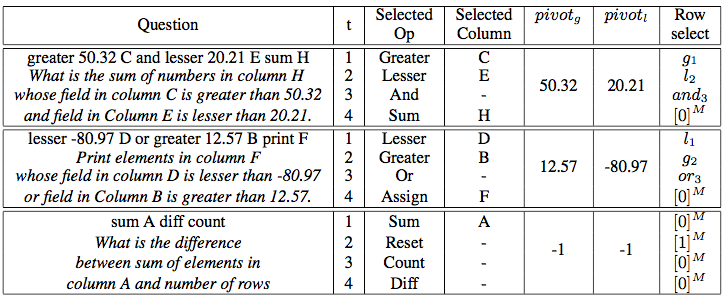

## Neural Programmer-Interpreters

这篇相关工作来自于 Google DeepMind，和前一篇连标题都只差一个字，也是一样发表在 ICLR-2016 上。

他们的核心做法是提出了一种通用核心(LSTM)+具体任务的组合框架。核心部分负责选择每一步要执行的子程序，以及“入栈”和“退栈”，而具体子程序则负责在不同情境下执行不同的任务。

他们的方法需要完整的程序代码作为训练，并且需要针对不同任务设计，但是核心部分可以跨任务共享参数。核心部分，以及不同环境和子程序交互如下：

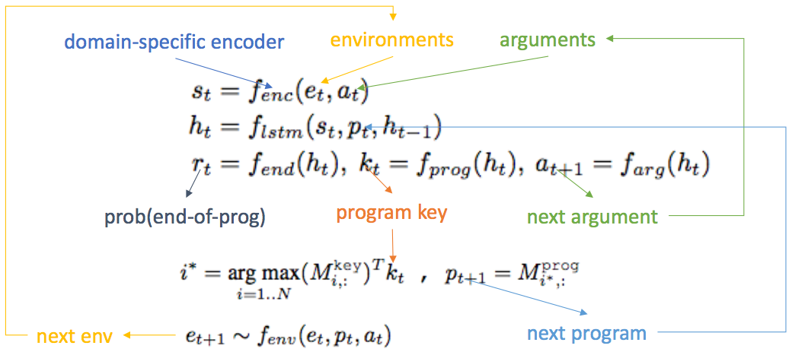

不同的环境需要不同设计，例如对小学竖式加法程序的环境函数定义为：

$$
f_{enc}(Q,i_1,i_2,i_3,i_4,a_t) = MLP([Q(1,i_1),Q(2,i_2),Q(3,i_3),Q(4,i_4),a_t(1),a_t(2),a_t(3)])
$$

对具体情形，生成的程序如下：

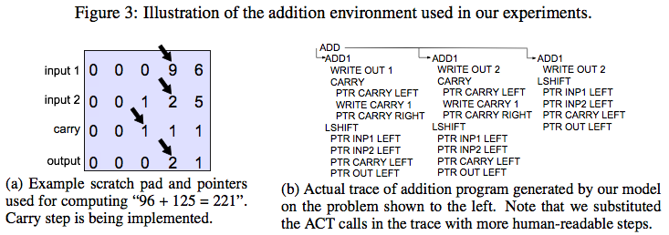

实验效果表明这种框架相比 seq2seq 模型有强得多的泛化能力，需要的标注数据也少了许多

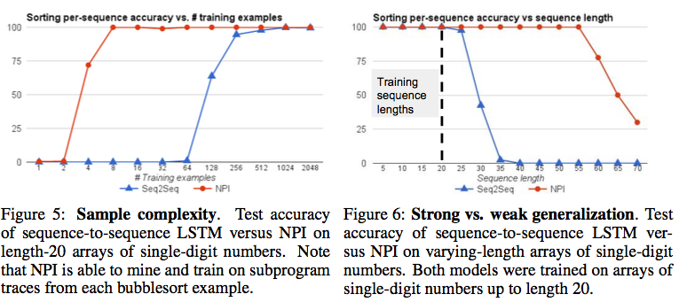

## Hybrid Computing

这篇工作来自于 DeepMind，发表在 Nature 上。他们的想法是模仿计算机底层实现，使用深层LSTM在给定大小的内存上进行读写，完成对应任务。这样做既可以使用内存来处理数据结构，又能像神经网络一样可以从样本学习参数。

> 所谓“处理数据结构”是很随意的形容，他们这里并没有显式指出所谓数据结构是什么

**核心深层LSTM**

输入为：当前输入 x、上一次读出的 R 个内存向量、上一次的内存状态。将前两者拼起来：

$$
\chi_t = [x_t; r_{t-1}^1; \dots; r_{t-1}^R]
$$

所用深度 LSTM 有 L 层，任意的第 l 层就是普通的 LSTM，结构如下

$$
\begin{align}
i_t^l &= \sigma(W_i^l[\chi_t; h_{t-1}^l; h_t^{l-1}] + b_i^l) \\
f_t^l &= \sigma(W_f^l[\chi_t; h_{t-1}^l; h_t^{l-1}] + b_f^l) \\
s_t^l &= f^l_ts^l_{t-1} + i_t^l \tanh (W_s^l[\chi_t; h_{t-1}^l; h_t^{l-1}] + b_s^l) \\
o_t^l &= \sigma(W_o^l[\chi_t; h_{t-1}^l; h_t^{l-1}] + b_o^l) \\
h_t^l &= o_t^l \tanh(s_t^l)
\end{align}
$$

最终输出变换为：

$$
\begin{align}
v_t &= W_y[h_t^1;\dots; h_t^L] \\
y_t &= v_t + W_r[r_t^1; \dots; r_t^R]
\end{align}
$$

**与内存交互**

读内存时，只需要确定一系列的读权重 w\_t 即可得到所有的 R 个读出值 r\_t ：

$$
\begin{align}
w_t^{r,1}, \dots, w_t^{r,R} &\in \Delta_N = \{ \alpha\in \mathbb{R}^N : \alpha_i \in [0, 1], \sum_{i=1}^N \alpha_i \le 1 \} \\
r_t^i &= M_t^T w_t^{r,i}, \forall i =\in \{1,2, \dots, R\}
\end{align}
$$

写内存时，除了一个写入权重 w 和写入向量 v 之外，本文还设计了一个擦除向量 e，可以先按写入权重将内存中擦除一部分。

$$
w_t^w \in \Delta_N, e_t \in [0, 1]^W, v_t \in \mathbb{R}^W \\
M_t = M_{t-1} \circ (E - w_t^We^T_t) + w_t^Wv_t^T
$$

**确定读写权重**

还是用上面的 LSTM 输出，做线性变换得到另一个接口参数向量

$$
\xi_t = W_\xi[h_t^1;\dots; h_t^L]
$$

这个参数中的各维可以分割出对应的值：

$$
\xi_t = [k_t^{r,1};\dots; k_t^{r,R}; \hat\beta_t^{r,1}; \dots;\hat\beta_t^{r,R}; k_t^W; \hat\beta_t^w;
\hat e_t; v_t; \hat f_t^1; \dots; \hat f_t^R; \hat g_t^a; \hat g_t^w; \hat\pi_t^1; \dots; \hat\pi_t^R
]
$$

分别根据取值范围用 sigmoid 或者 oneplus ($=1 + log(1 + \exp(x))$) 对上面带 hat 的参数进行归一化。继续后面的三种 attention 值。

**按内容寻址**

直接用 key 的值与内存内容进行比较，取值。即

$$
C(M,k,\beta)[i] = \exp(D(k, M[i,\cdot])\beta) / \sum_j exp(D(k, M[j,\cdot])\beta)
$$

其中 D 为余弦相似度，beta 为所谓比较强度，可以进行 softmax 的微调。

**确定写入权重**

传统计算机中操作系统会维护一个可用内存表，以便知道哪个内存空闲可以用来分配，这里也同样维护 R 个空闲门(free gate)，以便判断上一次读出的内存是否可以再分配。

$$
\begin{align}
\psi_t &= \prod_{i=1}^R(1 - f_t^i w_{t-1}^{r,i}) \\
u_t &= (u_{t-1} + w_{t-1}^w - u_{t-1}\circ w_{t-1}^w)\circ \psi_t
\end{align}
$$

对使用向量排序得到 phi（第一个为使用最少的内存），再计算分配向量，分配向量每个维度越大，表示对应内存的那个位置可以分配出去的程度越大。

$$
a_t[\phi_t[j]] = (1 - u_t[\phi_t[j]])\prod_{i=1}^{j-1}u_t[\phi[i]]
$$

最后用分配门和写入门，并结合按内容寻址所得权重，可以计算得到最后的写入权重：

$$
c_t^w = C(M_{t-1}, k_t^w, \beta^w_t) \\
w_t^w = g_t^w[g_t^a a_t + (1 - g_t^a) c_t^w]
$$

这里所有用到的门、内容寻址的 key 等等都由上面的参数向量得出。

**确定读出权重**

引入一个时序内存链接矩阵 L：L[i,j] 表示 位置 i 在位置 j 更新后接着被更新的程度。

每次都记录一个位置被修改的程度：

$$
p_0 = 0 \\
p_t = (1 - \sum_i w_t^w[i]) p_{t-1} + w_t^w
$$

然后更新链接矩阵：

$$
L_0[i, j] = 0 \\
L_t[i, i] = 0 \\
L_t[i, j] = (1 - w_t^w[i] - w_t^w[j])L_{t-1}[i, j] + w_t^w[i]p_{t-1}[j]
$$

这样所得 L 矩阵可以推算下一次或上一次的读概率（分别叫做前向和后向权重），再用一个加权求和与按内容寻址相结合：

$$
\begin{align}
f_t^i &= L_t w_{t-1}^{r,i} \\
b_t^i &= L_t^T w_{t-1}^{r,i} \\
c_t^{r,i} &= C(M_t, k_t^{r,i}, \beta_t^{r,i}) \\
w_t^{r,i} &= \pi_t^i[1]b_t^i + \pi_t^i[2]c_t^{r,i} + \pi_t^i[3]f_t^i
\end{align}
$$

这里用到的所有门、内容寻址 key 等也都由上面的参数向量得出。

**与神经图灵机的比较**

这篇文章的作者与2014年的神经图灵机是同一人，因此他们也做了一些分析。二者有相同的结构：神经网络和外部内存。区别在于交互上 

- 本文用按内容寻址而不是按地址寻址，因此不会连续分配内存，因此不用担心内存块的重叠干扰
- 本文引入了空闲门来删除一些用不到的内存
- 本文引入了时序链接矩阵来保证顺序的信息哪怕跳得很远也能保留。

本文的功能性实验设置在 bAbI 数据集、图数据和 mini-SHRDLU 小游戏上，模型理论的实验也有很多，此处从略。

## Coupling Distributed and Symbolic Execution

本文是来自华为诺亚方舟的工作。所做任务为表格数据上的问答。本文出发点在于神经网络的查询器(Yin et al. 2016)需要大量矩阵计算，又缺乏可解释性。而符号方式的做法需要穷举指数级状态，用到了强化学习的 REINFORCE 算法又容易收敛到局部最优。因此这里提出了一种结合二者的方法。

**神经网络方法**

主要参考了之前的工作(Yin et al. 2016)。这里的方法也是迭代计算，类似[Neelakantan et al. 2016]的想法，一遍一遍地算出结果直到最后。因为是针对表格的问答，因此每轮的结果包括两个，一个是对表格各列的权重分布 p，一个是行的权重 r。

$$
\begin{align}
c^{(t-1)}_{select}[i] &= \sum_j p_{f_j}^{(t-1)}c_{ij} \\
r_i^{(t-1)} &= r_i^{(t-1)}\cdot c^{(t-1)}_{select}[i] \\
g^{(t-1)} &= MaxPool_i\{c^{(t-1)}_{select}[i]\} \\
p_{f_j}^{(t)} &= softmax(MLP([q;f_j;g^{(t-1)}])) \\
r_i^{(t)} &= sigmoid(MLP([q, g^{(t-1)}, r^{(t-1)}, c^(t)_i]))
\end{align}
$$

**符号方法**

这是本文提出的一个基础方法。先引入如 select\_row, argmin, greater\_than, select\_value 等符号，然后用 RNN 迭代地对操作符以及字段用 softmax 分类：

$$
\begin{align}
h^{(t)}_{op} &= sigmoid(Wh_{op}^{(t-1)}) \\
h^{(0)}_{op} &= q \\
p^{(t)}_{op} &= softmax(w_i^T h_{op}^{(t-1)}) \\
p^{(t)}_{f_j} &= softmax(f_j^T h_{field}^{(t-1)}) \\
\end{align}
$$

**结合**

由于符号方法使用 REINFORCE 训练极易受到初始化的影响，很容易收敛到局部最优，需要一个较好的选初始解的方法。
这里两种方法都用到了迭代中间结果求解的方式，则本文直接将神经网络的方法中间输出作为符号方法的监督信息，获得了很好的效果。

## Neural Symbolic Machine

本文是 Google 总部的工作。本文认为，现有的NN方法抽象过于低层次（如神经图灵机），并且追求可以微分，导致很难与现代计算机的离散内存相结合，同时也限制了它们的使用范围，只能解决很小的人工构造的任务。据此出发，本文提出的方法不可微分，但具有抽象、可扩展、精确等三个特点。本文解决的是基于 Freebase 的问答，实验在 WebQuestionSP 数据集上完成。

本文以“经理-程序员-计算机”的比喻做了三层抽象：经理提出问题，程序员写出程序，计算机负责执行程序，同时也给程序员提供代码补全等帮助，程序员再把答案给经理，经理提供奖赏值。

**模型细节**

本文首先定义了计算机模块。它执行的是 LISP 风格的四种语句：

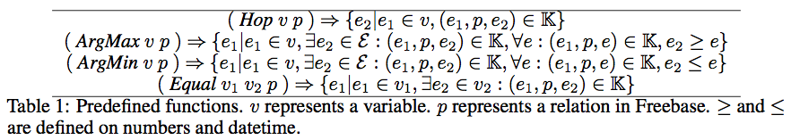

同时计算机可以代码补全，例如限制 Hop 语句中的 p 必须是从 v 出发的关系。

程序员模块就是一个量变都用 GRU 的 seq2seq 模型，在 decoder 部分使用了 attention，encoder 部分使用与[Yih et al. 2015]相同的办法先做了 entity 识别，并放到一个 Key-value 内存中，key 为 GRU 的输出，value 为 entity token 或 list。而 decoder 部分在遇到反括号时立刻执行该表达式，此时 GRU 的输出作为 key，执行结果作为 value 放入内存。

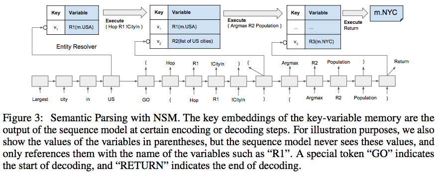

至此，可以解释本文工作的三个特点：

- 抽象：指没用用低层次操作而是用 lisp 风格的表达式
- 可扩展：可以在整个 freebase 上执行
- 精确：使用准确的 token 而不是 embedding

训练使用了通常的 REINFORCE 算法(Williams, 1992)。为了解决局部最优的问题：本文设计了一个最大似然损失用于寻找近似的最优程序。
对每个问题，要求最优程序是奖赏最高并且最短的，将优化目标改为这类最优程序的最大似然。同时应用了课程学习(curriculum learning)的方法，人工地逐渐增加程序的复杂度。最后将最大似然的结果与 REINFORCE 线性加权。

**实验结论**

在不使用 Semantic Parsing 结果时取得了较好结果(69%)，但比用上 Semantic Parsing 的[Yih et al. 2016]方法的效果还差2.7个百分点。

只用最大似然的优化目标在验证集上达到了 60.1% 而与 REINFOCE 结合以后达到了 67.2%。

用课程学习 F1 值达到了 89.5% 提升了11个百分点。

## Programming with A Differentiable Forth Interpreter

本文出自 UCL，投稿到了 ICLR-2017 上待审。本文主要基于一种叫做 sketch(Solar-Lezama et al. 2005) 的 Program Synthesis 方法。考虑到人写程序的时候一般会写一个梗概，然后再逐渐填补各部分的细节。基于此，他们设计了一个方法可以让人先写出一部分程序代码，然后用样本去训练剩余的部分。因此，这些写的时候留空的细节被称为 slot，需要由神经网络补全。

**Forth**

原始的 Forth 是一个基于栈的编程机器，这个机器 S 包括一个数据栈 D、一个返回地址栈 R、一个外置的随机访问内存 H 和一个程序计数器 c。Forth 程序是一个“字”序列，每个字是一个关键字或者用户定义的子程序名，每个字都可以把机器 S 从一个状态变为另一个状态（比如把一个栈顶元素增加1）。

本文首先把符号化的 S 提升为连续表示：D(栈顶元素d)、R(栈顶元素r)、H 上面位置 a 的读写操作都分别变为：

$$
read_M(a) = a^TM \\
write_M(x,a): M \leftarrow M - (a \otimes 1) \odot M + x \otimes a, \\
\forall M \in \{D, R, H\}
$$

从而入栈和出栈就变为：

$$
push_M(x): write_M(x, p), [side-effect: p \leftarrow inc(p)] \\
pop_M(): read_M(p), [side-effect: p \leftarrow dec(p)] \\
p \in \{d, r\}, inc(p) = p^T R^+, dec(p) = p^T R^-
$$

其中 R+/R- 分别为左右循环移动矩阵。

**待训练函数**

每个待训练函数都是一个 encoder-decoder 过程，encoder 是一个 MLP，而 decoder 则消耗 encoder 产生的表示以生成新的状态。

encoder 可以选择

- static 生成静态的固定表示，
- observe 输入状态中的一些元素（如栈顶位置元素等）。

decoder 可以选择

- choose：选择一系列 Forth 字用 encoder 表示作为权，求和得到机器状态
- manipulate: 直接处理机器状态 S 的指定元素
- permute: 重新改变各个状态元素的位置

## Unsupervised Program Induction with Hierarchical Generative Convolutional Neural Networks

这篇是来自 Facebook 的工作，也投到了 ICLR-2017 但好像撤掉了。这篇文章试图用CNN不断做 upsampling 然后从样本得到一个汇编表示。

输入输出样本一起通过一个四层 MLP，各抽取得到一个512维的特征，然后将一批样本求平均，再交由多层 CNN 从 1x1x512 上采样到 16x16x1 的代码。一行的 16 维中前8维表示8种指令编码，后8个分别表示4个寄存器作为输入和输出。而16行是一个上限，即最多有16行程序代码。

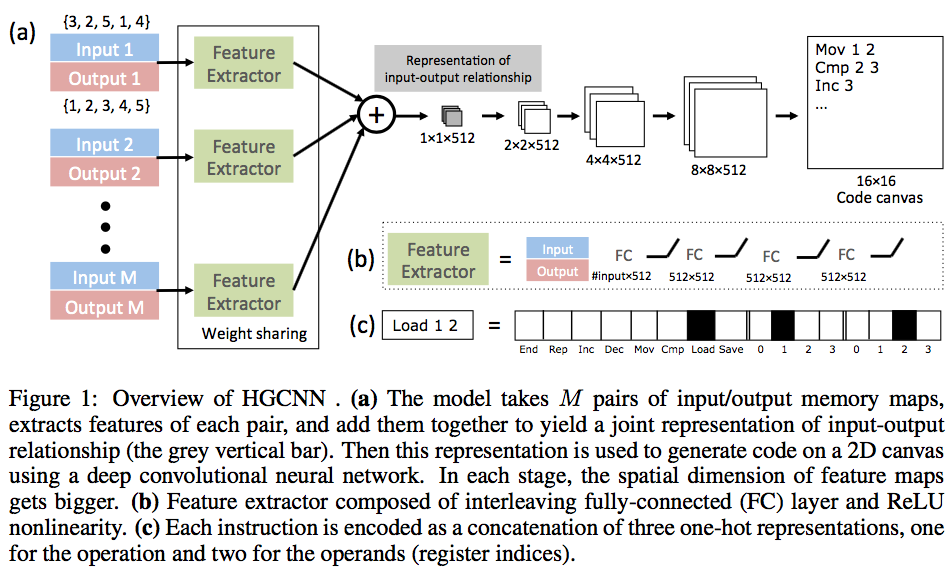

## DeepCoder: Learning to Write Programs

本文工作来自微软研究院。本文细致地梳理了现有 Program Synthesis 做法的几个重要部分，即 DSL 设计、搜索技术和候选程序排序。同时，由于现在可微分的解释器效果还是弱于程序语言理论中的离散式搜索，因此他们选择用神经网络来帮助基于搜索的技术，而不是试图取而代之。

**DSL**

由于后面神经网络输出的特征向量衡量的是一个函数符号是否出现，因此在设计DSL时必须保证允许的函数别太底层（过于普遍以至于任何程序都会有），也不能过于罕见否则从样本里也学不出来。

最终选了一些一阶函数、几个高阶函数、以及每个高阶函数对应允许的 lambda 表达式。

有了DSL以后就在上面遍历所有可能生成数据集，同时过滤掉一些情形，例如无关结果的冗余变量、更短的等价程序等。同时用输出的定义域反推输入的定义域，然后在可行的输入中随机采样再执行程序获得输出。

**神经网络模型**

所用网络是一个简单的前馈神经网络，输入层包括样本类型（输入输出为单个数还是数组）、每个输入输出数据的 embedding 等等，通过三个隐层和一个池化层。最终得到的隐层表示再通过一个 decoder 层转换为固定34维（函数token的数量）的一个特征向量。每一维表示对应的函数或 lambda 的 token 是否出现。

**搜索**

一种是通过简单的 DFS，每次选择神经网络中输出的概率最高的函数即可，直到程序的长度达到上限 T。

另一种是维护一个活动集，每次在这个集合里寻找函数，而当搜索失败时就再将概率次之的函数加入集合中重新寻找。

最后本文也尝试了 sketch 的方法，把每一步的函数及其参数视为 slot 或 hole，然后从活动集中的函数里选择填充。但这需要保证与输入输出样本保持一致。

**实验结论**

通过由神经网络提供特征向量，这些搜索方法都成十上百甚至上千倍地加速了程序的搜索速度。

## Making Neural Programming Architectures Generalize via Recursion

本文工作来自伯克利。本文基于 [Reed and de Freitas, 2016] 的 NPI 框架，考虑到之前工作大都不能超过一定的复杂度（例如最多只支持长度60的数组排序），一旦问题更加复杂，模型效果就大打折扣。本文希望借用引入递归概念来解决这一问题。递归可以使得复杂程序变得简单，简化搜索。同时本文另一大贡献是证明了所学出程序的泛化能力，能100%地应用到未知的输入样本上。

**模型**

原始的 NPI 模型如下

$$
s_t = f_{enc}(e_t, a_t) \\
h_t = f_{lstm}(s_t, p_t, h_{t-1}) \\
r_t = f_{end}(h_t), p_{t+1} = f_{prog}(h_t), a_{t+1} = f_{arg}(h_t)
$$

而改进的递归模型在子程序开始前都将隐状态置零，以便重新开始递归

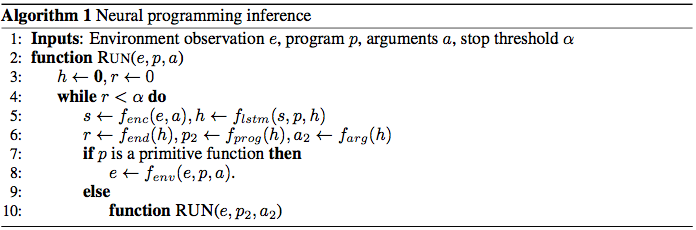

**证明**

本文做了竖式加法、冒泡排序、快速排序、拓扑排序等四种实验。通过递归，原问题只需要在基本问题上证明无误，同时递归能正确进行，则可证明在一切未知情形下都能正确泛化。

以竖式为例，基本问题有两个，即单独一列加法是否正确、指针移动是否正确。只要这两个问题得到了证明，那递归程序就能在一切情形下正确泛化。而要证明这个只需穷举一列的所有可能输入即可。

## TerpreT

TerpreT 是一种概率编程语言，相关工作来自微软研究院。TerpreT 与 python 语法较为接近，使用 ast 模块来编译 TerpreT 模型。

模块由四种变量组成：Param 变量定义程序、Var 变量表示中间结果、Input/Output 则是输入和输出。

编译后会将原本的整数之间的关系提升为边缘分布之间的关系：

- 函数调用：`z.set_to(foo(x, y))` 会被翻译为 $$\mu^z_i = \sum_{jk} I[i=foo(j,k)]\mu_j^x\mu_k^y$$
- 条件语句：`if x == 0: z.set_to(a); elif x == 1: z.set_to (b)` 会被翻译为 $$\mu^z = \mu_0^x\mu^a + \mu_1^x\mu^b$$

### Neural Functional Programming

本文主要探讨了在 TerpreT 基础上扩展加入4种函数式特性，有助于学到更多程序

- 固定内存分配：每个时间片都分配一个堆内存，避免程序长度不同影响学习效果
- 加入控制结构：使用循环、条件语句等，不使用直接的 JUMP
- 不可变数据：确定性地选择一些不可变寄存器存放不可变数据
- 类型系统：使用不同的存储存放不同类型的数据

### Lifelong Perceptual Programming By Example

除了现有的多任务学习、传递学习之外，这里提出了一种新的做法可以学习到一些可以重用的基础组件。为了识别如MNIST图片，本文为 TerpreT 新增了 tensor 类型和可学习函数。可学习函数会被编译为前向神经网络。

这里尝试了如下三种算术场景

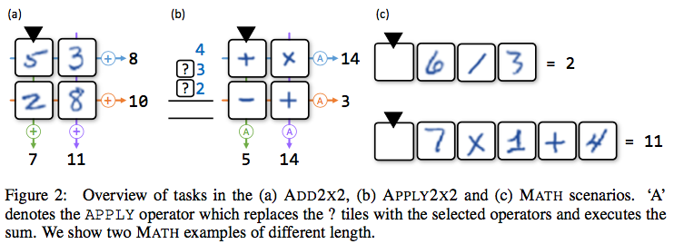

基础组件是两个前馈神经网络，输入都是 28x28 的单色图片，区别只在输出一个是10维一个是4维。

在学习过程中，本文通过划分基础组件，发现的一个很重要的反向学习现象：在停止学习之后，后续学习可以继续改进之前学习的效果。

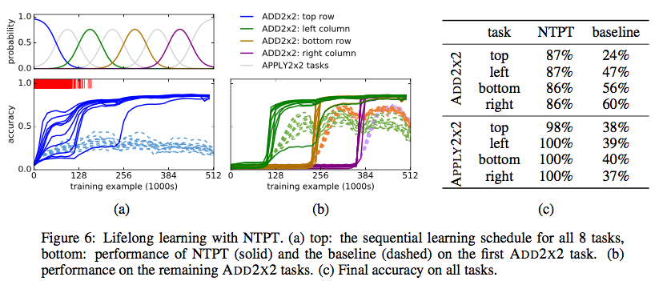

## Neural-Symbolic Program Synthesis

本文工作来自CMU和微软研究院。本文设计了一个树结构的生成模型，通过把I/O样本编码进来，树结构可以自动选择DSL中的某条产生式应用到非终结符上，从而增量地生成程序。

**模型**

树结构有四种参数：

- 符号（叶子节点）的表示：所有终结符和非终结符的 embedding
- 产生式（中间节点）的表示：所有 DSL 中包含的产生式的 embedding
- 归约网络：通过产生式右边的 embedding 生成左边的 embedding
- 派生网络：通过产生式左边的 embedding 生成右边的 embedding

这样从叶子节点出发，递归向上传递，直到根节点，此时根节点就能包括全局信息。然后反向递归，再由根节点向下，这样把全局信息带到每个中间节点上。当需要派生时，由叶子节点的表示和产生式的表示的内积作 softmax 权重进行选择。

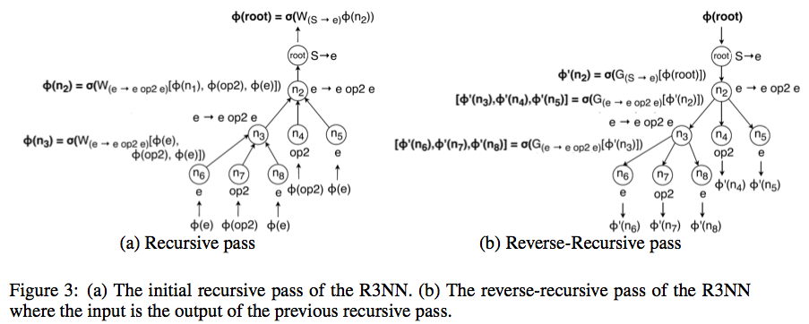

而 encoder 部分，本文以两个单独的 Bi-LSTM 为基础，又尝试了考虑二者相关性的 correlation-encoder 和几种变形。

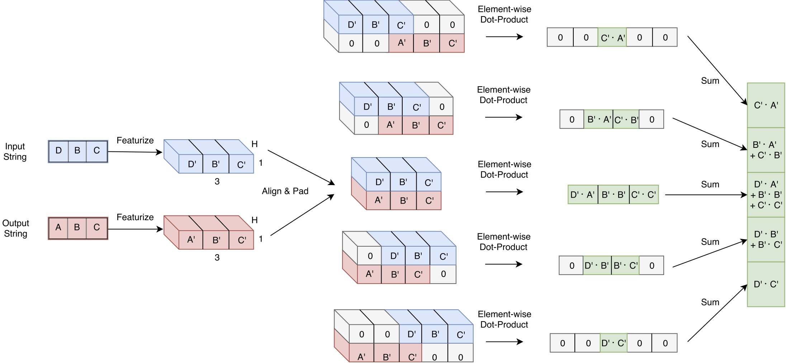

## 相关文章

- Neelakantan, Arvind, Quoc V. Le, and Ilya Sutskever. “Neural Programmer: Inducing Latent Programs with Gradient Decent.” (2016)
- Reed, Scott, and Nando de Freitas. “Neural Programmer-Interpreters.” arXiv preprint arXiv:1511.06279 (2015)
- Graves, Alex et al. “Hybrid Computing Using a Neural Network with Dynamic External Memory.” Nature advance online publication (2016)
- Yin, Pengcheng et al. Neural Enquirer: Learning to Query Tables with Natural Language. ArXiv, 2015.
- Mou, Lili et al. “Coupling Distributed and Symbolic Execution for Natural Language Queries.” arXiv:1612.02741 [cs] (2016)
- Liang, Chen et al. “Neural Symbolic Machines: Learning Semantic Parsers on Freebase with Weak Supervision.” ResearchGate (2016)
- Murray, Kenton W., and Jayant Krishnamurthy. “Probabilistic Neural Programs.” arXiv:1612.00712 [cs] (2016)
- Bošnjak, Matko et al. “Programming with a Differentiable Forth Interpreter.” arXiv:1605.06640 [cs] (2016)
- Gong, Qucheng et al. "UNSUPERVISED PROGRAM INDUCTION WITH HIERARCHICAL GENERATIVE CONVOLUTIONAL NEURAL NETWORKS", 2016
- Balog, Matej et al. “DeepCoder: Learning to Write Programs.” arXiv:1611.01989 [cs] (2016)
- Cai, Jonathon et al. "Making Neural Programming Architectures Generalize via Recursion", submitted to ICLR-2017
- Gaunt, Alexander L. et al. “Summary - TerpreT: A Probabilistic Programming Language for Program Induction.” arXiv:1612.00817 [cs] (2016)
- Gaunt, Alexander L. et al. “Lifelong Perceptual Programming By Example.” arXiv:1611.02109 [cs] (2016)
- Feser, John K. et al. “Neural Functional Programming.” arXiv:1611.01988 [cs] (2016)
- Parisotto, Emilio et al. “Neuro-Symbolic Program Synthesis.” arXiv preprint arXiv:1611.01855 (2016)

