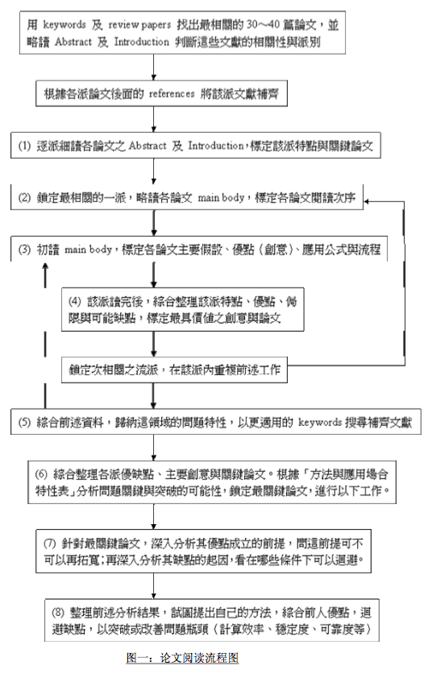
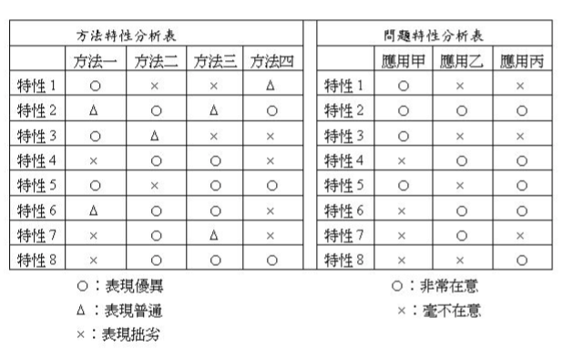

arrangement from [link](http://mp.weixin.qq.com/s?__biz=MjM5MDAyMzQyMQ==&mid=403007084&idx=1&sn=f667bc05e399aef259a9b0cd97801eb4&scene=4#wechat_redirect)

## read a paper

Abstract -> Introduction -> Important Diagrams -> (understand main topic) -> Conclusions   
-> [Technical Details]

Abstract -> Conclusion -> (how the problem is solved in the paper) -> Diagrams -> (impression)   
--> sequential   
 -> (known what to find) -> focus on such infomation
 
Abstract -> Diagrams -> statement on topics   
 -> Full Content -> Previous Work from the group   
 -> interesting reference   
 -> think about   
  -> if data is consistent with my own. if not, why?   
  -> what if I adopt his way   
  -> why he did the experiment like this
  
Abstract -> (it is interesting) -> Introduction -> (understand problems) -> Figures and Tables   
 -> discuss and find   
   -> his new ideas   
   -> related work to mine   
   -> same as mine before (works and assumptions)   
   
take it as writing -> find sentences about topics -> write it in a word document

related works -> find out method and result (important)   
  -> methdology   
  -> experiment design   
  -> data analysis   
  
read -> create it on your own

## detailed operation on start topic survey

summarized from [台湾清华彭明辉教授的研究生手册.pdf](http://vdisk.weibo.com/s/vHExVYNSICSq)

### Abstract and Introduction

1\. find survey / review -> 30 ~ 40 papers

2\. Abstract + Introduction, sometimes Illustrative examples & Conclusions (read those with sensible Intro)

  - a\. what are the **common methods** in this domain ?
  - b\. how could the methods be divided into **different branches** ?
  - c\. what are the characteristics, **merits and defects** for methods of **each branch** ?

3\. if still have trouble for the above questions:

  - 1\. find all papers based on (2a), put them into categories, ordered by date
  - 2\. read one branch a time, **Abstract + Intro**: find the **basic petitions and ideas, note down the merits**
  - 3\. read **Intro**: how they criticize other branches, **note down the drawbacks**
  
4\. research and retain mostly 20 papers related to your work, even remove some branches reasonably that you don't want to use

5\. answer the additionnal questions based on (2c), get the **main application** and **matters needing attention** for each application, in this domain

  - 1\. what are the **key problems** in this domain?
  - 2\. what characteristics**(merits and drawbacks) people care** usually?
  - 3\. **under what circumstances** people will **care more** about the merits and drawbacks?
  - 4\. **when** do people **care less** about them?

6\. organize papers into categories, ordered by date. read main bodies for them according to their relation and importance to your work

### Main body, experiment and simulation

before reading, take care of the three questions:

- 1\. what are the main assumption of it, how hard to meet the assumption in reality
- 2\. based on those assumptions, what are the good points for this paper
- 3\. what's the representation of these good points, (which formula item is simplified)

  - only care the key formulae (in final application)
  - focus on the assumptions rather than the induction, if you really need to read formulae
  
read along all the papers in this domain easily, find those easier to read and the most cited, answer the three questions above.

After all, based on (5) and these 3 questions, answer the 4th: main drawbacks of this branch.

Use the 4 answers to make conclusion: when the branch is suitable and when it's not.

## when confronted with unknown things

- search engine for passages
- read after I have some background knowledge
- search **keywords** and so on so forth, end with a **relationship** between them
- ask the author if it make trouble for understanding
- ask colleagues or the author

