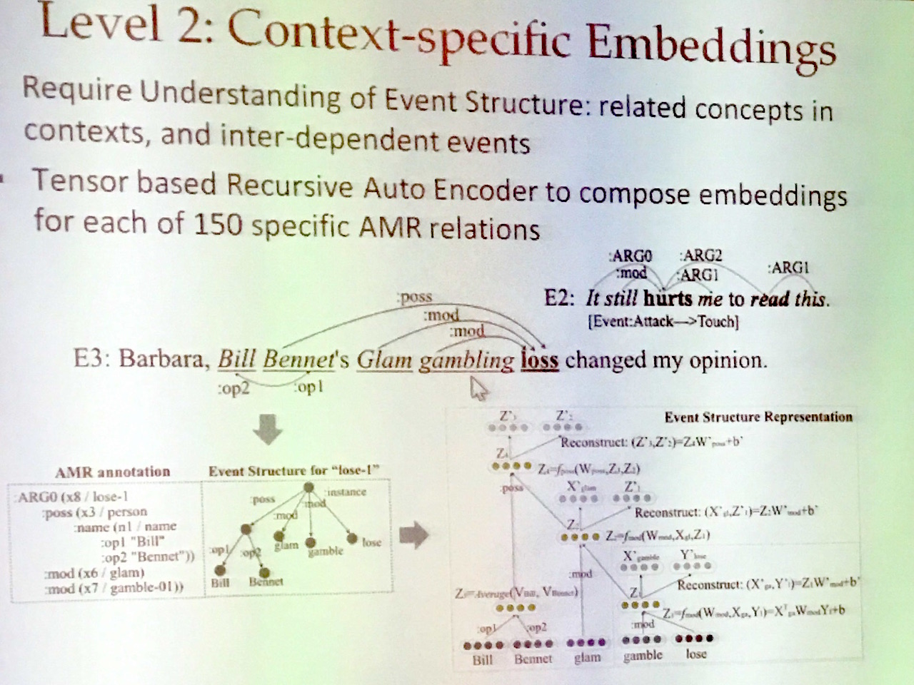
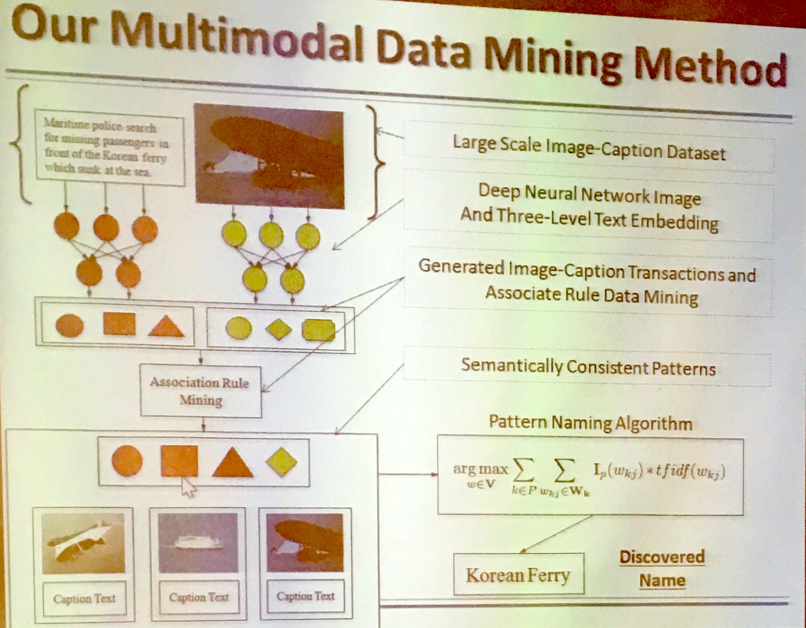

## Abstract

We propose a brand new ``Liberal" Information Extraction (IE) paradigm to combine the merits of traditional IE (high quality and fine granularity) and Open IE (high scalability). Liberal IE aims to discover schemas and extract facts from any input corpus, without any annotated training data or predefined schema. Using event extraction as a case study, we present a pilot Liberal IE framework which incorporates symbolic semantics (Abstract Meaning Representation) and distributional semantics to detect and represent rich event structure, and adopts a joint typing framework to simultaneously discover types of events and participants as well as schema which is customized for the input corpus. Experiments demonstrate that Liberal IE can construct high-quality schemas, discover a high proportion of fine-grained typed events in manually defined schemas, achieve comparable performance as supervised models trained from a large amount of labeled data for pre-defined event types, as well as accurately extract many new event types and argument roles.

We will then proceed to discuss applying this paradigm to low-resource incident languages (ILs). We will use name tagging problem in an emergent setting as a case study - the tagger needs to be complete within a few hours for a new IL using very few resources. Inspired by observing how human annotators attack this challenge, we propose a new expectation-driven learning framework. In this framework we rapidly acquire, categorize, structure and zoom in on IL-specific expectations (rules, features, patterns, gazetteers, etc.) from various non-traditional sources: consulting and encoding linguistic knowledge from native speakers, mining and projecting patterns from both mono-lingual and cross-lingual corpora, and typing based on cross-lingual entity linking. We also propose a cost-aware combination approach to compose expectations. Experiments on seven low-resource languages demonstrate the effectiveness and generality of this framework: we are able to setup a name tagger for a new IL within two hours, and achieve promising results.

## problem

Problem:

- information extraction is given.
- Human Annotator is given.
- HIGH COST
- Time Consuming
- Domain / Module Specific

Try to get type.

## method

basic though(lv1): embedding -> cluster -> title extraction

lv2: hurt (in mental)

Abstract Meaning Representation (Banarescu et al., 2013)

lv3: knowledge base embedding
cheer(Candidate, Democratic Party)

do entity linking

- candidate -> some person
- democratic party -> another organization

clustering not only the embedding but also the related concept

### title
event: center words
people: ARG1 -> word

## move

### to a new domain:
work well (biomedical)

### to a new modular:

(huge gap between visual / text)
semantic meaningful pattern for text but maybe not that in images

associative rule (like in data mining)

### to a new language

pattern recurring multiple times

> human can learn Tibetan through pattern matching  
> maybe another learning way

Expectation-driven learning

