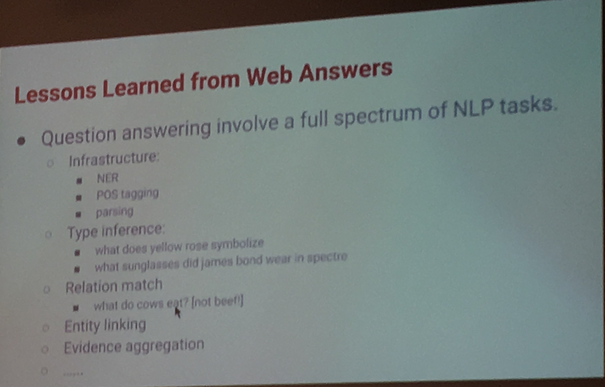
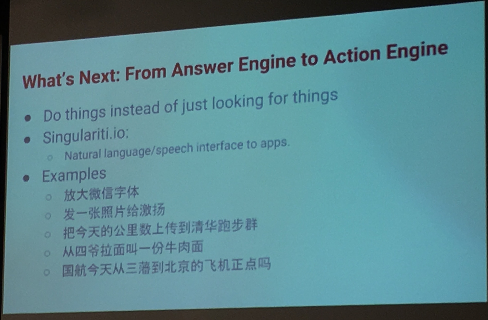

## 报告题目：From Search Engine to Answer Engine

报告人：林德康
报告摘要：Question-answering aims to provide the direct answers to users’ questions, instead of a list of documents that may contain the answers. In recent years, search engines have been transforming themselves into answer engines, by responding to increasingly larger proportions of users' queries (e.g., "when is the next world cup" and "fastest bird") with direct answers ("2018 and "peregrine falcon", respectively).  In this talk, I will give an overview of the approaches to question answering, and discuss the natural language processing and machine learning challenges in answer engines. 

讲者介绍：Dekang Lin is a co-founder of Singulariti, a Beijing-based startup for mobile search and assistant. He was a Senior Staff Research Scientist at Google from 2004 to 2016, where he led a team of researchers and engineers to build a question-answerer in Google search.

Before joining Google, Dekang Lin was a full professor of Computer Science at University of Alberta.  He authored 90 papers with over 12000 citations. He was elected as Fellow of Association for Computational Linguistics (ACL) in 2012 and served as the program co-chair and general chair for ACL-2002 and ACL-2011 respectively. 

### q 2 q

question -> map to -> question we known: (question -> baidu seach (highly correlated zhidao.com))

### structured knowledge base

base: (Ent1 -> Rel -> Ent2) (Any relation (??))

question parsing / analysis: question -> convert to -> base query language (lambda x: x in () filter(pred1 && pred2 && ..., x))

#### parsing

- supervised, manual annotation (machine learning) grammar induction
- manually constructed rules
  - (regular exp) patterns: who is ($PERSON) wife, useful for large scale companies (high frequency/traffic)
- Distant supervision (??)
  - auto-label examples from a corpus (??)
  

#### map between query lang and KB

relation keyword + entities cooccurence -> KB relation

[Cai & Yates 2013]
[Yao & van Drume 2014]

### unstructured

example: what enzyme breaks down starch / annual rainfall of beijing

query analysis -> query in google -> abstract content / snippet -> candidate -> scoring

#### query analysis

key goal: find focus words

- wh-words explicit question
- fastest animal (non-explicit question)
- non-question: when in rome rotten -> <film>(when in rome) + <site>(rotten)

tips:

- rule works too (query): wh- words regular exp
- non-wh word question is a substring of wh-question

#### answer type (ontology)

types:
- for explicit type words (animal, blabla)
- non-explicit types ("melting point" -> temperature)

Google: any focus words -> type

#### extract type samples

patterns:

- numerical pattern: (has|with) (a|an) TYPE of AAA -> AAA is TYPE: melting point of 78 degree
- entity types: TYPE(s) such as AAA -> AAA is TYPE: cities such as Beijing

#### scoring

features: 

### production

- passage gives belief to users
- robust to slightly different
- image search (belief scoring)
- named entity -> question ("People also ask") / "fun facts" (question and answer top searched)

### others

### QA

analysis question (how to) similar to factoid question: "怎么做虾饺" pattern based actually

## 报告题目：面向Web文本的语义关系抽取

报告人：韩先培

报告摘要：语义关系描述了实体及概念之间的关联与交互，是人类知识的核心组成部分。构建知识图谱的核心任务之一是从Web文本中抽取海量的语义关系。同时，每一段有意义的文本都描述了一组实体（时间、地点、人物、事件）以及这些实体相互之间的关联和交互，如何抽取文本中的实体和它们之间的语义关系也就成为了理解文本意义的基础。

针对上述任务，本报告将介绍近年来文本语义关系抽取技术上的相关进展，特别关注如何在Web环境下构建一个高性能的语义关系抽取系统。具体内容包括自扩展技术、远距离监督技术、半监督技术和自学习技术。同时本报告也对关系抽取技术在知识图谱和智能问答系统中的作用做一些个人思考。 

讲者介绍：韩先培，博士，中国科学院软件研究所基础软件国家工程研究中心/计算机科学国家重点实验室副研究员。主要研究方向是信息抽取、知识库构建、语义计算以及智能问答系统。在ACL、SIGIR等重要国际会议发表论文20余篇。韩先培是中国中文信息学会会员，中国中文信息学会语言与知识计算专业委员会秘书长及中国中文信息学会青年工作委员会委员。

"我今天去看医生" -> 我生病了 ( KB / semantic relation, ambiguity how to)

### methods

- supervised
- weak supervised: boostrap / non-supervised / self-learning

### representation & model

structural relation -> vector

#### human vector
manual vector (P=0.715 R=0.694 F=0.715) Jiang & Zhai (2007)

- entity feature
  - word, type, POS
  - blown cluster / wordnet to expand
- relation feature

#### 句法结构

Zhang et. al (2006) 句法结构
加入语义 Plank & Moschitti, 2013

#### embedding

- recursive net [socher et al, 2012]
- convolutional net [Zeng et al., 2014]
  - wordvec + position vec
- recurrent net [Li et al., 201?]

DL: CNN embedding (Nguyen & Grishman, 2015) less than state-of-the-art

### un/weak- supervised

bootstrapping / distant supervision / open 

#### bootstrapping

word pattern (easy to use / semantic shift [Krause et al. 2012])

semantic shift: how to [image]

#### distant supervision

use KB relation heuristically

problems: noise in KB

#### open IE

auto convert NL -> proposition

problems: complex sentence / semantic normalization

ReVerb

## 报告题目：基于伪命名实体检测的限定领域实体链接 [2016]

报告人：张江涛

报告摘要：实体链接是连接非结构化文本数据与结构化知识库的关键步骤。传统方法都是基于通用领域知识库对通用性的实体（人物，地址，机构等）进行连接。由于没有考虑限定领域的诸多特征，传统方法无法直接有效的应用于限定领域。我们针对限定领域（如影视领域）存在大量伪命名实体（FNE）的特征，并充分考虑实体识别与实体链接之间的相互作用关系，提出了一种新颖的基于伪命名实体检测的迭代联合模型。具体地，我们针对实体识别和实体链接过程定义了两组有效的特征，让这两个过程迭代的交替运行，用实体识别的结果去修正实体链接的特征，反过来用实体链接的结果更新实体识别的特征，使得两个过程相互影响，彼此贡献，通过不断的迭代有效降低伪命名实体的置信度直至被过滤掉。在一个真实的影视评论数据集上的实验结果表明了该方法的有效性。

讲者介绍：张江涛，清华大学软件所博士生，主要研究领域包括实体链接、知识发现等。
 
## 报告题目：文本辅助的知识向量化表示计算方法 [2016]

报告人：王志刚

报告摘要：本报告提出一种文本辅助的知识向量化表示计算方法：对于辅助文本语料，使用实体标注工具标注知识图谱中存在的实体，通过构建词和实体组成的共现网络将文本信息和实体信息进行关联，进而学习得到一元和二元的文本上下文嵌入表示；基于文本上下文嵌入表示，对知识图谱中实体和关系的嵌入表示进行建模，定义基于翻译方法的模型优化目标，完成知识的嵌入表示学习。该方法有利于解决现有方法的两个重要问题：一对多、多对一和多对多关系的表示能力低下，以及知识图谱稀疏性导致表示效果不足。

讲者介绍：王志刚，清华大学计算机系知识工程实验室博士生。主要研究领域包括语义Web和跨语言知识图谱等。在ACL、AAAI、IJCAI、WWW等国际重要会议发表多篇论文。

TransE [bordes et al. 2013]: (ambiguous)
TransH [Wang et al. 2014 AAAI] and TransR [Lin et al. 2015 AAAI]: (sparse)

## 报告题目：降低知识图谱的构造成本

报告人：鲍捷

报告摘要：在工程实践中，知识图谱的构造成本是决定其应用成败的核心因素之一。一 个完整的知识图谱应用，涉及自然语言处理、知识工程、数据库、信息检 索、人 机交互等多学科的综合。降低成本的关键，在于根据实际需求在迭代中减少不必要 的浪费，将各种方法取长补短。从工程阶段细分上说，涉及 1）知识提取的成本： 如何结合好人工和自动算法，统计和规则？如何平衡提取的粒度和成本的矛盾？ 2）知识表示的成本：实体命名的成本、三元组建模的成本、本体构造的成本等 3）知识存储的成本：结构化与非结构化混合的成本，数据库的维护成本，数据库 效率的成本等 4）知识检索的成本：语义检索的复杂度与成本的取舍、知识索引的 成本、交互式探索界面的意义等。本次讲座探讨如何在工程迭代中降低上述成本的一些一般性方法。

讲者介绍：鲍捷是文因互联（Memect）创始人兼CEO。他是前三星美国研究院研 究员，MIT访问研究员，RPI博士后，Iowa State University博士。研究领域包括语义 网、知识图谱、机器学习、神经网络等。W3C Web本体语言工作组成员。中文信息学会语言与知识 计算专委会委员。

Stanford 7 Steps (???) waterfall, long-term

representation (+ retrieval + storage + query)

不同知识类型：事实（A是B）、概念、趋势性（股票涨跌）

## 报告题目：基于路径的知识表示与推理

报告人：林衍凯

报告摘要：知识表示旨在将知识图谱中的实体和关系在一个低维空间中表示出来。现有的大多数方法在知识表示学习中只考虑了实体之间的直接关系。实体之间多步的关系路径同样包含着丰富的关系推理信息，本报告中介绍了一种基于路径表示的知识表示模型。该模型在知识表示学习中将关系路径表示为实体之间的平移向量，主要贡献有：（1）由于并不是所有的关系路径都是有意义的，我们设计了一种基于路径的资源分配算法用于计算不同关系路径的可信度；（2）我们用关系路径上的关系的不同语义组合向量来表示关系路径的向量。

讲者介绍：林衍凯，清华大学计算机系博士生。主要研究领域包括知识图谱与关系抽取等。在AAAI、IJCAI、EMNLP等国际重要会议发表多篇论文。

## 报告题目：拓展一个点到一个流形：基于知识图谱表示的精确链接预测

报告人：肖寒

报告摘要：我们研究了如何利用流形方法来进行大规模知识图谱的表示。传统的知识图谱表示模型利用一个单点表示知识，在代数上是过定线性系统，在几何上是奇异形式；综合来说，现有的方法会在知识表示时引入大量的噪音，影响表示效果。然而，我们利用基于流形的表示形式修正原有模型的基于单点的表示形式，给出了一种全新的知识表示方法，称为流形嵌入方法(ManfioldE)。从代数上说，我们的方法是一个适定系统，在几何上讲，我们的方法更为灵活；总体而言，我们的表示方法去除了大量的噪音，得到了较好的效果。实验结果证明我们的流形嵌入方法极大地提高了链接预测的准确度，并在精确链接预测上取得了突破性进展。

讲者介绍：肖寒，清华大学计算机系博士生，主要研究领域包括知识表示和深度学习等。

## 报告题目：基于深度学习的知识库问答

报告人：刘康

报告摘要：随着搜索引擎的飞速发展，将互联网文本内容结构化，从中抽取有用的概念、实体，建立这些实体间的语义关系，并与已有多源异构知识库进行关联，从而构建大规模知识图谱，对于文本内容的语义理解以及搜索结果的精准化有着重要的意义。然而，如何以自然语言方式访问这些结构化的知识图谱资源，构建知识库问答系统是摆在众多研究者和开发者前的一个重要问题。本报告将主要介绍知识库问答的主流方法，重点介绍Deep Learning在知识库问答中的应用方法，并对其中存在的问题和趋势进行分析和展望。

讲者介绍：刘康，博士，现任中科院自动化所模式识别国家重点实验室副研究员，先后于2002年、2005年获得西安电子科技大学学士、硕士学位。2010年于中科院自动化所获得博士学位后留所工作。研究领域包括信息抽取、网络挖掘、问答系统等，同时也涉及模式识别与机器学习方面的基础研究。在自然语言处理、知识工程等领域国际重要会议和期刊发表论文二十余篇（如TKDE、ACL、IJCAI、EMNLP、COLING、CIKM等），获得KDD CUP 2011 Track2 全球亚军，COLING 2014最佳论文奖，首届“CCF-腾讯犀牛鸟基金卓越奖”、2014年度中国中文信息学会“钱伟长中文信息处理科学技术奖-汉王青年创新一等奖”、2015 Google Focused Research Award。同时，作为项目技术负责人，主持了中文百科知识问答、百科知识抽取平台等多个系统的研发，这些系统已经在中国大百科全书出版社、华为等多个企事业单位得到应用。

## 报告题目：百度智能问答技术研发及应用

报告人：马艳军

报告摘要：报告首先介绍百度搜索、度秘等产品中用户的问答需求，然后介绍百度在智能问答方面的技术研发工作，包括问题理解、答案抽取、答案聚合等技术，同时介绍这些技术在产品中的应用。报告的最后对问答系统的发展趋势进行展望。

讲者介绍：马艳军博士，百度自然语言处理部高级研究员。2009年博士毕业于爱尔兰国立都柏林城市大学。2011年初加入百度，主要研究方向为自然语言处理、机器翻译、智能问答等。目前担任《Machine Translation》杂志编委，并多次担任ACL，IJCAI等国际权威会议领域主席和审稿人。参与欧盟第七框架计划（FP7）、863计划等国内外项目，发表论文20余篇，申请国内外技术发明专利20余项。加入百度后，主要从事机器翻译和智能问答技术研究，相关成果已经广泛应用于百度搜索等产品中，曾获“中国电子学会科技进步一等奖”和“国家科技进步二等奖”。

## 报告题目：基于关注机制神经网络的知识库问答

报告人：何世柱

报告摘要：问句中关键元素（主题、属性等）的识别和表示是知识库问答的关键步骤。传统方法只是将问句压缩成为一个固定表示，忽略了答案不同方面对问句不同词语/短语的关联程度。我们考虑了不同的候选答案的不同方面对问句表示的影响，提出了一个新颖的基于关注机制的神经网络模型。具体地，不同答案的不同方面对于问句中的词的关注程度，被我们用作问句中词的权重。这种动态表示方法比现有的将问句固定表达的方法更灵活和准确。此外，我们还首次利用了全局的知识库信息，使得我们的方法可以充分利用资源在知识库中的互相联系，并且有效缓解了OOV问题。在WebQuestions数据集上的实验说明了该方法的有效性。

讲者介绍：何世柱，中科院自动化所博士生。主要研究领域包括问答系统和知识管理等。在EMNLP、CIKM等自然语言处理和知识工程领域国际重要会议和期刊发表多篇论文。

## 报告题目：Employing External Rich Knowledge for Machine Comprehension

报告人：王炳宁

报告摘要：问机器阅读理解是近年来人工智能，深度学习领域的热门话题，现有的阅读理解语料资源（如MCTest）大小十分有限，基于大数据的深度学习技术很难直接应用在其中，传统的阅读理解方法大多是靠特征工程的方法，这些方法需要依靠现有的自然语言处理工具人工构造大量的特征。由于阅读理解和传统问答系统一样可以分为答案检索以及答案生成两个部分。我们将现有的丰富的答案检索（WikiQA）以及答案生成(SNLI)资源嵌入到阅读理解任务中去，依靠丰富的外部知识对答案检索以及生成过程进行监督，相对于传统的特征工程方法，在单句阅读理解问题上面取得了明显的提升。

讲者介绍：王炳宁，中科院自动化所博士生。主要研究领域为机器阅读理解。

## 海报展示介绍

 1\.    程舒晗     FastBFS: Fast Breadth-First Graph Search on a Single Server

 2\.    欧佳欣     A High Performance File System for Non-Volatile Main Memory

 3\.    欧明栋     Non-transitive Hashing with Latent Similarity Components

 4\.    沈弼龙     OCEAN: Fast Discovery of High Utility Occupancy Itemsets

 5\.    唐敏豪     An efficient HEVC to H.264/AVC transcoding system

 6\.    田  庚     TADOOP: Mining Network Traffic Anomalies with Hadoop Geng

 7\.    张宝宝     RPFP: IP Fast ReRoute with Providing Complete Protection and without Using Tunnels

 8\.    张华枫     Modeling a Heterogeneous Embedded System in Coloured Petri Nets

 9\.    张晓航     Crowdsourced Top-k Algorithms: An Experimental Evaluation

 10\.  张  煜     The IoT Electric Business Model: Using Blockchain Technology for the Internet of Things

 11\.  赵  立     Semi-supervised Multinomial Naive Bayes for Text Classification by Leveraging Word-level Statistical Constraint

