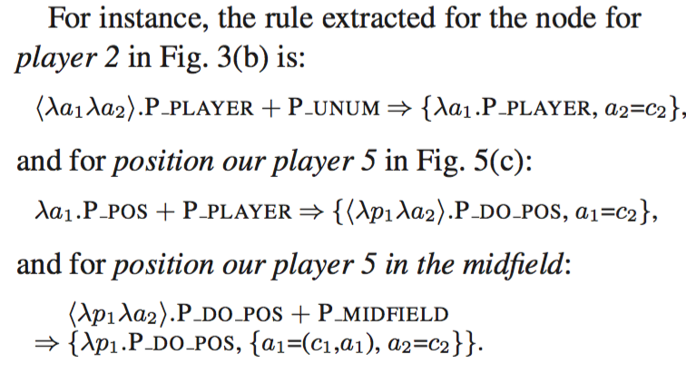

## Zelle, Mooney, 1996

Learn to Parse Database Queries.

### tags

variable-free logic, shift-reduce parsing, inductive logic programming, GeoQuery

### contents

Use database schema:

- basic objects: cityid, stateid, ...
- basic predicates: capital(), city(), major, ...
- meta predicate (high-order predicates): answer / largest / lowest / count ...

## Zelle, Mooney, 1993

Learning Semantic Grammars with Constructive Inductive Logic Programming

semantic grammar acquisition viewed as the learning of search control heuristics in a logic program

### tags

shift-reduce, 

### contents

#### flaw of connectionist models

1. output structure is flat, thus it's unclear how embedded propositions can be handled
2. give only a single output structure even if the sentence is truly ambiguous

#### CHILL (constructive heuristics induction for language learning)

1. introduce an overly-general parser using training data (may give spurious analyses)
2. specialize the parser by search control heuristics

CHILL Induction

For each pair clause in sample:

- **Find_Generalization**: takes the pair, construct a new clause that subsumes them while not covering any negative example
- **Reduce_Definition**: uses new clause to prove positive examples. New clause is more prefered and any clause not used is deleted.

Until the generalized definition will not change.

## Zettlemoyer, Collins, 2005

Learning to Map Sentences to Logical Form: Structured Classification with Probabilistic Categorial Grammars

### tags

probabilistic CCG, log-linear model, sentence-LF pair, Geo880, Jobs660

(CKY, high-order logic)

### background

#### lambda calculus

lambda expressions have:

- constants: entity / number / function
- logical connectors
  - conjunction $\wedge$
  - disjunction $\vee$
  - negation $\neg$
  - implication $\to$
- quantification: $\forall, \exists$
- lambda-expressions $\lambda x.borders(x, texas)$
- additional quantifiers $count, \arg\max, \arg\min, \iota$
  - a definite operator would return the unique item for which state(x) is true, if a unique item exists
  

#### CCG

Combinatory Category Grammars (Steedman, 1996, 2000)

- lexicon: word to category
- category: (S\NP)/NP
- composition rules:
  - functional application (left / right)
  - type raising

### parsing

#### parsing uses PCCG

ambiguity comes from:

- lexical item with multiple entry in lexicon
- spurious ambiguity: same semantic but different derivation

log-linear model: (L=logical form, T=derivation sequence, S=sentence)

$$
P(L, T \mid S; \bar\theta) = \frac
  {\exp(\bar f(L,T,S)\cdot\bar\theta)}
  {\sum_{(L,T)}\exp(\bar f(L,T,S)\cdot\bar\theta)}
$$

and parsing involves PCCG inference:

$$
L = \arg\max_L P(L\mid S;\bar\theta) = \arg\max_L\sum_TP(L,T\mid S;\bar\theta)
$$

use dynamic programming(beam-search actually): features are only **local** lexical feature (number of occurence of a lexical entry in T)

#### estimation of theta

T is latent. maximize the log-likelihood.

$$
\begin{align}
O(\bar\theta)
  &= \sum_i\log P(L_i\mid S_i; \bar\theta) \\
  &= \sum_I\log (\sum_T P(L_i, T\mid S_i; \bar\theta))
\end{align}
$$

differentiate it w.r.t theta and then use dynamic programming (variant of inside-outside algorithm) 

### induce the lexicon

#### GENLEX

GENLEX generates lots of lexical entries of which some may be pruned later.

$$
GENLEX(S,L) = \{x := y \mid x \in W(S), y\in C(L)\}
$$

- W(S) is all subsequence of S
- C(L) maps L to a set of categories using rules which will produce categories when triggered by a constituent of logical forms.

all possible lexicals:

$$
\Lambda^* = \Lambda_0 \cup \bigcup_{i=1}^n GENLEX(S_i, L_i)
$$

Weights are set to 0.1 for entries in Lambda_0 and 0.01 for others.

#### learning

basically two steps:

- step1 produce a lexicon Lambda\_t compacter than Lambda^star
- step2 keeps the log-likelihood be optimized for Lambda_t

PARSE function will parse the tree and gives the highest probabilities.

### problems

GENLEX is controlled by rules, and will be insufficient if the rules don't cover all the sentence - logical forms. (lexicon and composition can both limited recall) e.g.

> Through which states does the Mississippi run.

GENLEX doesn't trigger a category suitable for the _through_-adjunct be placed ahead.

## Wong, Mooney, 2006

Learning for Semantic Parsing with Statistical Machine Translation

### tags

NAACL-2006, SCFG, WASP, MT technique for alignments, GeoQuery

robustness to variations in:

- task complexity
- word order

### model

#### synchronous CFG:

start from a pair of start symbol (s, s), get a pair as (e, f).

In each grammar rule $$X\to\langle\alpha,\beta\rangle$$, alpha is called a pattern, beta is called a template (Kate et al. 2005)

WASP uses SCFG to model alignments. 

#### parsing

parsing uses a probabilistic model to choose between different derivations

$$
f^* = m(\arg\max_{\mathrm{d}\in D(G\mid e)}\Pr(\mathrm{d}\mid e; \lambda))
$$

### learning

learning needs to 

- induce a set of rule (lexicon)
- a probabilistic model for derivations

#### alignment model

directly using MT techniques does not use MRL grammar, thus **allocation probability mass to MR translations that are not syntactically well-formed**.

alignments of NL words and MR token:

- not all MR token carry specific meanings (e.g. braces)
- polysemy in MR tokens (in CLang, pt stands for point and position)

conceptual alignment between NL words and MR tokens:

|        | 0 token | 1 token | multiple tokens |
| ---    | ---     | ---     | ----            |
| 0 word | -       |  braces | -               |
| 1 word | -       | polysemy in tokens or synonym in words | - |
| multiple words | - | - | - |

To simply avoid these problems, present an MR in a production sequence, which correspond to both

- Top-down
- left-most

derivations .

**MRL grammar** is (or can be made) unambiguous, thus the sequence is unique for a parse.

Grammar + Parse = >  sequence of productions.

Use GIZA++ (Och and Ney, 2003) to obtain the alignments of words and production rules, under the ASSUMPTION: word to production is n-to-1

#### extraction rules from alignments

bottom-up

RHS only contains terminals:

alignment: (our, Team -> our), extract: Team -> (our, our)

RHS also contains non-terminals:

extract: above

Problem: when rules cannot be extracted for some production

use a greedy remove to do alignment fixing

## Wong, Mooney, 2007

Learning Synchronous Grammars for Semantic Parsing with Lambda Calculus

### tags

ACL2007, Synchronous Grammar, lambda-WASP, GeoQuery

mainly an improvement over WASP

### modeling and learning

problems: SCFG cannot handle logic variables, ZC05 is robust but still needs hand-written rules.

each rule(production) in SCFG is extended with:

$$ A\to\langle\alpha,\lambda x_1 \cdots\lambda x_k.\beta\rangle$$

under the ASSUMPTION: word to production is n-to-1

### optimization

#### alignment fixing

again the alignment can cause problem that rules cannot be extracted for some predicate.  -> parse and NL are not isomorphic.

To adjust the LF to improve isomorphism, using a graph algorithm.

#### MRL language model

- type checking to omit unreal LF parse
- add new features to trival LF, the the number of times a given rule is used to expand a non-terminal in a given parent rule

## Zettlemoyer, Collins, 2007

Online Learning of Relaxed CCG Grammars for Parsing to Logical Form

### tags

EMNLP/CoNLL 2007, relaxed CCG, ATIS dataset, Geo880

### relax CCG

in addition to the traditional CCG:

- function application
- function composition
- type raising

we have relaxed version:

**relaxed function application**

**relaxed function composition**

**role-hypothesising type shifting** (for missing predicates)

**null-head type shifting** (for missing arguments)

**crossed functional composition**

### online learning

an online learning perceptron algorithm

#### new features:

number of conjunctions of some predicate f with itself in some level of LF,
and disjunctions, too

#### perceptron learning

change from log-linear model to perceptron, example by example, enable online learning.

## Lu, Ng, Lee, Zettlemoyer, 2008

A Generative Model for Parsing Natural Language to Meaning Representations

### tags

hybrid tree, EMNLP 2008, GeoQuery(880), RoboCup(300)

a generative model recursively creates nodes(include both syntactic and semantic infomation) at each level according a Markov process.

- A hybrid tree using sentence and MR
- an input-output algorithm for inference
- reranking to make the correct meaning scored highest

### modeling

a hybrid tree

factorized parse

reranking use an averaged perceptron.

performance not good, detail ignored

## Liang, Jordan, Klein, 2009

Learning Semantic Correspondences with Less Supervision

### tags

generative model, new dataset

### contents

- world state is a full context
- words is a sentence
- a scenario is a pair of (state and words)

#### modeling

- r : set of records
- f : sequence of fields
- c : segmentation of w
- w : words / sentence

$$
p(r, f, c, w \mid s) = p(r \mid s)p(f \mid r)p(c, w \mid r, f, s)
$$

#### learning and inferencing

maximize marginal likelihood

$$
\max_\theta\prod_{(w,s)\in D}\sum_{r,f,c}p(r,f,c,w\mid s;\theta)
$$

use EM.

## Ge, Mooney, 2009

Learning a Compositional Semantic Parser using an Existing Syntactic Parser

### tags

syntactic to semantic, RoboCup, GeoQuery

#### parser:

- alernative MRs for syntax tree
- a trained disambiguation model

#### learning:

- alignment method for (words <-> predicates)
- inducing rules for composition MR
- disambiguation model (maximum entropy)

### contents

assume: MR is defined by an unambiguous CFG

#### parser:

1. parse tree
2. annotated leaves (using alignments)
3. bottom-up composition, including meta-predicate (pseudo-predicate)

given MR Grammar:

composition along parse tree:

composition with meta-predicate P_DO:

#### learning

alignment lexicon: GIZA++

composition rule induction:

disambiguation model: max-ent

$$
\Pr(D\mid S,T;\bar\theta)=\frac{\exp\sum_i\theta_if_i(D)}{Z(S,T)}
$$

then parameter:

$$
\bar\theta^* =
  \arg\max_\bar\theta\sum_i\log\sum_{D_i^*}\Pr(D_i^*\mid S_i,T_i;\bar\theta)
$$

## Clarke et al., 2010

Driving Semantic Parsing from the World's Response

### tags

ACL-2010, constrained optimization, integer linear programming

### feedback 

formally, given x(sentence), y(alignment), z(LF), the parsing is

$$
\hat z = F_w(x)={\arg\max}_{y\in Y,z\in Z}w^T\Phi(x,y,z)
$$

use feedback +1 / -1 as evidence

take +1 as optimal and all others as suboptimal (aggressively)

### semantic as model

instead of extracting patterns from training data,
the inference considers entire space of meaning representation and use syntactic information as soft evidence.

$$
\begin{align}
F_w(x)
 &=\arg\max_{y,z}w^T\Phi(x,y,z) \\
 &=\arg\max_{\alpha,\beta}\sum_{c\in X}\sum_{s\in D}\alpha_{cs}\cdot w^T\Phi_1
  + \sum_{c,d\in X}\sum_{s,t\in D}\beta_{cs,dt}\cdot w^T\Phi_2
\end{align}

$$

- first-order decision alpha-s: constituent aligned with symbol 
- second-order decision bets-s: symbol with another symbol

s.t.

- A consituent is associated with 1 symbol
- beta(cs,dt) activated iff. alpha(cs) and alpha(dt) activated
- beta(cs,dt) activated then s is a function and (s, t) is type-consistent
- functional composition is directional and acyclic

first-order features:

- stemmed word match
- similarity based on WordNet

second-order features:

- normalized distance of the head words in c and d for beta(cs, dt) on the dependency tree of sentence
- symbol frequency (regardless of the alignment to text)

## Kwiatkowski et al., 2010

Inducing Probabilistic CCG Grammars from Logical Form with Higher-Order Unification

### tags

EMNLP-2010, GeoQuery, Geo880, Geo250

#### unification

a unification finds f and g, s.t. given h

$$
h = f(g)\, or\, h = \lambda x. f(g(x))
$$

#### PCCG

$$
P(y, z \mid x; \theta, \Lambda) = \frac{\exp(\theta\cdot\phi(x,y,z))}{Z(y',z')} \\
f(x) = \arg\max_z p(z\mid x; \theta, \Lambda) \\
p(z \mid x; \theta, \Lambda)
$$

### inducing new lexicon

start with assigning each sentence a category:

$$
\text{New York borders Vermont} \vdash S:\text{next_to}(ny,vt)
$$

split it into:

$$
\text{New York borders} \vdash S/NP:\lambda x . \text{next_to}(ny,x) \\
\text{Vermont} \vdash NP : vt
$$

likewise, do the following

**first**, split the lambda function s.t.

- no unused variables
- containing no more than N adjuncts
- no new variable for non-variable expression of the original part

**second**, split category

select how f and g are composited in any of FA, BA, FC, BC (4 basic CCG composition)

**third**, split lexical items

for all splitted category pair (B, C), consider all i s.t. words 0:i is assigned to B and i:n to C

### overall learning algorithm

NEW-LEX(y^*) consider the whole or splitting.

each potential new lexicon, choose the one derived from the best parse with the largest difference between two log probability

