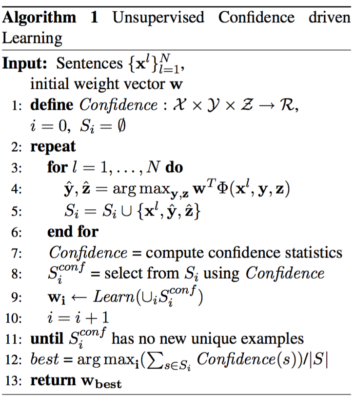
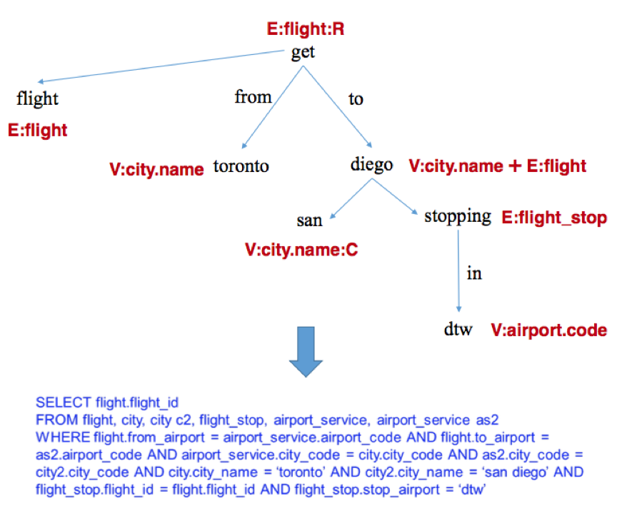

## Kwiatkowski, Zettlemoyer, Goldwater, Steedman 2011

Lexical Generalization in CCG Grammar Induction for Semantic Parsing

### tags

EMNLP 2011, GeoQuery, ATIS

### factored lexicons

lexicon item -> (lexeme, template) pair

- lexeme: (word span, [constant1, constant2])
- template: $$\lambda (w, \vec v).[w \vdash X:h_{\vec v}]$$

$$
(Boston, [from, bos]) \\
\lambda (w, \vec v).(w \vdash N / N:\lambda f\lambda x.v_1(x, v_2) \wedge f(x)) \\
Boston \vdash N / N:\lambda f\lambda x.from(x, bos) \wedge f(x)
$$

#### maximal factor

all the constants of h are included in lexeme.

$$
(Boston, [from, bos]) \\
\lambda (w, \vec v).(w \vdash N / N:\lambda f\lambda x.v_1(x, v_2) \wedge f(x))
$$

#### partial factor

$$
(Boston, [bos]) \\
\lambda (w, \vec v).(w \vdash N / N:\lambda f\lambda x.from(x, v_2) \wedge f(x))
$$

## Kwiatkowski, Choi, Artzi, Zettlemoyer, 2013

Scaling Semantic Parsers with On-the-fly Ontology Matching

### tags

EMNLP 2013, Freebase QA, GeoQuery

#### ontological mismatch problem

At first, GeoQuery / ATIS dataset is too small, predicates and utterances are not that much. Learning a parsing model is easy.

If a database has more predicates and thus more capable to answer more questions in theory, the amount of possible utterance can go even further.

What's worse, new utterances linguistically involve more predicates in theory, but database schema is fixed and supports only limited predicates.

### parsing

**convert to underspecified LF**

- predefined set 56 lexical categories (WordNet)
- 49 domain-independent lexical items (English only)
- underspefified constants are type placeholders

**ontological matching**

list of operators:

- collapsing operator
- expansion operator
- constant matching

operators:

parsing example

### inference

CKY-style chart parser, threshold pruning, ...

and ranking:

$$
\begin{align*}
Parse(x, O)
  &= \arg \max_{d\in GEN(x,O)} (Score(d)) \\
Score(d)  &= \phi(d) \theta \\
  &= \phi(\Pi)\theta + \sum_{o\in M}\phi(o)\theta
\end{align*}
$$

### learning

find correct samples and wrong samples, and update parameter

## Goldwasser et al. 2011

Confidence Driven Unsupervised Semantic Parsing

### tags

ACL2011, unsupervised

###idea

if a non-random model produces a prediction pattern multiplt times it is likely 
to be an indication of an underlying phenomenon in the data.

### confidence

output structures which fall close to the center of mass of these statistics will receive a high confidence score.

### confidence-driven

use a confidence driven EM-like learning will significantly improve the model compared with using only prediction score $$w^T\Phi(x,y,z)$$

### learning

### confidence choice

**translation model**

- unigram $$p(z\mid x)=\prod_{i=1}^{\vert z\vert}p(s_i\mid y(s_i))$$
- bigram $$p(z\mid x)=\prod_{i=1}^{\vert z\vert} p(s_{i-1}(s_i)\mid y(s_{i-1}),y(s_i))$$

**structural proportion**

- Prop(x, z): proportion of #pred\_in\_z and #words\_in\_x
- AvProp(S): Average over sets
- PropScore(S, (x,z)) = AvProp(S) - Prop(x, z)

**combined**

use the latter approach to filter out unlikely candidates and ranks the remaining ones using the former approaches

## Poon, 2013

Grounded Unsupervised Semantic Parsing

### tags

ACL 2013, unsupervised, database schema, ATIS

### contents

characteristics:

- leverage database schema
- start from dep-parse, and added states for mismatching between dep- and sem-parse
- semantic not needed to train: datetime, logical connector, numerics
- superlatives are applied to the most restricted case

assign nodes and edges in a dep-parse to various states.

- these states directly come from database schema
- for NL/parse-MR mismatch, add more states (Raising / Sinking)
- devise a lexical trigger from DB values, DASH(Pantel et al. 2009) is used to get additional word-pair 

**Parsing:**

$$
P_\theta(d,z)=\frac{1}{Z}\exp\sum_if_i(d,z)\cdot w_i(d,z)
$$

- inference using tree-Viterbi and inside-outside algo.
- weights learned from feature-rich EM

