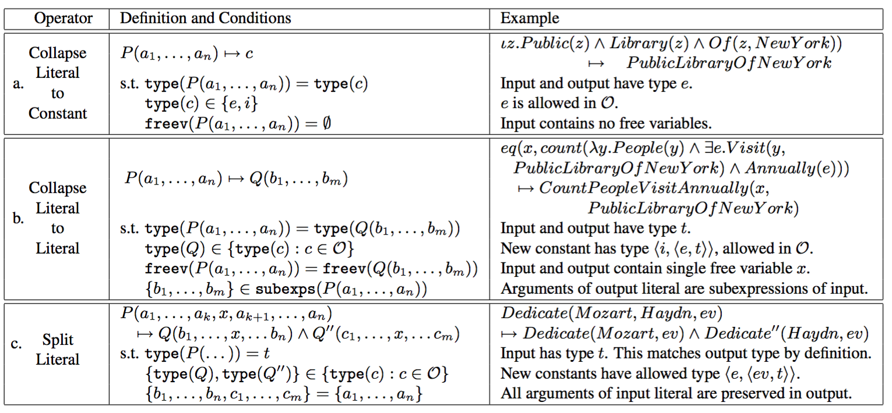
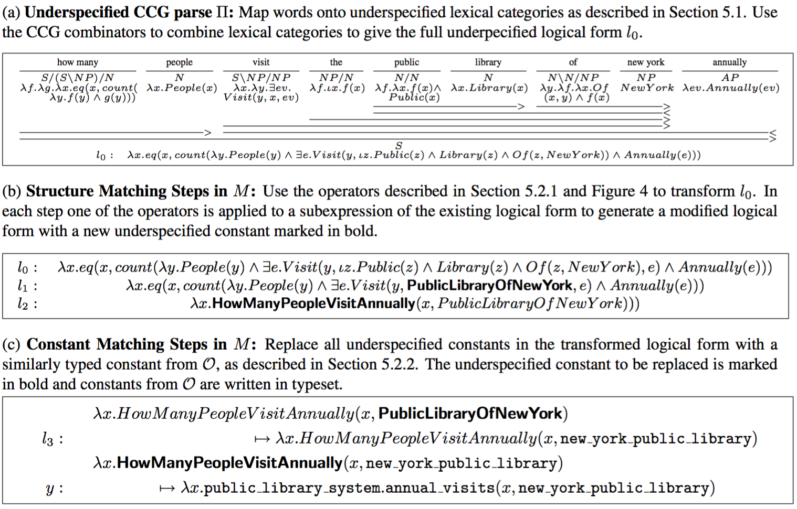
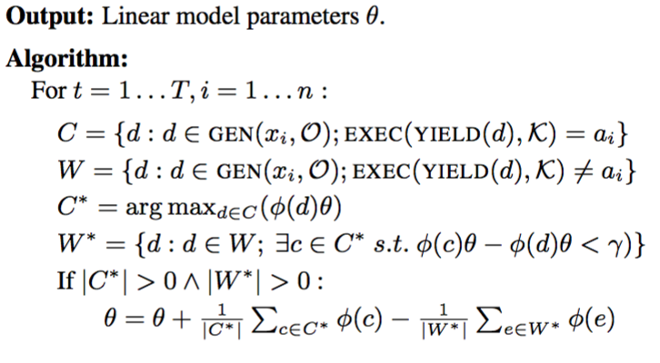

## Kwiatkowski, Zettlemoyer, Goldwater, Steedman 2011

Lexical Generalization in CCG Grammar Induction for Semantic Parsing

### tags

EMNLP 2011, GeoQuery, ATIS

### factored lexicons

lexicon item -> (lexeme, template) pair

- lexeme: (word span, [constant1, constant2])
- template: $$\lambda (w, \vec v).[w \vdash X:h_{\vec v}]$$

$$
(Boston, [from, bos]) \\
\lambda (w, \vec v).(w \vdash N / N:\lambda f\lambda x.v_1(x, v_2) \wedge f(x)) \\
Boston \vdash N / N:\lambda f\lambda x.from(x, bos) \wedge f(x)
$$

#### maximal factor

all the constants of h are included in lexeme.

$$
(Boston, [from, bos]) \\
\lambda (w, \vec v).(w \vdash N / N:\lambda f\lambda x.v_1(x, v_2) \wedge f(x))
$$

#### partial factor

$$
(Boston, [bos]) \\
\lambda (w, \vec v).(w \vdash N / N:\lambda f\lambda x.from(x, v_2) \wedge f(x))
$$

## Kwiatkowski, Choi, Artzi, Zettlemoyer, 2013

Scaling Semantic Parsers with On-the-fly Ontology Matching

### tags

EMNLP 2013, Freebase QA, GeoQuery

#### ontological mismatch problem

At first, GeoQuery / ATIS dataset is too small, predicates and utterances are not that much. Learning a parsing model is easy.

If a database has more predicates and thus more capable to answer more questions in theory, the amount of possible utterance can go even further.

What's worse, new utterances linguistically involve more predicates in theory, but database schema is fixed and supports only limited predicates.

### parsing

**convert to underspecified LF**

- predefined set 56 lexical categories (WordNet)
- 49 domain-independent lexical items (English only)
- underspefified constants are type placeholders

**ontological matching**

list of operators:

- collapsing operator
- expansion operator
- constant matching

operators:

parsing example

### inference

CKY-style chart parser, threshold pruning, ...

and ranking:

$$
\begin{align*}
Parse(x, O)
  &= \arg \max_{d\in GEN(x,O)} (Score(d)) \\
Score(d)  &= \phi(d) \theta \\
  &= \phi(\Pi)\theta + \sum_{o\in M}\phi(o)\theta
\end{align*}
$$

### learning

find correct samples and wrong samples, and update parameter

