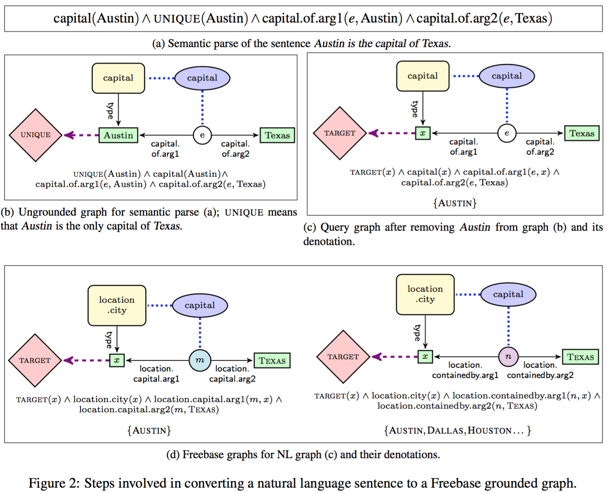
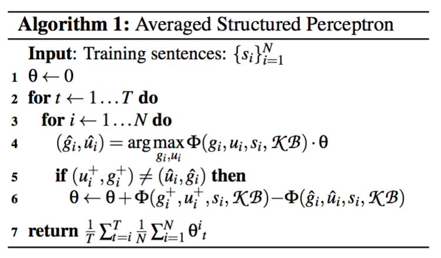
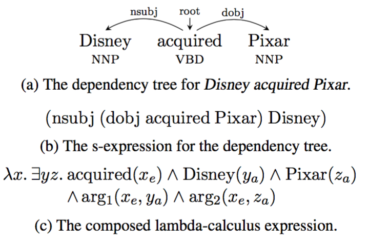
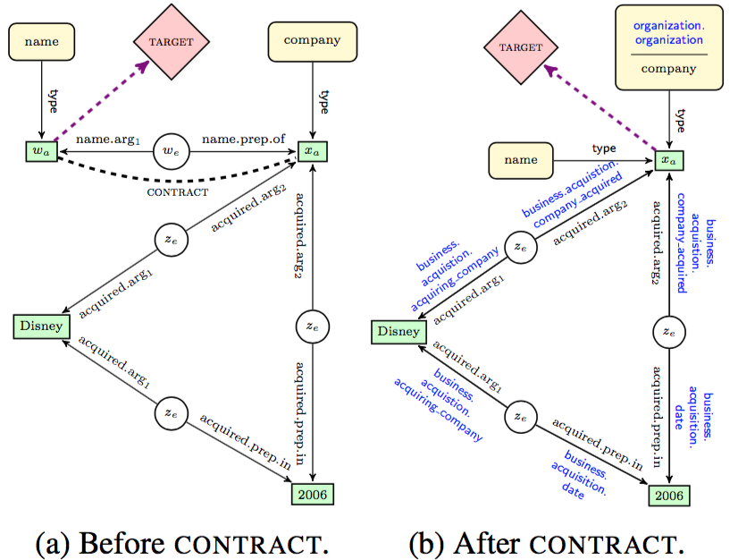
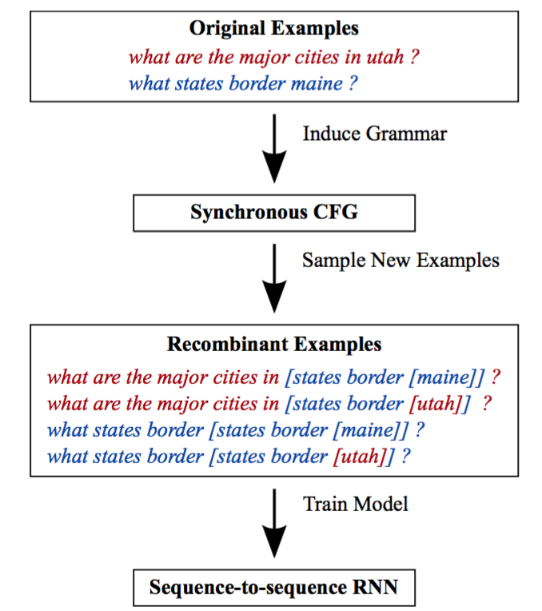
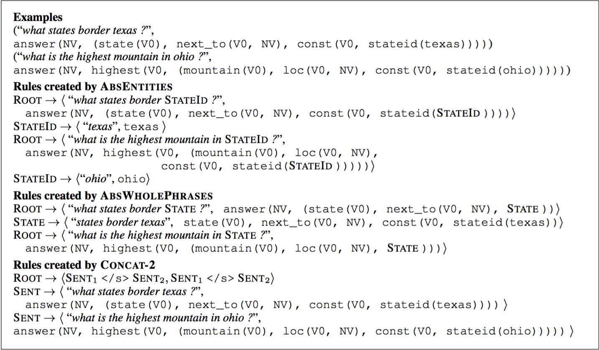

## Reddy, Lapata, Steedman, 2014

Large-scale Semantic Parsing without Question-Answer Pairs

### tags

T-ACL 2014, Freebase, Free917, WebQuestions, CCG

### Framework

Existing General-Purporse CCG Parser (Clark and Curran, 2007)

using ClueWeb09 and Freebase Annotation

Ungrounded graph to grounded graph

- oval: words -> unchanged
- rectangle: entity -> fb entity
- circle: mediator -> edge
- rounded rectangle: type -> fb type
- diamond: math node -> unchanged

select surrogate gold graphs by replacing an entity with a variable

### learning

perceptron, gold graph and predicted graph

### features

lexical alignments: extract relation alignment from topological similar graphs

contextual features:

- word and predicates
- predicate and argument word
- word state
- predicate and dependency word in dep parse

lexical similarity:

- num of shared word stem by edge labels of grounded and undergrounded graphs

graph connectivity features:

- has edges
- connected-node count

## Artzi, Lee, Zettlemoyer, 2015

Broad-coverage CCG Semantic Parsing with AMR

### tags

EMNLP 2015, xxx

Skolem Term and IDs

## Reddy et al. 2016

Transforming Dependency Structures to Logical Forms for Semantic Parsing

### tags

TACL2016, dependency parse,

### parse

1. get dep parse
2. binarization
2. substitution
3. hierarchical composition
4. post processing
5. unground graph to gounded graph

New operators for dealing with mismatch between dep and semantic parse

- CONTRACT: merge several nodes
- EXPAND: add missing links for disjoint parts in ungrounded graph

## Jia and Liang, 2016

Data Recombination for Neural Semantic Parsing

### tags

ACL2016, data recombination

### data recombinant

data D is from a distribution p(x, y), fit a generative model p'(x, y) to p, by slicing together fragments of different examples. Then draw *recombinant sample* from the new model for training.

- Abstracting Entities: add two new rules
  - entity -> type constant
  - type constant -> token in NL, MR
- Abstracting Entities and Phrase:
  - entity -> type const
  - infered type const -> phrase in NL, MR
- Concatenation k sentences for both NL and MR

### neural sequence

placeholder

