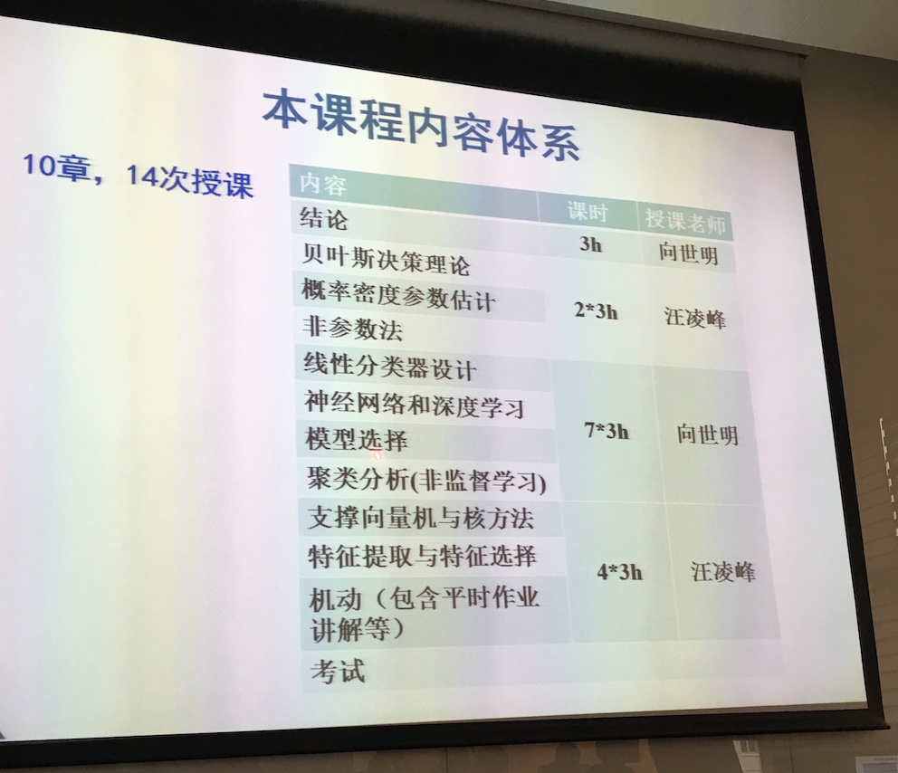

42 lectures + 3 for exams 

### 模式识别

模式描述：image -> RGB(100\*100\*3) vector (other repr exists)
特征选择：-> discard unused features for the above vector

### task

- preprocessing
  - video, img, signal processing
- pattern separation
  - location detection / background / pattern-pattern separation
- motion analysis
  - object tracking / movement pattern
- **pattern desp and classification**
  - **feature extraction/selection, classification, clustering, ML**
- application (on specific system)

### topics in pattern classification
... blabla ...

multi-modal 

semi-supervised class.. / clustering
distance metric learning
weak supervised ???

### pattern recognition formalization

example: human face recognition problem

模式描述 -> sample, label ->
pattern classification
- 2-class / multi-class
- classifier design: ML
- related: feature extraction / selection

模式表示: 特征表示 $x=[x_1,x_2, ..., x_d]^T$

分类器表示: (???)
- 类别模型: $M_i=M(x, \theta_i)$
- 判别函数: $y_i=f(x, w_i)$ (discriminant function) 有的没有判别函数 本门课程大多可以写出

识别（分类）:
- distance metric(similarity): $\min_i d(x, M_i)$
- decision region: $R_i=\arg\max_i f(x,w_i)$

#### fish example

firstly, data collection and fish feature distribution analsis

small dataset -> non-linear
huge dataset(network / graph) -> linear (due to the huge amount and very high dimension, linear is good enough)

model complexity:
string -> curve -> k-nearest-neighbor

#### systematic flow

data acquisition -> layout analysis -> character segmentation -> recognition -> post-preprocessing

?? recall: use multi-vector rather than a integer (compact embedding) ( [1,0,0]..[0,0,1] over 1, 2, 3 )

### method category

**statistical leanring / structual**

statistical: parameterized / non-parameterized / ... / ensemble / ...
structual: graph / ...

**other classification**

??? blaaaaaaa

**by generative / discriminative**

generative: how to generative
找到内控因素，每个类分别学习，parameters are continuous
-  $p(\bf{x} \vert C) = f(\bf{x}, \theta)$ parameterized model
-  bayesian direct graph
-  (template-based classifier ???)
-  HMM

discriminative: given sample and label, unaware about how it is generated，所有类同时学习
- Artificial NN
- SVM
- Boosting
- CRF (in Ph.D. course)

