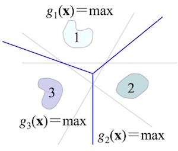

## relation with previous chapters

initial discriminant function is
$$
g_i(x) = P(w_i \vert x) = \frac{p(x \vert w_i)P(w_i)}{p(x)},
$$
where $w_i$ is the class tag, and $P(w_i)$ is somewhat known as prior

$p(x \vert w_i)$ is assumed to have some form of distribution, with parameters $\mu$.
Using MLE or bayesian estimation to get $\hat\mu$.

Also, we can use data to compute it in non-parameterized way

## introduction

Assume the given form of discriminant function, determine its parameter based on samples.

- No need to known the generative models.
- Actually a non-parameter model

Steps:

1. Given discriminant function with known form but unknown parameters
2. train with samples
3. do classification

## linear decision boundary

blabla

### multi-class classifier

- one-vs-all
- one-vs-one, for all one-one pair
- one-vs-others, in pace, 1coc(???)

ambiguous cases exists, thus change to the new decision rule:

$$
x \in \omega_i, g_i(x) = \max_{j=1,2,\dots,c} g_j(x)
$$

 

## generalized linear discriminant function

$$\{x_i \vert i =1, 2, \dots, d\} \to \{1, y_2, y_3, ..., y_{d_n}\}$$

## percetron

assume linear separable

- batch learning
- fixed-increment

## relax

- linear (L1)
- square (L2)
- relaxed: large error sample affect much
  - $$ J_r(a) = \frac{1}{2}\sum_{y\in Y} \frac{(a^Ty - b)^2}{\parallel y \parallel^2} $$

