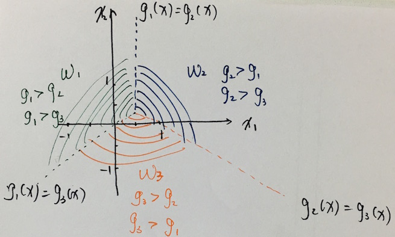
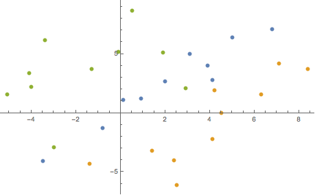

### 1.1

有四个来自于两个类别的二维空间中的样本，其中第一类的两个样本为 $(1,4)^T$ 和 $(2,3)^T$，第二类的两个样本为 $(4,1)^T$ 和 $(3,2)^T$ 。这里，上标 $T$ 表示向量转置。假定采用规范化增广样本表示形式，假设初始的权向量 $a=(0,1,0)^T$ ，$a$ 的第三维对应齐次坐标，且梯度更新步长 $\eta_k$ 固定为 1。试利用批处理感知器算法求解线性判别函数 $g(y)=a^Ty$ 的权向量。（注意请采用规范化增广样本表示形式）

**解**: 设原样本分别为 $x_1,x_2 \in \omega_1, x_3,x_4 \in \omega_2$ ，对其进行规范化得

$$
y_1 = \begin{pmatrix}
1 \\ 4 \\ 1
\end{pmatrix},
y_2 = \begin{pmatrix}
2 \\ 3 \\ 1
\end{pmatrix},
y_3 = \begin{pmatrix}
-4 \\ -1 \\ -1,
\end{pmatrix},
y_4 = \begin{pmatrix}
-3 \\ -2 \\ -1
\end{pmatrix}
$$

第一步，使用初始化 $a=(0,1,0)^T$, 求得

$$
a^Ty_1 = 4, a^Ty_2=3,a^Ty_3=-1,a^Ty_4=-2
$$

错分集合 $Y = \{y_3, y_4\}$，且 $J = \sum_{y\in Y} (-a^Ty) $ ，则更新权重向量：

$$
\begin{align}
a &= a - \eta_1\frac{\partial J}{\partial a} \\
  &= a + \sum_{y\in Y}y \\
  &= a + y_3 + y_4 = (-7, -2, -2)^T
\end{align}
$$

第二步，利用 $a = (-7, -2, -2)^T$ 寻找错分向量：

$$
\begin{align}
a^Ty_1 &= -7-8-2 &= -17 &\le 0 \\
a^Ty_2 &= -14 -6 - 2 &= -22 &\le 0 \\
a^Ty_3 &= 28 + 2 + 2 &= 32 &\gt 0 \\
a^Ty_4 &= 21 + 4 + 2 &= 27 &\gt 0
\end{align}
$$

错分集合 $Y = \{y_1, y_2\}$ 则更新权重向量 $ a = a + y_1 + y_2 = (-4, 5, 0)^T $.

第三步，求错分集合：

$$
\begin{align}
a^Ty_1 &= -4 + 20 &\gt 0 \\
a^Ty_2 &= -8 + 15 &\gt 0 \\
a^Ty_3 &= 16 - 5 &\gt 0 \\
a^Ty_4 &= 12 - 10 &\gt 0
\end{align}
$$

错分集合为 $Y=\emptyset$ 则 $\eta_3 \sum_{y\in Y}y = 0$，算法终止。

求解得权向量：$ a = (-4, 5, 0)^T $.

### 1.2

对于多类分类情形，考虑 one-vs-all 技巧，即构建 $c$ 个线性判别函数：

$$
g_i(x) = w_i^Tx + w_{i0}, i = 1, 2, \dots, c
$$

此时的决策规则为：对 $j \ne i$, 如果 $g_i(x) > g_j(x)$, x 则被分为 $\omega_i$ 类。
现有三个二维空间内的模式分类器，其判别函数为：

$$
g_1(x) = -x_1 + x_2 \\
g_2(x) = x_1 + x_2 - 1 \\
g_3(x) = -x_2
$$

试画出决策面，指出为何此时不存在分类不确定性区域。

**解**: 分类面如图所示：

由于每个类的判别函数在特定点上总有一个最大者，故整个平面中不存在有歧义或未分类的点，不存在分类不确定区域。

### 2.1

Write a program to implement the “batch perception” algorithm (see page 44 or 45 in PPT).
(a). Starting with a = 0, apply your program to the training data from w1 and w2. Note that the number of iterations required for convergence（即记录下收敛的步数）。
(b). Apply your program to the training data from w3 and w2. Again, note that the number of iterations required for convergence.
(c). Explain the difference between the iterations required in the above two cases.

**解**: （代码见附录 _batch\_perception_ 函数）

(a) 收敛需要 24 步迭代，所得权重 [-30.4,34.09999999999997,34.0]   
(b) 收敛需要 17 步迭代，所得权重 [41.40000000000002,-48.60000000000002,-19.0]  
(c) 由下图可以发现，w1 (蓝色) 和 w2 (橙色) 的点相离较近，而 w2 (橙色) 与 w3 (绿色) 距离较远，仅有个别点较近。

因此，同样的算法寻找 w2 和 w3 的边界会比寻找 w1 与 w2 的边界收敛更快。

### 2.2

写一个基于松驰准则的感知函数学习的代码，并采用 w1 和 w2 的数据进行训练。对程序运算过程和结果进行分析。

**解**: （代码见附录 _single\_sample\_relax_ 函数）

初始化 eta 固定为 1、margin 值为 1，权重向量为 ${\bf 0}$，使用单样本松弛算法。  
由于考虑到正常的 $a^Ty <= margin$ 判断会遇到浮点数下溢问题，当内积非常接近 margin 时梯度的增量极小 ($10^{-17}$)，几乎为0。于是迭代长时间不会有进展，近乎无穷循环。
故考虑将分类失败的判断改为 $a^Ty <= margin - \epsilon$，代码实现中取 $\epsilon = 10^{-5}$。

如此，得出最终权重向量为 $[-1.8326541642743,2.0185743315717,2.8618651844839] \text{  }$ ，共迭代了 21796 次。

实验不同的 $\epsilon$ 可以发现，所得不同权重向量较高精度上相等，故可以认为迭代已经收敛于精度足够的稳定值。

### 2.3

写一个最小平方准则的线性判别函数学习的代码，并分别采用 w1 和 w2、w2 和 w3、w3 和 w4 的数据进行训练。
对程序运算过程和结果进行分析。

**解**: （代码见附录 _pseudo\_inverse_ 函数）

由于规范化增广样本仅仅 3 维，且样本数较少，使用伪逆较为方便，代码计算不需要迭代，分别代入数据可得到：

- w1 和 w2 的分类权重：[-0.33391921600076024,0.28785693487557085,0.7826412336099762]
- w2 和 w3 的分类权重：[0.17987721564209358,-0.13701343448280026,-0.02977081723472505]
- w3 和 w4 的分类权重：[0.08276694629366121,0.12681539660924512,0.4783531495651045]

### 附录 代码

代码使用 Julia 编写，保存为 `hw2.jl` 并安装好 Julia 之后可直接 `julia hw2.jl` 执行查看输出。
在线版本可在[此处查看](https://github.com/zxteloiv/julia-ex/blob/master/linear_discriminant_functions/hw2.jl)。

~~~ julia
w11 = [0.1, 6.8, -3.5, 2.0, 4.1, 3.1, -0.8, 0.9, 5.0, 3.9];
w12 = [1.1, 7.1, -4.1, 2.7, 2.8, 5.0, -1.3, 1.2, 6.4, 4.0];
w21 = [7.1, -1.4, 4.5, 6.3, 4.2, 1.4, 2.4, 2.5, 8.4, 4.1];
w22 = [4.2, -4.3, 0.0, 1.6, 1.9, -3.2, -4.0, -6.1, 3.7, -2.2];
w31 = [-3.0, 0.5, 2.9, -0.1, -4.0, -1.3, -3.4, -4.1, -5.1, 1.9];
w32 = [-2.9, 8.7, 2.1, 5.2, 2.2, 3.7, 6.2, 3.4, 1.6, 5.1];
w41 = [2.0, 8.9, 4.2, 8.5, 6.7, 0.5, 5.3, 8.7, 7.1, 8.0] * -1;
w42 = [8.4, -0.2, 7.7, 3.2, 4.0, 9.2, 6.7, 6.4, 9.7, 6.3] * -1;
const SAMPLE = [w11 w12 w21 w22 w31 w32 w41 w42];

function normalize_data(positive, negative)
    " normalization adds additional one column to data "
    normalize = data -> [data ones(size(data)[1])]

    positive = normalize(positive)
    negative = normalize(negative) * -1
    assert(size(positive) == size(negative))
    data = transpose([positive; negative])

    d, n = size(data)
    weight = zeros(d)

    data, weight
end

function pseudo_inverse(positive, negative)
    data, weight = normalize_data(positive, negative)
    d, n = size(data)

    weight = pinv(data * transpose(data)) * data * ones(n)
end

function single_sample_relax(positive, negative; eta=1, margin=1, epsilon=0.00001)
    data, weight = normalize_data(positive, negative)
    d, n = size(data)

    function find_error(data, weight, eta, margin)
        for i = 1:n
            if dot(weight, data[:, i]) <= margin - epsilon
                return data[:, i]
            end
        end
        nothing
    end

    step, y = 1, find_error(data, weight, eta, margin)
    while y != nothing
        gradient = (margin - dot(weight, y)) / dot(y, y) * y
        weight += eta * gradient

        step += 1
        y = find_error(data, weight, eta, margin)
    end

    weight, step
end

function batch_perception(positive, negative)
    data, weight = normalize_data(positive, negative)
    d, n = size(data)

    function compute_error(data, weight)
        error_samples = [y for y in filter([data[:, i] for i = 1:n]) do y
            dot(weight, y) <= 0
        end]
    end

    step, error_samples = 1, compute_error(data, weight)

    while length(error_samples) > 0
        gradient = sum(error_samples)
        weight += gradient
        #println("new weight \$weight\t<= \$gradient")

        step += 1
        error_samples = compute_error(data, weight)
    end

    weight, step
end

"""
Write a program to implement the “batch perception” algorithm
(see page 44 or 45 in PPT).

(a). Starting with a = 0, apply your program to the training data from 1 and 2.
Note that the number of iterations required for convergence.

(b). Apply your program to the training data from 3 and 2.
Again, note that the number of iterations required for convergence.

(c). Explain the difference between the iterations required in the above two cases.

写一个基于松驰准则的感知函数学习的代码，并采用 w1 和 w2 的数据进行训练。对程序运算过程和结果进行分析。

写一个最小平方准则的线性判别函数学习的代码，并分别采用 w1 和 w2、w2 和 w3、w3 和 w4 的数据进行训练。
"""
function hw2_1()
    weight, step = batch_perception(SAMPLE[:, 1:2], SAMPLE[:, 3:4])
    println("batch perception w1 and w2: iteration steps: \$step, final weights: \$weight")
    weight, step = batch_perception(SAMPLE[:, 3:4], SAMPLE[:, 5:6])
    println("batch perception w2 and w3: iteration steps: \$step, final weights: \$weight")

    weight, step = single_sample_relax(SAMPLE[:, 1:2], SAMPLE[:, 3:4])
    println("single sample relax w1 and w2: iteration steps: \$step, final weights: \$weight")

    weight = pseudo_inverse(SAMPLE[:, 1:2], SAMPLE[:, 3:4])
    println("pseudo_inverse MSE w1 and w2: final weights: \$weight")
    weight = pseudo_inverse(SAMPLE[:, 3:4], SAMPLE[:, 5:6])
    println("pseudo_inverse MSE w2 and w3: final weights: \$weight")
    weight = pseudo_inverse(SAMPLE[:, 5:6], SAMPLE[:, 7:8])
    println("pseudo_inverse MSE w3 and w4: final weights: \$weight")

end

if !isinteractive()
    hw2_1()
end

~~~

