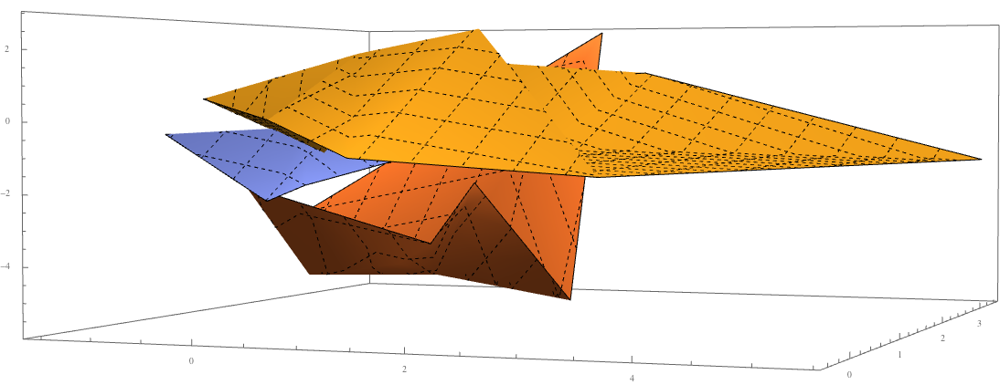
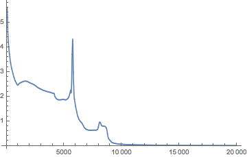
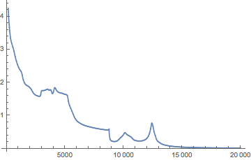
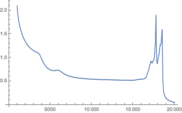
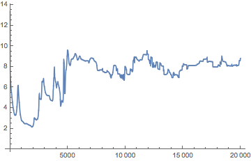
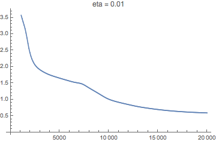
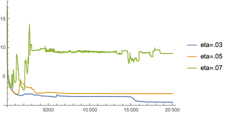
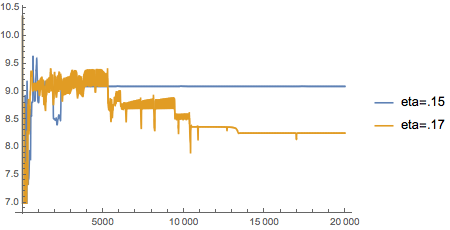
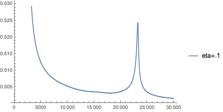
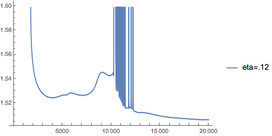

## 1.1

Consider a three-layer network for classification with nH nodes in hidden layer, and c nodes in output layer. The patterns (also say samples ) are in d dimensional space.  The activation function (or transfer function) for the nodes in the hidden layer is the sigmoid function. Differently, the nodes in the output layer will employ the following softmax operation as their activation function:

$$
z_j=\frac{e^{net_j}}{\sum_{m=1}^ce^{net_m}},j=1,2,\dots,c,
$$

where $net_j$ stands for the weighted sum at the $j$-th node in the output layer. 

Please derive the learning rule under the back propagation framework if the criterion function for each sample is the sum of the squared errors, that is （即分析每一层权重的更新方法）:

$$
J({\bf W})=\frac{1}{2}\sum_{j=1}^c(t_j-z_j)^2,
$$

where $t_j$ is the known target value for the sample at the $j$-th node in the output layer.

**解**: 设输入层的一个节点输出为 $x_i, i=1,2,\dots,d$，设隐含层的一个节点输出为 $y_h, h=1,2,\dots,n_H$, 输出层的一个节点输出 $z_j, j=1,2,\dots,c$，并且，定义输入层到隐含层的权重矩阵为 ${\bf W}^{(1)}$，其中 $w^{(1)}_{ih} $ 对应着 $x_i$ 到 $y_h$ 的权重，输出层到隐含层的权重矩阵为 ${\bf W}^{2}$ 其中 $w^{(2)}_{hj}$ 对应 $y_h$ 到 $z_j$ 的权重.

由题所述的损失函数和激活函数，暂时忽略在加权求和时的 bias 项，可得

$$
\begin{align}
J({\bf W}) &= \frac{1}{2}\sum_{j=1}^c(t_j-z_j)^2 \\
z_j &= \frac{\exp(net_j)}{\sum_{m=1}^c\exp(net_m)} \\
net_j &= \sum_{h=1}^{n_H} w^{(2)}_{hj}y_h \\
y_h &= \sigma(\sum_{i=1}^dw_{ih}^{(1)}x_i) \\
\sigma(z) &= \frac{1}{1 + \exp(-z)}
\end{align}
$$

方便起见，先计算两个函数的偏导：

$$
\begin{align}
\frac{\partial z_j}{\partial net_k} &= \begin{cases}\
z_j(1 - z_j) = z_j &- z_jz_j&, k = j \\
&-z_j z_k &, k\ne j
\end{cases} \\
&= z_j I(k=j)-z_jz_k\\
\frac{d\sigma(z)}{d z} &= z (1 - z) 
\end{align}
$$

同时，由于 $z_j$ 使用了 softmax，故每个输出节点的误差 $z_j - t_j$ 都会传播到其他节点。
所以，对隐藏层到输出层权重的梯度为：

$$
\begin{align}
\frac{\partial J}{\partial w^{(2)}_{hj}}
&= \sum_{k=1}^c \frac{\partial J}{\partial z_k} \frac{\partial z_k}{\partial w^{(2)}_{hj}} \\
&= \sum_{k=1}^c \frac{\partial J}{\partial z_k} 
(\sum_{m=1}^c \frac{\partial z_k}{\partial net_m} \frac{\partial net_m}{\partial w^{(2)}_{hj}})
\end{align}
$$

又注意到，对输出节点 $j$ 无关的权重求导时均等于0，即有

$$
\frac{\partial net_m}{\partial w^{(2)}_{hj}} = \begin{cases}
0 & m \ne j \\
y_h & m = j
\end{cases}
$$

所以梯度可以继续化简如下：

$$
\begin{align}
\frac{\partial J}{\partial w^{(2)}_{hj}}
&= \sum_{k=1}^c \frac{\partial J}{\partial z_k} \frac{\partial z_k}{\partial w^{(2)}_{hj}} \\
&= \sum_{k=1}^c \frac{\partial J}{\partial z_k} 
\frac{\partial z_k}{\partial net_j} \frac{\partial net_j}{\partial w^{(2)}_{hj}} \\
&= \frac{\partial J}{\partial z_j} 
\frac{\partial z_j}{\partial net_j} \frac{\partial net_j}{\partial w^{(2)}_{hj}} +
\sum_{k \ne j} \frac{\partial J}{\partial z_k} 
\frac{\partial z_k}{\partial net_j} \frac{\partial net_j}{\partial w^{(2)}_{hj}} \\
&= (z_j - t_j) z_j(1-z_j)y_h + \sum_{k \ne j}(z_k - t_k)(-z_kz_j)y_h \\
&= (z_j-t_j)z_jy_h - \sum_{k=1}^c(z_k - t_k)z_kz_jy_h
\end{align}
$$

每次只用一个样本，那么最终 $w_{hj}^{(2)}$ 的更新规则为：

$$
w_{hj}^{(2)} := w_{hj}^{(2)} - \eta [(z_j-t_j)z_jy_h - \sum_{k=1}^c(z_k - t_k)z_kz_jy_h]
$$

同理，求输入层到隐藏层的权重梯度：

$$
\begin{align}
\frac{\partial J}{\partial w^{(1)}_{ih}}
&= \sum_{j=1}^c \frac{\partial J}{\partial z_j} \frac{\partial z_j}{\partial w^{(1)}_{ih}} \\
&= \sum_{j=1}^c \frac{\partial J}{\partial z_j} 
(\sum_{m=1}^c \frac{\partial z_j}{\partial net_m} \frac{\partial net_m}{\partial w^{(1)}_{ih}}) \\
&= \sum_{j=1}^c \frac{\partial J}{\partial z_j}
  \sum_{m=1}^c \frac{\partial z_j}{\partial net_m}
  \sum_{k=1}^{n_H}\frac{\partial net_m}{\partial y_k}
  \frac{\partial y_k}{\partial w^{(1)}_{ih}}
\end{align}
$$

同样可以观察到，当 $ k\ne h$ 时有 ${\partial y_k}/{\partial w^{(1)}_{ih}}= 0$，则可以化简上式为：

$$
\begin{align}
\frac{\partial J}{\partial w^{(1)}_{ih}} 
&= \sum_{j=1}^c \frac{\partial J}{\partial z_j}
  \sum_{m=1}^c \frac{\partial z_j}{\partial net_m}
  \frac{\partial net_m}{\partial y_h}
  \frac{\partial y_h}{\partial w^{(1)}_{ih}} \\
&= \sum_{j=1}^c (z_j - t_j) \sum_{m=1}^c (z_j I(m=j)-z_jz_m)w_{hm}y_h(1-y_h)x_i \\
&= y_h(1-y_h)x_i \sum_{j=1}^c (z_j - t_j) (z_jw_{hj}-\sum_{m=1}^c z_jz_mw_{hm})
\end{align}
$$

同理，由于只用一个样本，最终 $ w^{(1)}_{ih}$ 的更新规则为：

$$
w^{(1)}_{ih} := w^{(1)}_{ih} - \eta[y_h(1-y_h)x_i \sum_{j=1}^c (z_j - t_j) (z_jw_{hj}-\sum_{m=1}^c z_jz_mw_{hm})]
$$

## 1.2

在卷积神经网络中，请指出在遇到max pooling操作时，错误如何传？

**答**: 在每个做 max pooling 的层，都对每个 pooling 窗口保存 max 对应点的序号，即可把错误反向传递到对应的卷积点上，而对 max 没有取到的其他点，权重保持不变。


## 2

本题使用的数据如下：

第一类10个样本（三维空间）：
[ 1.58,  2.32,  -5.8],   [ 0.67,  1.58,  -4.78],  [ 1.04,  1.01,  -3.63],  
[-1.49,  2.18,  -3.39],  [-0.41,  1.21,  -4.73],  [1.39,  3.16,  2.87],
[ 1.20,  1.40,  -1.89],  [-0.92,  1.44,  -3,22],  [ 0.45,  1.33,  -4.38],
[-0.76,  0.84,  -1.96]
  
第二类10个样本（三维空间）：
[ 0.21,  0.03,  -2.21],   [ 0.37,  0.28,  -1.8],  [ 0.18,  1.22,  0.16],  
[-0.24,  0.93,  -1.01],  [-1.18,  0.39,  -0.39],  [0.74,  0.96,  -1.16],
[-0.38,  1.94,  -0.48],  [0.02,  0.72,  -0.17],  [ 0.44,  1.31,  -0.14],
[ 0.46,  1.49,  0.68]

第三类10个样本（三维空间）：
[-1.54,  1.17,  0.64],   [5.41,  3.45,  -1.33],  [ 1.55,  0.99,  2.69],  
[1.86,  3.19,  1.51],    [1.68,  1.79,  -0.87],  [3.51,  -0.22,  -1.39],
[1.40,  -0.44,  -0.92],  [0.44,  0.83,  1.97],  [ 0.25,  0.68,  -0.99],
[ 0.66,  -0.45,  0.08]

1.	请编写两个通用的三层前向神经网络反向传播算法程序，一个采用批量方式更新权重，另一个采用单样本方式更新权重。其中，隐含层结点的激励函数采用双曲正切函数，输出层的激励函数采用sigmoid函数。目标函数采用平方误差准则函数。
2.	请利用上面的数据验证你写的程序，分析如下几点：
(a)	隐含层不同结点数目对训练精度的影响；
(b)	观察不同的梯度更新步长对训练的影响，并给出一些描述或解释；
(c)	在网络结构固定的情况下，绘制出目标函数随着迭代步数增加的变化曲线。

首先观察三个类样本数据的分布：



代码可在线查看：[GitHub](https://github.com/zxteloiv/julia-ex/blob/master/neural_networks/main.jl)

### 隐层数目

首先实验不同的隐层节点数目的影响，由于只有30个样本，取 mini-batch size=2，学习率为0.03，最多迭代 12000 次的情况下，最终得到

| hidden nodes | min-loss |
| ---- | -------- |
| 1 | 6.442803256273846 |
| 3 | 6.953509598531242 |
| 5 | 5.480642048134567 |
| 7 | 0.6266507014938214 | 
| 10 | 1.5207282493780743 |

可以推断，在隐层节点数太少时，网络的性能较差，而随着节点数增到 7 时，网络性能达到最佳。而当隐层改为10个节点时，模型复杂度上升，迭代次数内未能求得最优参数。

同时，对10个节点的情况进行多次试验，由于随机初始值不同，得到的最小值及曲线变化大不相同：

 
 


可以推测，在模型复杂度较高的情况下，普通的 SGD 越来越难以得到最优值，甚至可能在相当一段时间内不收敛。例如，固定的学习率也可能导致在权重接近最优时跳得更远，而固定的迭代次数也可能相对不够，较小的学习率需要更多的迭代，而随着迭代降低学习率也可能在网络未达最优时就阻止了梯度的继续变化。这需要更多高级的优化算法，或对SGD做一些改良，这里没有继续进行。

### 梯度更新步长

由上面的讨论可知，初始值的影响较为明显，为研究方便起见，隐藏层节点数使用上面最好效果的 7，并固定权重和偏置的初值如下（下标1为隐藏层，下标2为输出层，另外为矩阵乘法方便，横坐标表示输出节点维度，纵坐标表示输入向量维度）

~~~ julia
net.layers[1].weights = [0.34220853408533164 0.3245861926046375 0.3332052733100308
0.22859717196907367 0.46779743149877756 0.3036053965321488
0.10892493071988898 0.5410961612858103 0.3499789079943008
0.4423683719806599 0.2032223830720614 0.3544092449472787
0.270107374555619 0.16764827123181456 0.5622443542125665
0.02227635058706275 0.8910201267019922 0.08670352271094506
0.4865634514215009 0.4626169052427591 0.05081964333573993]

net.layers[1].bias = [0.9952117507065281,0.388087128339186,0.8725765350929733,0.41961076086301596,0.1167031740076856,0.9087224278524852,0.05980293821390692]

net.layers[2].weights = [0.0526149662305822 0.2031494320476992 0.1346865896996537 0.11584528187906622 0.17054130500350598 0.15808138735561705 0.16508103778387567
0.24831808672833983 0.2403426545152851 0.11561300113671563 0.10207716354505683 0.14601009172035231 0.0947610652356002 0.052877937118650215
0.2356175051594146 0.008793297652765042 0.07416296981297327 0.08912410166055519 0.15911479330166178 0.19253821277987473 0.2406491196327555]

net.layers[2].bias = [0.7230274076027488,0.34008837831362837,0.8944012775586168]
~~~

使用上面的初始参数，mini-batch size=2，隐藏层节点数为7，最多迭代20000次，取不同的学习率值时，最终的 loss 如下

| eta | final-loss |
| --- | ---------- |
|0.001| 2.3708887540297052 |
|0.005| 0.9207467487145347 |
|0.01 | 0.5893923992479503 |
|0.03 | 0.5258405792516152 |
|0.05 | 2.014817532447977  |
|0.07 | 9.023216376898912  |
|0.1  | 0.5036235402998435 |
|0.12 | 1.5062125173786134 |
|0.15 | 9.089765087389832  |
|0.17 | 8.249566686894225  |

可见，当学习率过小时，收敛过慢，最终没有迭代到一个较低的值，学习率逐渐增大到 0.01 时，迭代速度较合适：



而当学习率为 0.03 时曲线上已经有一些抖动，继续增大时逐渐不能收敛，跳出了极小值所在区间：



当学习率取更大值时明显已经无法收敛：



由于取 0.1 时反而效果较好，故对此参数继续迭代到3万次，并与取 0.12 时做对比：




可见当学习率取 0.1 附近时较为偶然，也许此值可以忽略很多小的沟壑，从而找到目标函数最小值，但它也有可能跳出最优值附近区间。

### 变化曲线

固定网络结构的情况下，使用上例中表现较好的 eta=0.01 所得曲线为：










