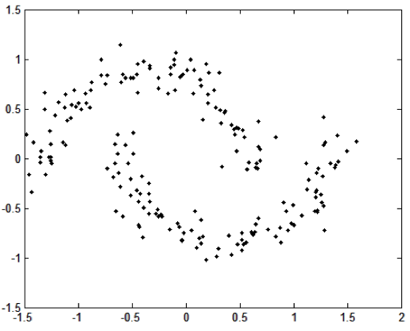
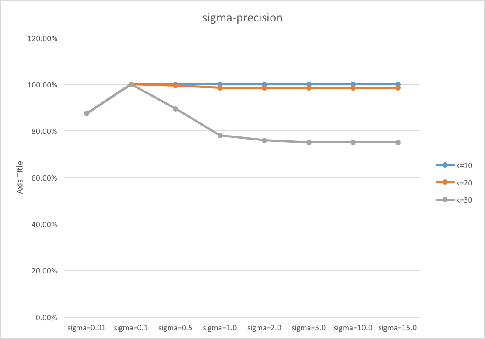

## 1.1 Adaboost

简述 Adaboost 算法的设计思想。

**答**: Adaboost 是一种组合方法，通过对不同种类的多个弱分类器做线性加权进行组合，学习得到一个强分类器。在每次需要加入一个新的弱分类器时，对之前的弱分类器分错的样本进行加权，训练得到的弱分类器可以对这些分错样本有一定侧重。

## 1.2 Cross-Validation

设有一个分类器包含一个参数 $\alpha$, 请简述采用交叉验证方法对该参数进行选择的步骤。

**答**: 以 10-fold 交叉验证为例。首先确定 $\alpha$ 需要实验的取值为 $\{\,\alpha_1, \alpha_2, \dots, \alpha_n\,\}$
选择 $\alpha = \alpha_1$
把数据集分为训练数据和测试数据，再将测试数据分为10份。
每次使用其中9份训练，在剩下1份中测试性能，记为 $p_11$。
轮换10次，得到一组性能数据 $p_{1j}, j = 1, 2, \dots, 10$
取性能最好者得到 $p_{1max} = \max_j p_{1j}$
类似地，再取其他 $\alpha_i$ 值，得到一组 $p_{imax}, i = 1, 2, \dots, n$
最终 $\alpha = \arg \max_{\alpha_i} p_{imax}$ 

## 2.1 k-means

现有1000个二维空间的数据点，可以采用如下MATLAB代码来生成：

~~~ matlab
Sigma = [1, 0; 0, 1];
mu1 = [1, -1]; 
x1 = mvnrnd(mu1, Sigma, 200);
mu2 = [5.5, -4.5];
x2 = mvnrnd(mu2, Sigma, 200);
mu3 = [1, 4]; 
x3 = mvnrnd(mu3, Sigma, 200);
mu4 = [6, 4.5]; 
x4 = mvnrnd(mu4, Sigma, 200);
mu5 = [9, 0.0]; 
x5 = mvnrnd(mu5, Sigma, 200);

% obtain the 1000 data points to be clustered 
X = [x1; x2; x3; x4; x5];

% Show the data point 
plot(x1(:,1), x1(:,2), 'r.'); hold on;
plot(x2(:,1), x2(:,2), 'b.');
plot(x3(:,1), x3(:,2), 'k.');
plot(x4(:,1), x4(:,2), 'g.');
plot(x5(:,1), x5(:,2), 'm.');
~~~

在运行完上述代码之后，可以获得1000个数据点，它们存储于矩阵X之中。X是一个行数为1000列数为2的矩阵。即是说，矩阵X的每一行为一个数据点。另外，从上述MATLAB中可见，各真实分布的均值向量分别为mu1, mu2, mu3, mu4, mu5。
提示：在实验中，生成一个数据矩阵X之后，就将其固定。后续实验均用此数据集，以便于分析算法。

请完成如下工作：
(1). 编写一个程序，实现经典的K-均值聚类算法；
(2). 令聚类个数等于5，采用不同的初始值观察最后的聚类中心，给出你所估计的聚类中心，指出每个中心有多少个样本；指出你所得到聚类中心与对应的真实分布的均值之间的误差（对5个聚类，给出均方误差即可）。

(1) 代码见 [Github Repo](https://github.com/zxteloiv/julia-ex/tree/master/clustering)，主要包括三个文件：

- gen_k-means_data.jl 生成数据，输出到终端
- k-means.jl 聚类算法主要文件
- main_kmeans.jl 入口函数位置

(2) 多次运行统计如下

| No. | 初始中心 | 误差 | 类分布 | 最终中心 |
| --- | -------- | ---- | ------ | -------- |
| 1   | [6.6939,-5.4017],[6.7155,4.5134],[0.0397,-1.9298],[4.0997,-3.7419],[5.4827,3.2733] | 0.1693 | [201.0,198.0,198.0,201.0,202.0] | [8.8699,-0.0387],[6.0164,4.5892],[1.0251,-0.9898],[5.5131,-4.5951],[1.0034,3.9247] |
| 2   | [3.4235,0.1799],[7.8776,-0.3014],[0.8074,-0.937],[7.7488,-0.1569],[6.567,4.4531] | 0.1693 | [202.0,201.0,198.0,201.0,198.0] | [1.0034,3.9247],[5.5131,-4.5951],[1.0251,-0.9898],[8.8699,-0.0387],[6.0164,4.5892] |
| 3   | [5.902,5.4364],[0.9754,5.009],[6.9544,-2.9525],[8.7147,5.3574],[4.4354,3.48] | 0.1693 | [198.0,202.0,201.0,201.0,198.0] | [6.0164,4.5892],[1.0034,3.9247],[5.5131,-4.5951],[8.8699,-0.0387],[1.0251,-0.9898] |
| 4   | [5.8873,5.5452],[1.1112,4.4041],[6.3762,2.7627],[0.9075,3.4441],[5.4542,-3.7635] | 0.1693 |[198.0,202.0,201.0,198.0,201.0] | [6.0164,4.5892],[1.0034,3.9247],[8.8699,-0.0387],[1.0251,-0.9898],[5.5131,-4.5951] |
| 5   | [6.1372,-3.326],[1.577,0.0763],[1.565,3.2955],[2.7538,-1.3246],[0.96,-0.6246] | 0.1693 | [201.0,202.0,198.0,201.0,198.0] | [8.8699,-0.0387],[1.0034,3.9247],[6.0164,4.5892],[5.5131,-4.5951],[1.0251,-0.9898] |

由于每次是随机选择初始中心，故最终得到的类顺序可能不同。

## 2.2 spectral clustering

关于谱聚类。有如下200个数据点，它们是通过两个半月形分布生成的。如图所示：

(1). 请编写一个谱聚类算法，实现“Normalized Spectral Clustering—Algorithm 3 (Ng算法）”
(2). 设点对亲和性（即边权值）采用如下计算公式：

$$
\omega_{ij} = \exp(-\frac{\Vert {\bf x}_i - {\bf x}_j \Vert_2^2}{2\sigma^2})。
$$

同时，数据图采用 k-近邻方法来生成（即是说，对每个数据点 $x_i$，首先在所有样本中找出不包含$x_i$的 k 个最邻近的样本点，然后 $x_i$ 与每个邻近样本点均有一条边相连，从而完成图构造）。注意，为了保证亲和度矩阵W是对称矩阵，可以令$W=(W^T+W)/2$,　其中，$W^T$表示$W$的转置矩阵。假设已知前100个点为一个聚类，后100个点为一个聚类，请分析分别取不同的 $\sigma$ 值和 k 值对聚类结果的影响。（本题可以给出关于聚类精度随着 $\sigma$ 值和 k 值的变化曲线。在实验中，可以固定一个，变化另一个）。

(1) 代码见 [Github Repo](https://github.com/zxteloiv/julia-ex/tree/master/clustering)，主要包括以下文件

- main_spectral.jl 入口函数
- spectral.jl 谱聚类函数
- spiral_data.jl 数据文件

在编码过程中，需要注意 W 矩阵的对称性、求出的特征向量选择最大的两个等问题，否则无法实现聚类效果。

(2) 先固定 $sigma=1$，调整 k 值变化如下表

| k   |  sigma  | prec |
| --  | ------- | ---- |
| k=3 | sigma=1 | 100% |
| k=5 | sigma=1 | 100% |
| k=10 | sigma=1 | 100% |
| k=20 | sigma=1 | 98.5% |
| k=30 | sigma=1 | 77.5% |
| k=50 | sigma=1 | 78% |
| k=200 | sigma=1 | 74.5% |

可见，由于 k 的增大，相当于对邻接矩阵引入了越来越多的干扰。然而在 k 值较小时，由于矩阵过于稀疏、k-means的随机初始化等原因，往往产生0向量、空指针等导致错误，需要对程序做更多调试。

固定 k=10，调整 sigma 值变化如下：

| k    | sigma      |  prec |
| ---  | --------   | ----- |
| k=10 | sigma=0.01 | 87.5% |
| k=10 | sigma=0.1 | 100% |
| k=10 | sigma=0.5 | 100% |
| k=10 | sigma=1.0 | 100% |
| k=10 | sigma=2.0 | 100% |
| k=10 | sigma=5.0 | 100% |
| k=10 | sigma=10.0 | 100% |
| k=10 | sigma=15.0 | 100% |
| k=20 | sigma=0.01 | 87.5% |
| k=20 | sigma=0.1 | 100% |
| k=20 | sigma=0.5 | 99.5% |
| k=20 | sigma=1.0 | 98.5% |
| k=20 | sigma=2.0 | 98.5% |
| k=20 | sigma=5.0 | 98.5% |
| k=20 | sigma=10.0 | 98.5% |
| k=20 | sigma=15.0 | 98.5% |
| k=30 | sigma=0.01 | 87.5% |
| k=30 | sigma=0.1 | 100% |
| k=30 | sigma=0.5 | 89.5% |
| k=30 | sigma=1.0 | 78% |
| k=30 | sigma=2.0 | 76% |
| k=30 | sigma=5.0 | 75% |
| k=30 | sigma=10.0 | 75% |
| k=30 | sigma=15.0 | 75% |

可见，随着 sigma 增加，邻近与较远的点相似度之间差异开始不明显，聚类便变得困难，精度开始降低。但是这只在 k 值较大时才会出现，而当 k 值较小时，较远的点没有边相连，sigma 变化不会有影响。

